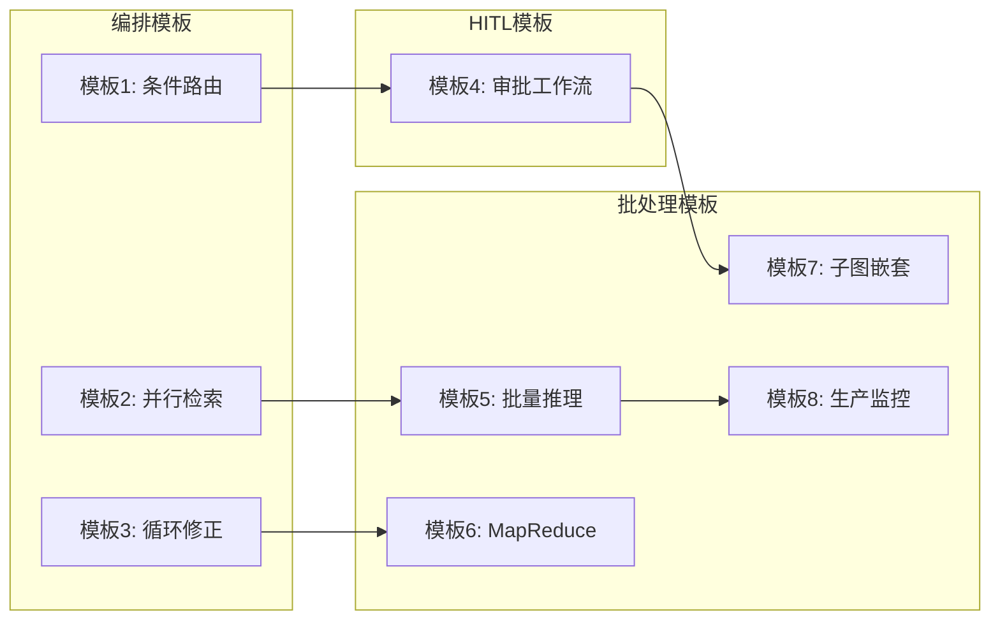

# 附录 BB：编排与批处理代码模板库

> 本附录提供阶段 22 的完整代码模板，可直接复制使用。

---

## 模板架构总览



---

## 模板1：条件路由 Agent

```python
"""
条件路由 Agent 模板
功能: 根据查询类型动态路由到不同处理器
"""
from langgraph.graph import StateGraph, END, START
from typing import TypedDict

class RouteState(TypedDict):
    query: str
    category: str
    answer: str

def classify(state: RouteState) -> dict:
    q = state["query"].lower()
    if any(kw in q for kw in ["代码", "bug", "api"]):
        return {"category": "technical"}
    elif any(kw in q for kw in ["价格", "合同"]):
        return {"category": "business"}
    return {"category": "casual"}

def route_fn(state: RouteState) -> str:
    return f"{state['category']}_handler"

def handle_technical(state: RouteState) -> dict:
    return {"answer": f"技术: {state['query']}"}

def handle_business(state: RouteState) -> dict:
    return {"answer": f"商务: {state['query']}"}

def handle_casual(state: RouteState) -> dict:
    return {"answer": f"闲聊: {state['query']}"}

g = StateGraph(RouteState)
g.add_node("classify", classify)
g.add_node("technical_handler", handle_technical)
g.add_node("business_handler", handle_business)
g.add_node("casual_handler", handle_casual)

g.add_edge(START, "classify")
g.add_conditional_edges("classify", route_fn, {
    "technical_handler": "technical_handler",
    "business_handler": "business_handler",
    "casual_handler": "casual_handler",
})
for h in ["technical_handler", "business_handler", "casual_handler"]:
    g.add_edge(h, END)

route_app = g.compile()
```

---

## 模板2：并行检索 Agent

```python
"""
并行检索 Agent 模板
功能: 多路并行检索后合并结果
"""
import asyncio
from langgraph.graph import StateGraph, END, START
from typing import TypedDict, List, Annotated
from operator import add

class SearchState(TypedDict):
    query: str
    results: Annotated[List[str], add]
    summary: str

async def web_search(state: SearchState) -> dict:
    await asyncio.sleep(0.3)
    return {"results": [f"web: {state['query']}"]}

async def vector_search(state: SearchState) -> dict:
    await asyncio.sleep(0.2)
    return {"results": [f"vector: {state['query']}"]}

async def kb_search(state: SearchState) -> dict:
    await asyncio.sleep(0.4)
    return {"results": [f"kb: {state['query']}"]}

def merge(state: SearchState) -> dict:
    return {"summary": f"找到{len(state.get('results', []))}条结果"}

g = StateGraph(SearchState)
g.add_node("web", web_search)
g.add_node("vector", vector_search)
g.add_node("kb", kb_search)
g.add_node("merge", merge)

g.add_edge(START, "web")
g.add_edge(START, "vector")
g.add_edge(START, "kb")
g.add_edge("web", "merge")
g.add_edge("vector", "merge")
g.add_edge("kb", "merge")
g.add_edge("merge", END)

parallel_app = g.compile()
```

---

## 模板3：自我修正循环 Agent

```python
"""
自我修正循环 Agent 模板
功能: 生成→评估→改进循环
"""
from langgraph.graph import StateGraph, END, START
from typing import TypedDict

class RefineState(TypedDict):
    query: str
    draft: str
    feedback: str
    iterations: int
    final: str

MAX_ITER = 3

def generate(state: RefineState) -> dict:
    return {"draft": f"初稿: {state['query']}", "iterations": 0}

def evaluate(state: RefineState) -> dict:
    it = state.get("iterations", 0)
    if it >= MAX_ITER or it >= 2:
        return {"feedback": "达标", "iterations": it + 1}
    return {"feedback": "需改进", "iterations": it + 1}

def refine(state: RefineState) -> dict:
    return {"draft": f"改进版: {state['draft']}"}

def should_continue(state: RefineState) -> str:
    if state.get("feedback") == "达标":
        return "finalize"
    return "refine"

def finalize(state: RefineState) -> dict:
    return {"final": state.get("draft", "")}

g = StateGraph(RefineState)
g.add_node("generate", generate)
g.add_node("evaluate", evaluate)
g.add_node("refine", refine)
g.add_node("finalize", finalize)

g.add_edge(START, "generate")
g.add_edge("generate", "evaluate")
g.add_conditional_edges("evaluate", should_continue, {
    "refine": "refine", "finalize": "finalize"
})
g.add_edge("refine", "evaluate")
g.add_edge("finalize", END)

refine_app = g.compile()
```

---

## 模板4：审批工作流

```python
"""
审批工作流模板
功能: 高风险操作需人工审批
"""
from langgraph.graph import StateGraph, END, START
from langgraph.checkpoint.memory import MemorySaver
from typing import TypedDict

class ApprovalState(TypedDict):
    request: str
    risk_level: str
    approval_status: str
    result: str

def analyze(state: ApprovalState) -> dict:
    req = state["request"]
    risk = "high" if any(kw in req for kw in ["删除", "发送", "格式化"]) else "low"
    return {"risk_level": risk, "approval_status": "pending"}

def route_by_risk(state: ApprovalState) -> str:
    if state["risk_level"] == "high":
        return "wait_approval"
    return "execute"

def wait_approval(state: ApprovalState) -> dict:
    return {}

def execute(state: ApprovalState) -> dict:
    return {"result": f"已执行: {state['request']}"}

g = StateGraph(ApprovalState)
g.add_node("analyze", analyze)
g.add_node("wait_approval", wait_approval)
g.add_node("execute", execute)

g.add_edge(START, "analyze")
g.add_conditional_edges("analyze", route_by_risk, {
    "wait_approval": "wait_approval",
    "execute": "execute"
})
g.add_conditional_edges("wait_approval",
    lambda s: "execute" if s.get("approval_status") == "approved" else END,
    {"execute": "execute", END: END})
g.add_edge("execute", END)

approval_app = g.compile(
    checkpointer=MemorySaver(),
    interrupt_before=["wait_approval"]
)

# 使用
config = {"configurable": {"thread_id": "001"}}
result = approval_app.invoke({"request": "删除数据"}, config=config)

# 人工审批
approval_app.update_state(config, {"approval_status": "approved"}, as_node="wait_approval")
result = approval_app.invoke(None, config=config)
```

---

## 模板5：批量推理

```python
"""
批量推理模板
功能: 并发批量处理 + 重试
"""
import asyncio
from typing import List, Tuple, Callable

class BatchInference:
    def __init__(self, max_retries=3, concurrency=5):
        self.max_retries = max_retries
        self.concurrency = concurrency
    
    async def process_one(self, func: Callable, item) -> Tuple[dict, str]:
        for attempt in range(self.max_retries):
            try:
                result = await func(item)
                return result, "success"
            except Exception as e:
                if attempt < self.max_retries - 1:
                    await asyncio.sleep(1 * (attempt + 1))
                else:
                    return {"item": item, "error": str(e)}, "failed"
    
    async def batch(self, items: List, func: Callable) -> dict:
        semaphore = asyncio.Semaphore(self.concurrency)
        
        async def limited(item):
            async with semaphore:
                return await self.process_one(func, item)
        
        results = await asyncio.gather(*[limited(i) for i in items])
        
        return {
            "total": len(items),
            "success": sum(1 for _, s in results if s == "success"),
            "failed": sum(1 for _, s in results if s == "failed"),
            "results": [r for r, _ in results],
        }
```

---

## 模板6：MapReduce 工作流

```python
"""
MapReduce 工作流模板
功能: 并行Map + 汇总Reduce
"""
from langgraph.graph import StateGraph, END, START
from typing import TypedDict, List, Annotated
from operator import add

class MRState(TypedDict):
    documents: List[str]
    mapped: Annotated[List[str], add]
    reduced: str

async def map_stage(state: MRState) -> dict:
    async def extract(doc: str) -> str:
        return f"要点: {doc[:30]}"
    
    tasks = [extract(doc) for doc in state["documents"]]
    results = await asyncio.gather(*tasks)
    return {"mapped": results}

async def reduce_stage(state: MRState) -> dict:
    all_points = "\n".join(f"- {m}" for m in state["mapped"])
    return {"reduced": f"综合报告:\n{all_points}"}

g = StateGraph(MRState)
g.add_node("map", map_stage)
g.add_node("reduce", reduce_stage)
g.add_edge(START, "map")
g.add_edge("map", "reduce")
g.add_edge("reduce", END)

mr_app = g.compile()
```

---

## 模板7：子图嵌套

```python
"""
子图嵌套模板
功能: 主图调用子图
"""
from langgraph.graph import StateGraph, END, START
from typing import TypedDict

# 子图: 研究
class ResearchState(TypedDict):
    topic: str
    findings: list
    report: str

def research_node(state: ResearchState) -> dict:
    return {"findings": [f"发现: {state['topic']}"]}

def analyze_node(state: ResearchState) -> dict:
    return {"report": f"分析{len(state['findings'])}条"}

rg = StateGraph(ResearchState)
rg.add_node("research", research_node)
rg.add_node("analyze", analyze_node)
rg.add_edge(START, "research")
rg.add_edge("research", "analyze")
rg.add_edge("analyze", END)
research_app = rg.compile()

# 主图
class MainState(TypedDict):
    query: str
    report: str
    answer: str

def call_research(state: MainState) -> dict:
    result = research_app.invoke({"topic": state["query"]})
    return {"report": result["report"]}

def answer_node(state: MainState) -> dict:
    return {"answer": f"回答: {state['report']}"}

mg = StateGraph(MainState)
mg.add_node("research", call_research)
mg.add_node("answer", answer_node)
mg.add_edge(START, "research")
mg.add_edge("research", "answer")
mg.add_edge("answer", END)

main_app = mg.compile()
```

---

## 模板8：生产监控系统

```python
"""
生产监控模板
功能: 延迟+错误+质量监控
"""
import time
from collections import deque
from functools import wraps

class ProductionMonitor:
    def __init__(self, window=1000):
        self.latencies = deque(maxlen=window)
        self.errors = deque(maxlen=window)
        self.scores = deque(maxlen=window)
        self.total = 0
    
    def record(self, latency_ms, error=None, score=None):
        self.total += 1
        self.latencies.append(latency_ms)
        if error:
            self.errors.append(error)
        if score is not None:
            self.scores.append(score)
    
    def stats(self):
        s = sorted(self.latencies) if self.latencies else [0]
        return {
            "total": self.total,
            "p50": s[len(s)//2],
            "p95": s[int(len(s)*0.95)] if len(s) > 1 else 0,
            "error_rate": len(self.errors) / max(self.total, 1),
            "quality": sum(self.scores)/len(self.scores) if self.scores else 0,
        }

monitor = ProductionMonitor()

def monitored(func):
    @wraps(func)
    async def wrapper(*args, **kwargs):
        start = time.time()
        error = None
        try:
            return await func(*args, **kwargs)
        except Exception as e:
            error = type(e).__name__
            raise
        finally:
            monitor.record((time.time()-start)*1000, error)
    return wrapper
```
