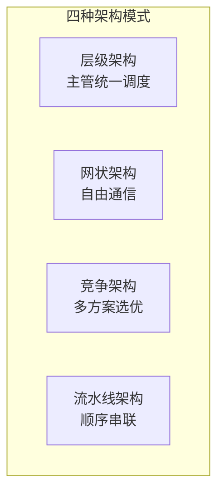

# 附录 BC：多 Agent 系统速查手册

> **阶段 23 速查参考**
> 技术基准：langgraph 1.0.7、langchain-core 1.5.3、MCP、A2A

---

## 多 Agent 架构模式速查



| 模式 | 控制方式 | 适用场景 | Agent数 |
|------|---------|---------|---------|
| 层级 | 主管统一路由 | 有明确分工 | 3-7 |
| 网状 | 任意互相调用 | 探索性任务 | 2-4 |
| 竞争 | 多方案选最优 | 创意方案 | 2-5 |
| 流水线 | 顺序串联 | 固定流程 | 3-6 |

## 编排模式速查

| 模式 | 路由者 | 每步LLM | 调试难度 | 适用场景 |
|------|--------|---------|---------|---------|
| Supervisor | 主管 | 2次 | 低 | 通用任务 |
| Swarm | 当前Agent | 1次 | 中 | 流转任务 |
| Network | 当前Agent | 1次 | 高 | 灵活协作 |

## 通信方式速查

| 方案 | 协议 | 延迟 | 适用场景 |
|------|------|------|---------|
| HTTP REST | HTTP/JSON | 中 | 通用API |
| gRPC | HTTP/2 | 低 | 高性能微服务 |
| WebSocket | TCP | 低 | 实时双向 |
| 消息队列 | AMQP | 高 | 异步解耦 |
| MCP | JSON-RPC | 中 | 标准工具调用 |

## Agent消息结构

```python
class AgentMessage(BaseModel):
    message_id: str      # 唯一ID
    sender: str          # 发送者
    receiver: str        # 接收者
    message_type: str    # request/response/broadcast
    content: str         # 消息内容
    metadata: dict       # 附加元数据
    timestamp: str       # 时间戳
    reply_to: str        # 回复的消息ID
```

## 关键 API 速查

### Supervisor 模式核心代码

```python
graph = StateGraph(State)
graph.add_node("supervisor", supervisor_fn)
graph.add_node("worker1", worker1_fn)
graph.add_node("worker2", worker2_fn)
graph.set_entry_point("supervisor")
graph.add_conditional_edges("supervisor", route_fn)
graph.add_edge("worker1", "supervisor")
graph.add_edge("worker2", "supervisor")
app = graph.compile()
```

### Swarm 模式核心代码

```python
swarm = StateGraph(State)
swarm.add_node("triage", triage_fn)
swarm.add_node("agent_a", agent_a_fn)
swarm.add_node("agent_b", agent_b_fn)
swarm.set_entry_point("triage")
swarm.add_conditional_edges("triage", route_fn)
swarm.add_conditional_edges("agent_a", route_fn)
swarm.add_conditional_edges("agent_b", route_fn)
app = swarm.compile()
```

### 远程Agent调用

```python
async def call_remote(endpoint, payload):
    async with httpx.AsyncClient(timeout=30) as client:
        resp = await client.post(f"{endpoint}/execute", json=payload)
        return resp.json()
```

### 健康检查

```python
async def check_health(url):
    async with httpx.AsyncClient(timeout=5) as client:
        resp = await client.get(f"{url}/health")
        return resp.status_code == 200
```

### 故障转移

```python
async def call_with_failover(urls, request):
    for url in urls:
        try:
            async with httpx.AsyncClient(timeout=10) as client:
                resp = await client.post(url, json=request)
                if resp.status_code == 200:
                    return resp.json()
        except Exception:
            continue
    raise Exception("All agents unavailable")
```

## 性能优化速查

| 策略 | 节省 | 难度 |
|------|------|------|
| 并行无依赖Agent | 30-50%时间 | 中 |
| 缓存结果 | 20-40%成本 | 低 |
| 传摘要不传全文 | 30% Token | 低 |
| 小模型做路由 | 50%路由成本 | 低 |
| 设最大迭代 | 防无限循环 | 低 |

## 成本估算

| 模型 | 输入($/1K) | 输出($/1K) | 适合 |
|------|-----------|-----------|------|
| gpt-4o-mini | $0.00015 | $0.0006 | 路由/简单任务 |
| gpt-4o | $0.0025 | $0.01 | 复杂推理 |

## 最佳实践清单

### 设计
- [ ] 明确Agent职责边界
- [ ] 选择合适编排模式
- [ ] 设计共享状态结构
- [ ] 定义消息格式

### 开发
- [ ] 系统提示词含角色/输入/输出/约束
- [ ] 设置最大迭代次数(3-5)
- [ ] 验证输出格式
- [ ] 异常处理和降级

### 部署
- [ ] 通信超时机制
- [ ] 健康检查
- [ ] 故障转移
- [ ] 成本上限

### 运维
- [ ] 监控调用次数和延迟
- [ ] 追踪成本
- [ ] 审查输出质量
- [ ] 收集失败案例
