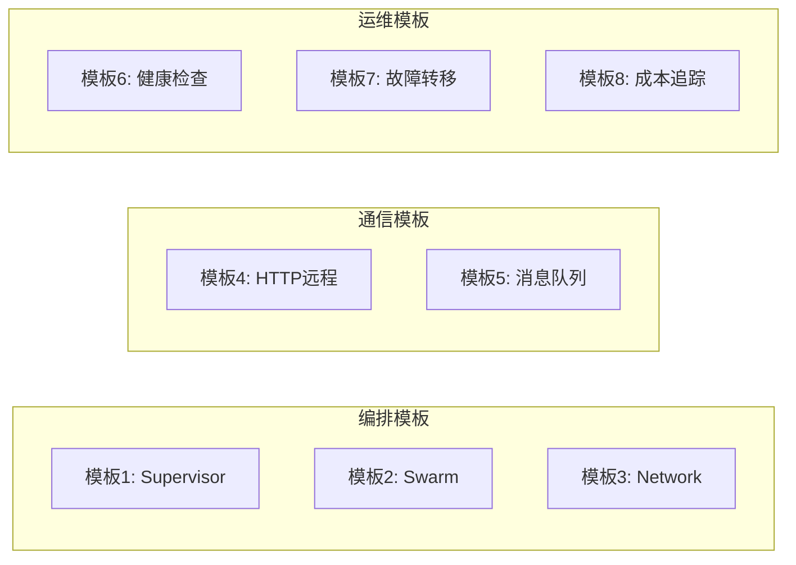

# 附录 BD：多 Agent 编排代码模板库

> **阶段 23 代码模板**
> 可直接复制使用的完整代码模板

---

## 模板架构总览



---

## 模板1：Supervisor 多 Agent

```python
from langgraph.graph import StateGraph, END, START
from langchain_openai import ChatOpenAI
from langchain_core.messages import HumanMessage, SystemMessage
from typing import TypedDict, Annotated
from langgraph.graph.message import add_messages

llm = ChatOpenAI(model="gpt-4o-mini", temperature=0)

class State(TypedDict):
    messages: Annotated[list, add_messages]
    query: str
    result_a: str
    result_b: str
    final: str
    next: str

def supervisor(state: State):
    resp = llm.invoke([
        SystemMessage(content="你是路由器。返回'agent_a'/'agent_b'/'FINISH'。"),
        HumanMessage(content=f"问题: {state['query']}")
    ])
    return {"next": resp.content.strip()}

def agent_a(state: State):
    resp = llm.invoke([
        SystemMessage(content="你是AgentA。"),
        HumanMessage(content=state["query"])
    ])
    return {"result_a": resp.content}

def agent_b(state: State):
    resp = llm.invoke([
        SystemMessage(content="你是AgentB。"),
        HumanMessage(content=state["query"])
    ])
    return {"result_b": resp.content}

def finalize(state: State):
    return {"final": f"A: {state.get('result_a','')}\nB: {state.get('result_b','')}"}

def route(state: State):
    nxt = state.get("next", "FINISH")
    return END if nxt == "FINISH" else nxt

g = StateGraph(State)
g.add_node("supervisor", supervisor)
g.add_node("agent_a", agent_a)
g.add_node("agent_b", agent_b)
g.add_node("finalize", finalize)
g.set_entry_point("supervisor")
g.add_conditional_edges("supervisor", route, {"agent_a":"agent_a","agent_b":"agent_b",END:"finalize"})
g.add_edge("agent_a", "supervisor")
g.add_edge("agent_b", "supervisor")
g.add_edge("finalize", END)
app = g.compile()
```

---

## 模板2：Swarm 接力

```python
from langgraph.graph import StateGraph, END, START
from langchain_openai import ChatOpenAI
from langchain_core.messages import HumanMessage, SystemMessage
from typing import TypedDict, Annotated
from langgraph.graph.message import add_messages

llm = ChatOpenAI(model="gpt-4o-mini", temperature=0)

class SwarmState(TypedDict):
    messages: Annotated[list, add_messages]
    query: str
    step1_result: str
    step2_result: str
    final: str
    current: str

def step1_agent(state: SwarmState):
    resp = llm.invoke([
        SystemMessage(content="你是步骤1Agent。完成后交给step2。"),
        HumanMessage(content=state["query"])
    ])
    return {"step1_result": resp.content, "current": "step2"}

def step2_agent(state: SwarmState):
    resp = llm.invoke([
        SystemMessage(content="你是步骤2Agent。基于上一步结果处理。"),
        HumanMessage(content=f"上一步: {state.get('step1_result','')}")
    ])
    return {"step2_result": resp.content, "current": "done"}

def done_agent(state: SwarmState):
    return {"final": f"结果: {state.get('step2_result','')}"}

def route(state: SwarmState):
    curr = state.get("current", "step1")
    if curr == "done":
        return "finish"
    return curr

g = StateGraph(SwarmState)
g.add_node("step1", step1_agent)
g.add_node("step2", step2_agent)
g.add_node("finish", done_agent)
g.set_entry_point("step1")
g.add_conditional_edges("step1", route)
g.add_conditional_edges("step2", route)
g.add_edge("finish", END)
app = g.compile()
```

---

## 模板3：并行 Agent

```python
from langgraph.graph import StateGraph, END
from typing import TypedDict
import asyncio

class ParallelState(TypedDict):
    query: str
    result_a: str
    result_b: str
    combined: str

async def agent_a(state: ParallelState):
    await asyncio.sleep(0.1)
    return {"result_a": f"A处理: {state['query']}"}

async def agent_b(state: ParallelState):
    await asyncio.sleep(0.1)
    return {"result_b": f"B处理: {state['query']}"}

def combine(state: ParallelState):
    return {"combined": f"{state['result_a']}\n{state['result_b']}"}

g = StateGraph(ParallelState)
g.add_node("agent_a", agent_a)
g.add_node("agent_b", agent_b)
g.add_node("combine", combine)
g.set_entry_point("agent_a")
g.set_entry_point("agent_b")
g.add_edge("agent_a", "combine")
g.add_edge("agent_b", "combine")
g.add_edge("combine", END)
app = g.compile()
```

---

## 模板4：HTTP 远程 Agent

```python
# server.py
from fastapi import FastAPI
from pydantic import BaseModel
from langchain_openai import ChatOpenAI

app = FastAPI()
llm = ChatOpenAI(model="gpt-4o-mini")

class Req(BaseModel):
    query: str

@app.post("/execute")
async def execute(req: Req):
    resp = llm.invoke([
        {"role":"system","content":"你是Agent助手。"},
        {"role":"user","content":req.query}
    ])
    return {"result": resp.content}

@app.get("/health")
async def health():
    return {"status":"ok"}

# client.py
import httpx

async def call_agent(url, query):
    async with httpx.AsyncClient(timeout=30) as client:
        resp = await client.post(f"{url}/execute", json={"query": query})
        return resp.json()["result"]
```

---

## 模板5：Agent 注册中心

```python
import time
from dataclasses import dataclass, field
from typing import Optional

@dataclass
class AgentInfo:
    name: str
    endpoint: str
    capabilities: list
    status: str = "healthy"
    last_heartbeat: float = field(default_factory=time.time)
    load: int = 0

class Registry:
    def __init__(self, timeout=30):
        self.agents = {}
        self.timeout = timeout
    
    def register(self, name, endpoint, capabilities):
        self.agents[name] = AgentInfo(name, endpoint, capabilities)
    
    def discover(self, capability):
        candidates = [
            a for a in self.agents.values()
            if capability in a.capabilities
            and a.status == "healthy"
            and time.time() - a.last_heartbeat < self.timeout
        ]
        return min(candidates, key=lambda a: a.load) if candidates else None
    
    def heartbeat(self, name, load=0):
        if name in self.agents:
            self.agents[name].last_heartbeat = time.time()
            self.agents[name].load = load
```

---

## 模板6：健康检查

```python
import httpx
import asyncio

async def check_http(url, timeout=5):
    try:
        async with httpx.AsyncClient(timeout=timeout) as client:
            resp = await client.get(f"{url}/health")
            return resp.status_code == 200
    except Exception:
        return False

async def check_with_latency(url, threshold=5.0):
    start = time.time()
    ok = await check_http(url)
    latency = time.time() - start
    return ok and latency < threshold, latency

async def periodic_check(url, interval=30):
    while True:
        ok, lat = await check_with_latency(url)
        print(f"{url}: {'OK' if ok else 'FAIL'} ({lat:.2f}s)")
        await asyncio.sleep(interval)
```

---

## 模板7：故障转移

```python
import httpx
import asyncio

async def call_with_failover(urls, payload, max_retries=3, delay=1):
    errors = []
    for attempt in range(max_retries):
        for url in urls:
            try:
                async with httpx.AsyncClient(timeout=30) as client:
                    resp = await client.post(url, json=payload)
                    if resp.status_code == 200:
                        return resp.json()
                    errors.append(f"{url}: HTTP {resp.status_code}")
            except Exception as e:
                errors.append(f"{url}: {e}")
        if attempt < max_retries - 1:
            await asyncio.sleep(delay)
    raise Exception(f"All failed: {'; '.join(errors[-3:])}")
```

---

## 模板8：成本追踪

```python
class CostTracker:
    PRICING = {
        "gpt-4o-mini": {"input": 0.00015, "output": 0.0006},
        "gpt-4o": {"input": 0.0025, "output": 0.01},
    }
    
    def __init__(self, model="gpt-4o-mini"):
        self.model = model
        self.input_tokens = 0
        self.output_tokens = 0
        self.by_agent = {}
    
    def track(self, agent_name, input_tk, output_tk):
        self.input_tokens += input_tk
        self.output_tokens += output_tk
        if agent_name not in self.by_agent:
            self.by_agent[agent_name] = {"in": 0, "out": 0}
        self.by_agent[agent_name]["in"] += input_tk
        self.by_agent[agent_name]["out"] += output_tk
    
    def report(self):
        p = self.PRICING.get(self.model, {"input":0,"output":0})
        in_cost = self.input_tokens / 1000 * p["input"]
        out_cost = self.output_tokens / 1000 * p["output"]
        return {
            "total_cost": round(in_cost + out_cost, 4),
            "input_tokens": self.input_tokens,
            "output_tokens": self.output_tokens,
            "by_agent": {
                name: {"tokens": v["in"]+v["out"],
                       "cost": round((v["in"]*p["input"]+v["out"]*p["output"])/1000, 4)}
                for name, v in self.by_agent.items()
            }
        }
```
