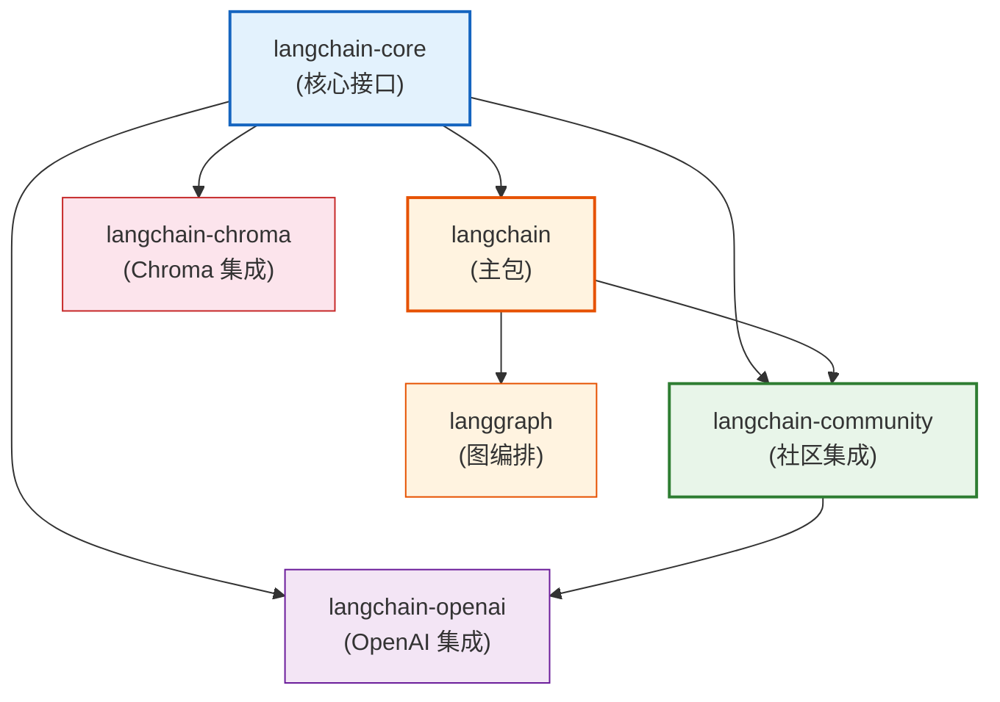

# 附录 B：术语表与 API 速查卡

> **定位**：LangChain/LangGraph 核心术语解释 + 常用 API 快速参考，供随时查阅。

---

## 目录

1. [术语表](#1-术语表)
2. [核心 API 速查](#2-核心-api-速查)
3. [LCEL 速查](#3-lcel-速查)
4. [LangGraph 速查](#4-langgraph-速查)
5. [常用参数速查](#5-常用参数速查)
6. [版本兼容性表](#6-版本兼容性表)

---

## 1. 术语表

### 基础术语

| 术语 | 英文 | 通俗解释 |
|------|------|---------|
| 大语言模型 | LLM (Large Language Model) | 像一个读过海量书籍的"超级大脑"，能理解和生成文字 |
| 提示词 | Prompt | 给 AI 的"指令"——你问什么、怎么问，决定 AI 回答什么、怎么回答 |
| 上下文 | Context | AI 回答时参考的"参考资料"——包括对话历史、检索到的文档等 |
| 温度 | Temperature | AI 的"随机度"——0 最保守（每次答一样），1 最发散（每次不同） |
| Token | Token | AI 处理文字的"最小单位"——中文约 1 字 = 1 token，英文约 4 字符 = 1 token |
| 嵌入 | Embedding | 把文字变成一串数字向量——相似的内容数字也相似 |
| 向量库 | Vector Store | 专门存向量、做相似度搜索的数据库 |
| 幻觉 | Hallucination | AI"一本正经地胡说八道"——编造不存在的事实 |

### LangChain 术语

| 术语 | 英文 | 通俗解释 |
|------|------|---------|
| 链 | Chain | 把多个步骤串起来——Prompt → Model → Parser 就是一条链 |
| 模型 I/O | Model I/O | 与 LLM 交互的三步：写 Prompt → 调模型 → 解析输出 |
| 记忆 | Memory | 让 AI 记住之前的对话——像人的短期记忆 |
| 检索器 | Retriever | 从知识库找相关文档的"图书管理员" |
| 工具 | Tool | AI 可以调用的外部能力——搜索、计算、查天气 |
| 代理 | Agent | 会自己决定用哪个工具的"智能助手" |
| 文档加载器 | Document Loader | 把 PDF/网页/数据库的内容读进来 |
| 文本分割器 | Text Splitter | 把长文档切成小块——方便检索 |
| 输出解析器 | Output Parser | 把 AI 的文字回答转成程序能用的结构化数据 |

### LCEL 术语

| 术语 | 英文 | 通俗解释 |
|------|------|---------|
| LCEL | LangChain Expression Language | LangChain 的"乐高语法"——用 `|` 拼接组件 |
| Runnable | Runnable | 所有组件的"标准接口"——实现了它就能用 `|` |
| 管道运算符 | Pipe Operator `|` | 把前一步的输出连到后一步的输入 |
| 透传 | Passthrough | "传声筒"——输入什么原样输出什么 |
| 流式 | Streaming | "挤牙膏"——不一次性返回，逐段产出 |

### LangGraph 术语

| 术语 | 英文 | 通俗解释 |
|------|------|---------|
| 图 | Graph | 用节点和连线描述工作流——节点是处理步骤，连线是数据流向 |
| 节点 | Node | 工作流中的一个"处理站"——每个节点做一件事 |
| 边 | Edge | 节点之间的"通道"——数据从 A 节点流向 B 节点 |
| 条件边 | Conditional Edge | "岔路口"——根据条件决定下一步走哪 |
| 状态 | State | 工作流的"共享记忆"——所有节点都能读写 |
| 编译 | Compile | 把图定义变成可执行程序 |

### RAG 术语

| 术语 | 英文 | 通俗解释 |
|------|------|---------|
| RAG | Retrieval-Augmented Generation | "开卷考试"——先查资料再回答 |
| 检索 | Retrieval | 从知识库中找最相关的文档片段 |
| 分块 | Chunking | 把长文档切成小段——每段 500 字左右 |
| 重排序 | Re-Ranking | "精选"——从粗排结果中挑最相关的 |
| 多查询 | Multi-Query | "多角度搜索"——用 LLM 改写多个查询分别检索 |
| 上下文压缩 | Contextual Compression | "划重点"——只提取与问题相关的段落 |

---

## 2. 核心API速查

### 模型调用

```python
from langchain_openai import ChatOpenAI

# 创建模型
llm = ChatOpenAI(
    model="gpt-4o-mini",        # 模型名
    temperature=0,               # 0=确定, 0.7=平衡, 1=随机
    max_tokens=1000,             # 最大输出长度
    timeout=30,                  # 超时秒数
    max_retries=2,                # 重试次数
)

# 基本调用
response = llm.invoke("你好")
print(response.content)          # 文本内容
print(response.response_metadata)  # 元数据(token用量等)

# 流式调用
for chunk in llm.stream("讲个故事"):
    print(chunk.content, end="")

# 批量调用
results = llm.batch(["你好", "再见"])
```

### Prompt 模板

```python
from langchain_core.prompts import ChatPromptTemplate

# 创建模板
prompt = ChatPromptTemplate.from_messages([
    ("system", "你是{role}。"),
    ("human", "{question}"),
])

# 使用
messages = prompt.invoke({
    "role": "翻译官",
    "question": "翻译: hello world",
})
```

### 输出解析器

```python
from langchain_core.output_parsers import StrOutputParser, JsonOutputParser
from pydantic import BaseModel

# 字符串解析器
str_parser = StrOutputParser()

# JSON 解析器
class Person(BaseModel):
    name: str
    age: int

json_parser = JsonOutputParser(pydantic_object=Person)
```

### 链

```python
# 基本链
chain = prompt | llm | str_parser
result = chain.invoke({"question": "你好"})

# 带检索的链
from langchain_core.runnables import RunnablePassthrough
rag_chain = (
    {"context": retriever | format_docs, "question": RunnablePassthrough()}
    | prompt | llm | str_parser
)
```

### 记忆

```python
from langchain_core.chat_history import InMemoryChatMessageHistory
from langchain_core.runnables.history import RunnableWithMessageHistory

history = InMemoryChatMessageHistory()
chain_with_history = RunnableWithMessageHistory(
    chain,
    lambda session_id: history,
    input_messages_key="question",
)
```

### 工具

```python
from langchain_core.tools import Tool

# 定义工具
my_tool = Tool(
    name="calculator",
    func=lambda x: str(eval(x)),
    description="计算数学表达式",
)
```

### Agent

```python
from langchain.agents import create_tool_calling_agent, AgentExecutor

agent = create_tool_calling_agent(
    llm=llm,
    tools=[tool1, tool2],
    prompt=prompt,
)
executor = AgentExecutor(agent=agent, tools=[tool1, tool2])
result = executor.invoke({"input": "计算 1+1"})
```

---

## 3. LCEL 速查

### Runnable 类型

```python
from langchain_core.runnables import (
    RunnableSequence,       # 顺序执行: a | b | c
    RunnableParallel,       # 并行执行: {"x": a, "y": b}
    RunnablePassthrough,    # 透传: 原样输出
    RunnableLambda,         # 包装函数: lambda x: ...
    RunnableBranch,         # 条件分支: if/else
    RunnableMap,            # 字典映射
)
```

### 常用方法

```python
# 同步
chain.invoke(input)
chain.batch([input1, input2])
chain.stream(input)

# 异步
await chain.ainvoke(input)
await chain.abatch([input1, input2])
async for chunk in chain.astream(input):
    ...
async for event in chain.astream_events(input, version="v2"):
    ...

# 容错
chain.with_fallbacks([fallback_chain])
chain.with_retry(stop_after_attempt=3)
chain.with_timeout(timeout=10)

# 扩展
chain.assign(extra_field=lambda x: ...)
chain.pick(["field1", "field2"])
```

### 管道组合

```python
# 顺序
chain = step1 | step2 | step3

# 并行
chain = RunnableParallel(
    a=step_a,
    b=step_b,
)

# 条件
chain = RunnableBranch(
    (lambda x: x["type"] == "A", chain_a),
    (lambda x: x["type"] == "B", chain_b),
    default=chain_default,
)
```

---

## 4. LangGraph 速查

### 基本结构

```python
from langgraph.graph import StateGraph, END, START
from typing import TypedDict, Annotated
from langgraph.graph.message import add_messages

# 1. 定义状态
class State(TypedDict):
    messages: Annotated[list, add_messages]
    context: str

# 2. 定义节点函数
def node_a(state: State) -> State:
    return {"messages": [...]}

def node_b(state: State) -> State:
    return {"context": "..."}

# 3. 构建图
graph = StateGraph(State)
graph.add_node("a", node_a)
graph.add_node("b", node_b)
graph.add_edge(START, "a")
graph.add_edge("a", "b")
graph.add_edge("b", END)

# 4. 编译
app = graph.compile()

# 5. 运行
result = app.invoke({"messages": [("human", "你好")]})
```

### 条件边

```python
def router(state: State) -> str:
    if "搜索" in state["messages"][-1].content:
        return "search"
    return "answer"

graph.add_conditional_edges(
    "router",
    router,
    {"search": "search_node", "answer": "answer_node"},
)
```

### 循环

```python
from langgraph.graph import StateGraph, END, START

# 添加循环边
graph.add_edge("check", "execute")    # check → execute
graph.add_edge("execute", "check")    # execute → check (循环)
# 需要在 check 中有条件退出
```

---

## 5. 常用参数速查

### 模型参数

| 参数 | 类型 | 默认值 | 说明 |
|------|------|--------|------|
| `model` | str | - | 模型名 |
| `temperature` | float | 0.7 | 0=确定, 1=随机 |
| `max_tokens` | int | None | 最大输出 token |
| `timeout` | int | None | 超时秒数 |
| `max_retries` | int | 2 | API 重试次数 |
| `streaming` | bool | False | 是否流式 |

### 文本分割参数

| 参数 | 类型 | 默认值 | 说明 |
|------|------|--------|------|
| `chunk_size` | int | 1000 | 每块最大字符数 |
| `chunk_overlap` | int | 200 | 块间重叠字符数 |
| `separators` | list | 默认 | 分隔符优先级 |

### 检索参数

| 参数 | 类型 | 默认值 | 说明 |
|------|------|--------|------|
| `search_type` | str | "similarity" | similarity/MMR/similarity_score_threshold |
| `k` | int | 4 | 返回文档数 |
| `fetch_k` | int | 20 | MMR 初始候选数 |
| `lambda_mult` | float | 0.5 | MMR 多样性权重 |

### Agent 参数

| 参数 | 类型 | 默认值 | 说明 |
|------|------|--------|------|
| `agent` | Agent | - | Agent 类型 |
| `tools` | list | - | 工具列表 |
| `handle_parsing_errors` | bool | False | 解析错误是否自动处理 |
| `max_iterations` | int | 15 | 最大迭代次数 |
| `verbose` | bool | False | 是否打印详细日志 |

---

## 6. 版本兼容性表

### LangChain 版本

| 版本 | Python 要求 | 核心变化 |
|------|------------|---------|
| 0.1.x | 3.8+ | 旧版 AgentExecutor + LLMChain |
| 0.2.x | 3.9+ | LCEL 推荐使用, Runnable 全面统一 |
| 0.3.x | 3.9+ | pydantic 2.x, 移除旧 API |

### 包依赖关系



> **图解说明**：LangChain 的包结构——langchain-core 是最底层（定义 Runnable 等接口），langchain 是主包，各集成包（openai/chroma 等）依赖 core。langgraph 独立但兼容 langchain。

### 模型价格参考（2024）

| 模型 | 输入(/1M token) | 输出(/1M token) | 说明 |
|------|-----------------|-----------------|------|
| gpt-4o | $2.5 | $10 | 旗舰模型 |
| gpt-4o-mini | $0.15 | $0.6 | 性价比首选 |
| gpt-3.5-turbo | $0.5 | $1.5 | 旧版经济 |
| text-embedding-3-small | $0.02 | - | 嵌入模型 |
| text-embedding-3-large | $0.13 | - | 高质量嵌入 |

---

## 快速查找索引

| 需求 | 查看 |
|------|------|
| 调用 LLM | 第2节 - 模型调用 |
| 写 Prompt | 第2节 - Prompt 模板 |
| 解析输出 | 第2节 - 输出解析器 |
| 串联步骤 | 第2节 - 链 / 第3节 |
| 流式输出 | 第3节 - 常用方法 stream |
| 容错降级 | 第3节 - with_fallbacks |
| 添加工具 | 第2节 - 工具 |
| 创建 Agent | 第2节 - Agent |
| 构建工作流 | 第4节 - LangGraph |
| 条件路由 | 第4节 - 条件边 |
| RAG | 第5节 - 检索参数 |
| 调参 | 第5节 - 各参数表 |
| 选版本 | 第6节 - 版本兼容 |
| 算成本 | 第6节 - 模型价格 |

---

## 配套文档

- 📖 `附录/附录A_环境搭建与快速入门指南.md` — 环境配置
- 📖 所有知识库和课程文档
