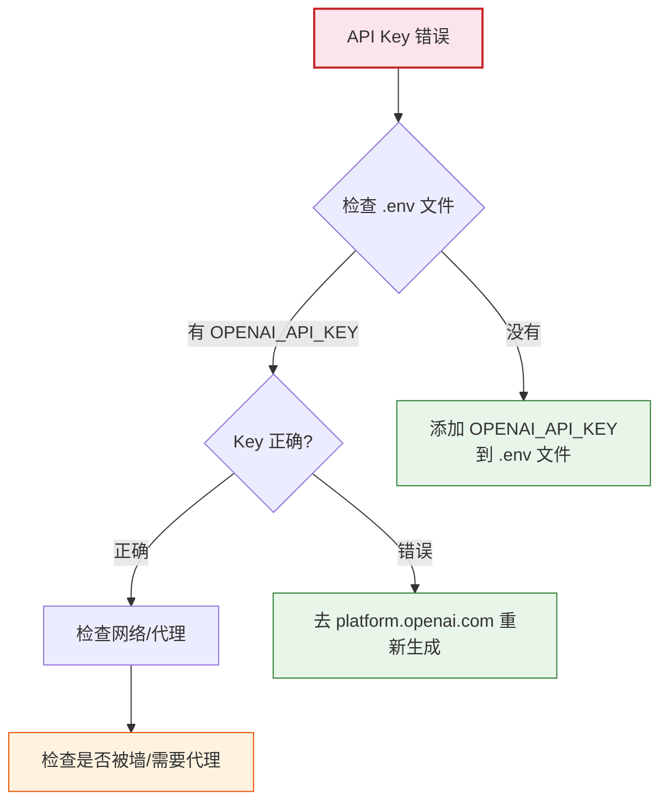
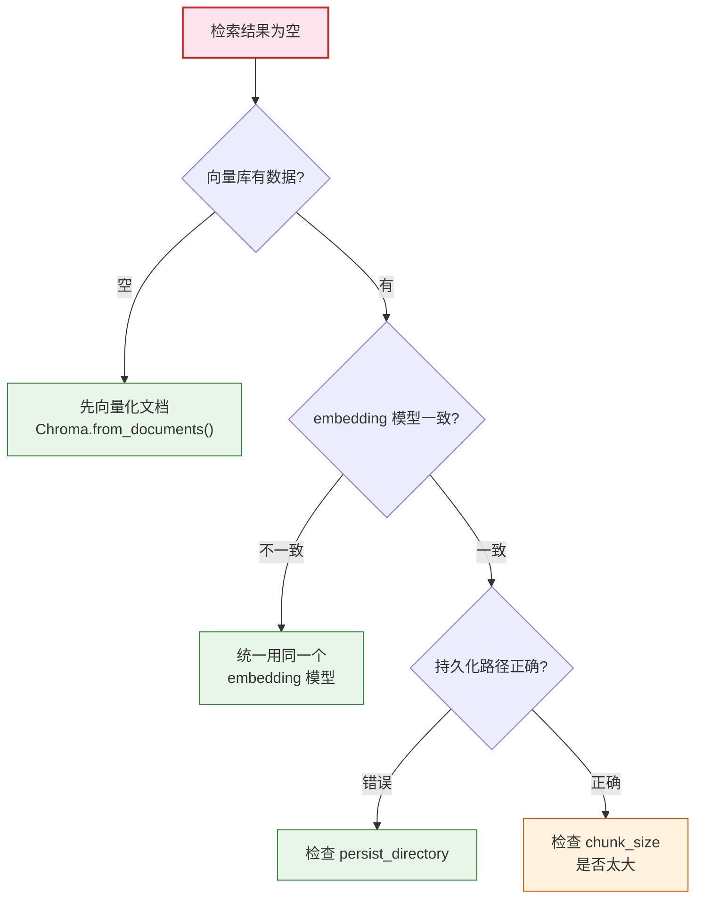
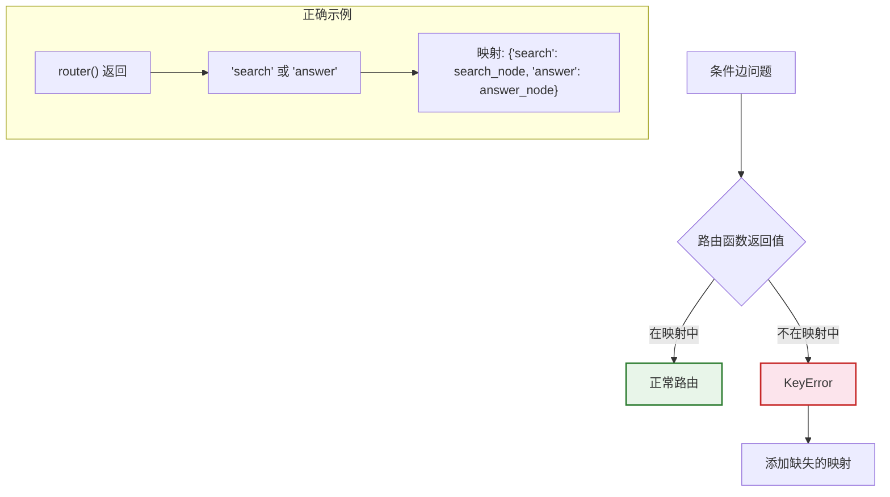

# 附录 C：常见错误与故障排除速查手册

> **定位**：收录 LangChain 开发中最常见的报错和故障，按场景分类，提供即查即用的解决方案。

---

## 目录

1. [环境与安装错误](#1-环境与安装错误)
2. [API 调用错误](#2-api-调用错误)
3. [链与 LCEL 错误](#3-链与-lcel-错误)
4. [RAG 检索错误](#4-rag-检索错误)
5. [Agent 工具错误](#5-agent-工具错误)
6. [LangGraph 错误](#6-langgraph-错误)
7. [部署运行错误](#7-部署运行错误)

---

## 1. 环境与安装错误

### 错误 1：ModuleNotFoundError

```
ModuleNotFoundError: No module named 'langchain'
```

| 项 | 说明 |
|----|------|
| **原因** | 未安装或未激活虚拟环境 |
| **解决** | `source venv/bin/activate && pip install langchain` |
| **验证** | `python -c "import langchain; print(langchain.__version__)"` |

### 错误 2：ImportError 导入路径

```
ImportError: cannot import name 'ChatOpenAI' from 'langchain'
```

| 项 | 说明 |
|----|------|
| **原因** | v0.2+ 导入路径变化 |
| **解决** | `from langchain_openai import ChatOpenAI`（不再是 `from langchain`） |
| **对照** | 见 `知识库/13_最佳实践与反模式手册.md` 第8节迁移表 |

### 错误 3：pydantic 版本冲突

```
pydantic.errors.PydanticImportError: 
```

| 项 | 说明 |
|----|------|
| **原因** | pydantic v1 和 v2 不兼容 |
| **解决** | `pip install pydantic>=2.0` + `pip install langchain>=0.2` |
| **注意** | LangChain 0.2+ 需要 pydantic 2.x |

### 错误 4：chromadb 安装失败

```
ERROR: Could not build wheels for chromadb
```

| 项 | 说明 |
|----|------|
| **原因** | 缺少编译工具 |
| **解决** | `apt install gcc g++` 或 `xcode-select --install` |
| **替代** | `pip install langchain-chroma`（预编译版） |

---

## 2. API 调用错误

### 错误 5：AuthenticationError

```
openai.AuthenticationError: Incorrect API key provided
```



> **图解说明**：API Key 错误排查流程——先检查 .env 文件有没有 Key→没有就添加→有就检查是否正确→正确就检查网络。

### 错误 6：RateLimitError

```
openai.RateLimitError: Rate limit reached
```

| 项 | 说明 |
|----|------|
| **原因** | 调用频率超出限制 |
| **解决1** | `llm.with_retry(stop_after_attempt=3)` 自动重试 |
| **解决2** | 降低调用频率（加 sleep） |
| **解决3** | 升级 OpenAI 用量等级 |

### 错误 7：Timeout

```
httpx.TimeoutException: Request timed out
```

| 项 | 说明 |
|----|------|
| **原因** | 请求超时（默认30秒） |
| **解决** | `ChatOpenAI(timeout=60)` 增加超时 |
| **备选** | `.with_fallbacks()` 切换更快的模型 |

### 错误 8：ContextLengthExceeded

```
openai.BadRequestError: context_length_exceeded
```

| 项 | 说明 |
|----|------|
| **原因** | 输入 token 超过模型上限 |
| **解决1** | 减少 Top-K（如 k=3→k=2） |
| **解决2** | 用上下文压缩（见 `知识库/08`） |
| **解决3** | 换用更长上下文的模型（如 GPT-4o 128K） |

---

## 3. 链与 LCEL 错误

### 错误 9：Runnable 类型不匹配

```
TypeError: Expected Runnable, got str
```

| 项 | 说明 |
|----|------|
| **原因** | 管道中混入了非 Runnable 对象 |
| **解决** | 用 `RunnableLambda()` 包装普通函数 |
| **示例** | `chain = prompt \| RunnableLambda(my_func) \| parser` |

### 错误 10：RunnablePassthrough 误用

```python
# ❌ 错误：丢失了 question
chain = {"context": retriever} | prompt | llm
# prompt 需要 {context} 和 {question}，但 question 丢了

# ✅ 正确：用 RunnablePassthrough 保留原始输入
chain = {
    "context": retriever,
    "question": RunnablePassthrough(),
} | prompt | llm
```

### 错误 11：流式输出无内容

```
chain.stream() 返回空 chunk
```

| 项 | 说明 |
|----|------|
| **原因** | 链中有非流式组件（如某些 Parser） |
| **解决1** | 用 `StrOutputParser()`（支持流式） |
| **解决2** | 用 `astream_events(version="v2")` 看每步 |
| **调试** | `async for e in chain.astream_events(...): print(e["event"])` |

---

## 4. RAG 检索错误

### 错误 12：检索结果为空

```
retriever.invoke("问题") → []
```



> **图解说明**：检索结果为空时的排查流程——先检查向量库有没有数据→再检查 embedding 模型是否一致→再检查持久化路径→最后检查分块大小。

### 错误 13：Chroma 持久化丢失

```
重启后向量库数据丢失
```

| 项 | 说明 |
|----|------|
| **原因** | 未调用 `persist()` 或路径错误 |
| **解决** | `Chroma(persist_directory="./chroma_db")` 指定路径 |
| **注意** | v0.5+ 不需要手动 `persist()`，自动保存 |

### 错误 14：检索相关性差

```
检索到了文档但与问题不相关
```

| 项 | 说明 |
|----|------|
| **原因1** | 分块太大——关键信息被淹没 |
| **解决1** | 减小 `chunk_size`（500→300） |
| **原因2** | 没有重排序 |
| **解决2** | 加 Re-Ranking（见 `知识库/08`） |
| **原因3** | 查询太短/模糊 |
| **解决3** | 加 Multi-Query 改写 |

---

## 5. Agent 工具错误

### 错误 15：Agent 死循环

```
Agent 一直调用工具，不输出最终答案
```

| 项 | 说明 |
|----|------|
| **原因** | 无迭代限制 + 工具描述不清 |
| **解决1** | `AgentExecutor(max_iterations=5)` |
| **解决2** | 改进工具描述——清晰说明何时用 |
| **解决3** | `early_stopping_method="generate"` 超时让 LLM 总结 |

### 错误 16：工具解析失败

```
Agent parser error: Could not parse tool call
```

| 项 | 说明 |
|----|------|
| **原因** | LLM 输出格式不符合 Agent 要求 |
| **解决** | `handle_parsing_errors=True` |
| **升级** | 用 `create_tool_calling_agent`（原生工具调用，不需解析） |

### 错误 17：工具参数错误

```
Tool input validation error
```

| 项 | 说明 |
|----|------|
| **原因** | LLM 传了错误类型的参数 |
| **解决1** | 工具描述中写清楚参数类型和示例 |
| **解决2** | 用 Pydantic 定义工具参数 |
| **解决3** | 在工具函数中加 `try/except` |

---

## 6. LangGraph 错误

### 错误 18：状态字段丢失

```
KeyError: 'messages'
```

| 项 | 说明 |
|----|------|
| **原因** | 节点函数没有返回状态中需要的字段 |
| **解决** | 节点函数必须返回包含所需字段的 dict |
| **示例** | `def node(state): return {"messages": [...]}` |

### 错误 19：图未编译

```
RuntimeError: Graph not compiled
```

| 项 | 说明 |
|----|------|
| **原因** | 调用前未编译图 |
| **解决** | `app = graph.compile()` 然后才能 `app.invoke()` |

### 错误 20：条件边路由错误

```
条件边返回了不存在的节点名
```

| 项 | 说明 |
|----|------|
| **原因** | `add_conditional_edges` 的映射不完整 |
| **解决** | 确保所有可能返回值都在映射字典中 |
| **示例** | `{"a": "node_a", "b": "node_b", END: END}` |



> **图解说明**：条件边路由问题——路由函数返回的字符串必须在 `add_conditional_edges` 的映射字典中有对应的节点名。如果返回了不在映射中的值，就会报 KeyError。

---

## 7. 部署运行错误

### 错误 21：Docker OOM

```
docker: Error: killed (OOM)
```

| 项 | 说明 |
|----|------|
| **原因** | 容器内存不足 |
| **解决1** | `docker-compose` 中 `deploy.resources.limits.memory: 2G` |
| **解决2** | 减少 uvicorn workers 数量 |
| **解决3** | 优化检索（减少内存中的文档数量） |

### 错误 22：CORS 错误

```
Access-Control-Allow-Origin error
```

| 项 | 说明 |
|----|------|
| **原因** | 前端跨域请求被拒 |
| **解决** | FastAPI 加 `CORSMiddleware` |
| **代码** | `app.add_middleware(CORSMiddleware, allow_origins=["*"])` |

### 错误 23：Uvicorn 多进程问题

```
Multiple instances of ChromaDB running
```

| 项 | 说明 |
|----|------|
| **原因** | 多 worker 进程同时访问同一个 ChromaDB |
| **解决1** | ChromaDB 独立部署为服务 |
| **解决2** | 用 `--workers 1`（单进程） |
| **最佳** | docker-compose 中 ChromaDB 单独容器 |

---

## 快速排查索引

| 报错关键词 | 查看 |
|-----------|------|
| ModuleNotFoundError | 第1节 |
| ImportError | 第1节 |
| AuthenticationError | 第2节 |
| RateLimitError | 第2节 |
| Timeout | 第2节 |
| context_length | 第2节 |
| Runnable/TypeError | 第3节 |
| 检索为空 | 第4节 |
| Chroma 丢失 | 第4节 |
| Agent 循环 | 第5节 |
| parser error | 第5节 |
| 状态/编译 | 第6节 |
| OOM/CORS | 第7节 |

---

## 配套文档

- 📖 `附录A_环境搭建与快速入门指南.md` — 环境配置
- 📖 `附录B_术语表与API速查卡.md` — API 速查
- 📖 `知识库/13_最佳实践与反模式手册.md` — 最佳实践
