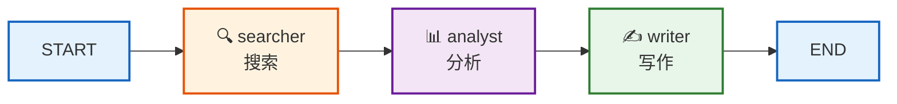
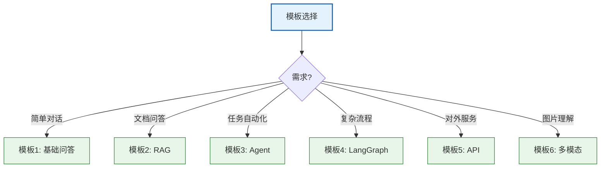

# 附录 D：实战项目模板代码集

> **定位**：提供 6 个可直接运行的 LangChain/LangGraph 完整项目模板，覆盖最常见的应用场景。每个模板含完整代码、依赖清单和运行说明。

---

## 目录

1. [基础问答机器人](#1-基础问答机器人)
2. [文档 RAG 问答系统](#2-文档-rag-问答系统)
3. [多工具 Agent](#3-多工具-agent)
4. [LangGraph 多 Agent 协作](#4-langgraph-多-agent-协作)
5. [流式 Web API 服务](#5-流式-web-api-服务)
6. [多模态图文助手](#6-多模态图文助手)

---

## 1. 基础问答机器人

### 项目结构

```
project-1-basic-chatbot/
├── .env
├── requirements.txt
├── main.py
└── README.md
```

### requirements.txt

```
langchain>=0.2.0
langchain-openai>=0.1.0
python-dotenv>=1.0.0
```

### .env

```
OPENAI_API_KEY=sk-your-key-here
```

### main.py

```python
"""基础问答机器人 - 带对话记忆"""
import os
from dotenv import load_dotenv
from langchain_openai import ChatOpenAI
from langchain_core.prompts import ChatPromptTemplate, MessagesPlaceholder
from langchain_core.messages import HumanMessage, AIMessage
from langchain_core.runnables import RunnablePassthrough
from langchain_core.chat_history import InMemoryChatMessageHistory
from langchain_core.runnables.history import RunnableWithMessageHistory

load_dotenv()

# === 模型 ===
llm = ChatOpenAI(
    model="gpt-4o-mini",
    temperature=0.7,
).with_retry(stop_after_attempt=3)

# === Prompt ===
prompt = ChatPromptTemplate.from_messages([
    ("system", "你是一个友好的AI助手。请简洁清晰地回答问题。"),
    MessagesPlaceholder(variable_name="history"),
    ("human", "{input}"),
])

# === 链 ===
chain = prompt | llm

# === 会话管理 ===
session_store = {}

def get_session_history(session_id: str):
    if session_id not in session_store:
        session_store[session_id] = InMemoryChatMessageHistory()
    return session_store[session_id]

# 带历史记忆的链
chain_with_history = RunnableWithMessageHistory(
    chain,
    get_session_history,
    input_messages_key="input",
    history_messages_key="history",
)

# === 主循环 ===
def main():
    print("🤖 问答机器人已启动（输入 'quit' 退出）")
    session_id = "default"
    while True:
        user_input = input("\n你: ").strip()
        if user_input.lower() in ("quit", "exit", "退出"):
            break
        response = chain_with_history.invoke(
            {"input": user_input},
            config={"configurable": {"session_id": session_id}},
        )
        print(f"AI: {response.content}")

if __name__ == "__main__":
    main()
```

### 运行

```bash
pip install -r requirements.txt
python main.py
```

---

## 2. 文档 RAG 问答系统

### 项目结构

```
project-2-rag-qa/
├── .env
├── requirements.txt
├── data/           # 放文档
├── build_index.py  # 构建索引
├── main.py         # 问答入口
└── README.md
```

### requirements.txt

```
langchain>=0.2.0
langchain-openai>=0.1.0
langchain-chroma>=0.1.0
langchain-community>=0.2.0
python-dotenv>=1.0.0
tiktoken>=0.5.0
```

### build_index.py

```python
"""构建向量索引"""
import os
from dotenv import load_dotenv
from langchain_community.document_loaders import DirectoryLoader
from langchain_text_splitters import RecursiveCharacterTextSplitter
from langchain_openai import OpenAIEmbeddings
from langchain_chroma import Chroma

load_dotenv()

# 加载文档
loader = DirectoryLoader("./data", glob="**/*.txt")
docs = loader.load()
print(f"加载 {len(docs)} 个文档")

# 分块
splitter = RecursiveCharacterTextSplitter(
    chunk_size=500,
    chunk_overlap=50,
)
chunks = splitter.split_documents(docs)
print(f"分块为 {len(chunks)} 段")

# 向量化并存储
embedding = OpenAIEmbeddings()
vectorstore = Chroma.from_documents(
    chunks,
    embedding,
    persist_directory="./chroma_db",
)
print(f"索引构建完成，存入 ./chroma_db")
```

### main.py

```python
"""RAG 问答系统"""
import os
from dotenv import load_dotenv
from langchain_openai import ChatOpenAI, OpenAIEmbeddings
from langchain_chroma import Chroma
from langchain_core.prompts import ChatPromptTemplate
from langchain_core.output_parsers import StrOutputParser
from langchain_core.runnables import RunnablePassthrough
from langchain_core.runnables import RunnableLambda

load_dotenv()

# === 模型 ===
llm = ChatOpenAI(model="gpt-4o-mini", temperature=0).with_retry(stop_after_attempt=3)

# === 检索器 ===
embedding = OpenAIEmbeddings()
vectorstore = Chroma(
    persist_directory="./chroma_db",
    embedding_function=embedding,
)
retriever = vectorstore.as_retriever(search_kwargs={"k": 3})

# === Prompt ===
prompt = ChatPromptTemplate.from_template("""
基于以下文档回答问题。如果文档中没有答案，请说明。

文档:
{context}

问题: {question}
""")

# === 格式化函数 ===
def format_docs(docs):
    return "\n\n".join(d.page_content for d in docs)

# === RAG 链 ===
rag_chain = (
    {"context": retriever | RunnableLambda(format_docs),
     "question": RunnablePassthrough()}
    | prompt
    | llm
    | StrOutputParser()
)

# === 带来源的版本 ===
def rag_with_sources(question: str):
    docs = retriever.invoke(question)
    answer = rag_chain.invoke(question)
    sources = [d.metadata.get("source", "未知") for d in docs]
    return {"answer": answer, "sources": sources}

# === 主循环 ===
def main():
    print("📚 RAG 问答系统（输入 'quit' 退出）")
    while True:
        q = input("\n问题: ").strip()
        if q.lower() in ("quit", "exit"):
            break
        result = rag_with_sources(q)
        print(f"\n回答: {result['answer']}")
        print(f"来源: {result['sources']}")

if __name__ == "__main__":
    main()
```

### 运行

```bash
mkdir data && cp your_docs.txt data/
python build_index.py
python main.py
```

---

## 3. 多工具 Agent

### 项目结构

```
project-3-agent/
├── .env
├── requirements.txt
├── tools.py
├── main.py
└── README.md
```

### requirements.txt

```
langchain>=0.2.0
langchain-openai>=0.1.0
langchain-experimental>=0.0.60
python-dotenv>=1.0.0
```

### tools.py

```python
"""自定义工具集"""
import os
import subprocess
from langchain_core.tools import tool

@tool
def calculator(expression: str) -> str:
    """计算数学表达式。输入: 数学表达式，如 '2 + 3 * 4'。"""
    try:
        result = eval(expression)  # 简化示例，生产环境用 ast.literal_eval
        return f"结果: {result}"
    except Exception as e:
        return f"计算失败: {e}"

@tool
def file_reader(filepath: str) -> str:
    """读取文本文件内容。输入: 文件路径。"""
    try:
        with open(filepath, "r", encoding="utf-8") as f:
            return f.read()[:2000]  # 限制长度
    except FileNotFoundError:
        return f"文件不存在: {filepath}"

@tool
def shell_runner(command: str) -> str:
    """执行shell命令并返回输出。输入: shell命令。"""
    try:
        result = subprocess.run(
            command, shell=True, capture_output=True, text=True, timeout=10
        )
        output = result.stdout or result.stderr
        return output[:1000]
    except subprocess.TimeoutExpired:
        return "命令超时"

TOOLS = [calculator, file_reader, shell_runner]
```

### main.py

```python
"""多工具 Agent"""
from dotenv import load_dotenv
from langchain_openai import ChatOpenAI
from langchain_core.prompts import ChatPromptTemplate
from langchain.agents import create_tool_calling_agent, AgentExecutor
from tools import TOOLS

load_dotenv()

# === 模型 ===
llm = ChatOpenAI(model="gpt-4o-mini", temperature=0)

# === Prompt ===
prompt = ChatPromptTemplate.from_messages([
    ("system", """你是一个智能助手，可以调用工具完成任务。
可用工具: 计算器(calculator)、文件读取(file_reader)、命令执行(shell_runner)。
请先判断需要调用哪个工具，调用后根据结果回答。"""),
    ("human", "{input}"),
    ("placeholder", "{agent_scratchpad}"),
])

# === Agent ===
agent = create_tool_calling_agent(llm, TOOLS, prompt)
executor = AgentExecutor(
    agent=agent,
    tools=TOOLS,
    max_iterations=5,
    handle_parsing_errors=True,
    verbose=True,
)

# === 主循环 ===
def main():
    print("🤖 Agent 已启动（输入 'quit' 退出）")
    while True:
        user_input = input("\n你: ").strip()
        if user_input.lower() in ("quit", "exit"):
            break
        result = executor.invoke({"input": user_input})
        print(f"Agent: {result['output']}")

if __name__ == "__main__":
    main()
```

---

## 4. LangGraph 多 Agent 协作

### 项目结构

```
project-4-langgraph/
├── .env
├── requirements.txt
├── main.py
└── README.md
```

### main.py

```python
"""LangGraph 多 Agent 协作 - 研究助手"""
import operator
from typing import Annotated, TypedDict
from dotenv import load_dotenv
from langchain_openai import ChatOpenAI
from langchain_core.messages import HumanMessage, SystemMessage
from langgraph.graph import StateGraph, START, END

load_dotenv()

llm = ChatOpenAI(model="gpt-4o-mini", temperature=0)

# === 状态 ===
class ResearchState(TypedDict):
    topic: str
    search_results: Annotated[list, operator.add]
    analysis: str
    report: str

# === 节点 ===
def searcher(state: ResearchState) -> dict:
    """搜索节点 - 模拟搜索"""
    topic = state["topic"]
    # 实际场景中调用搜索工具
    results = [f"关于 '{topic}' 的搜索结果 1", f"关于 '{topic}' 的搜索结果 2"]
    return {"search_results": results}

def analyst(state: ResearchState) -> dict:
    """分析节点"""
    topic = state["topic"]
    results = state["search_results"]
    analysis = llm.invoke([
        SystemMessage("你是分析专家。基于搜索结果，提取关键信息。"),
        HumanMessage(f"主题: {topic}\n结果: {results}"),
    ])
    return {"analysis": analysis.content}

def writer(state: ResearchState) -> dict:
    """写作节点"""
    topic = state["topic"]
    analysis = state["analysis"]
    report = llm.invoke([
        SystemMessage("你是技术写作专家。基于分析结果写一份简洁报告。"),
        HumanMessage(f"主题: {topic}\n分析: {analysis}"),
    ])
    return {"report": report.content}

# === 构图 ===
graph = StateGraph(ResearchState)
graph.add_node("searcher", searcher)
graph.add_node("analyst", analyst)
graph.add_node("writer", writer)
graph.add_edge(START, "searcher")
graph.add_edge("searcher", "analyst")
graph.add_edge("analyst", "writer")
graph.add_edge("writer", END)

app = graph.compile()

# === 运行 ===
def main():
    topic = input("研究主题: ")
    result = app.invoke({"topic": topic, "search_results": []})
    print(f"\n{'='*50}")
    print(result["report"])

if __name__ == "__main__":
    main()
```



> **图解说明**：LangGraph 多 Agent 协作流程——搜索节点收集信息→分析节点提炼关键点→写作节点生成报告。每个节点有独立职责，通过状态传递数据。

---

## 5. 流式 Web API 服务

### 项目结构

```
project-5-api/
├── .env
├── requirements.txt
├── main.py
├── Dockerfile
└── README.md
```

### requirements.txt

```
langchain>=0.2.0
langchain-openai>=0.1.0
fastapi>=0.110.0
uvicorn>=0.27.0
python-dotenv>=1.0.0
sse-starlette>=1.6.0
```

### main.py

```python
"""流式 Web API - SSE 流式输出"""
import os
from dotenv import load_dotenv
from fastapi import FastAPI
from fastapi.responses import StreamingResponse
from fastapi.middleware.cors import CORSMiddleware
from pydantic import BaseModel
from langchain_openai import ChatOpenAI
from langchain_core.prompts import ChatPromptTemplate
from langchain_core.output_parsers import StrOutputParser

load_dotenv()

app = FastAPI(title="LangChain API")
app.add_middleware(CORSMiddleware, allow_origins=["*"])

# === 模型+链 ===
llm = ChatOpenAI(model="gpt-4o-mini", temperature=0.7).with_retry(stop_after_attempt=3)
prompt = ChatPromptTemplate.from_template("你是一个助手。回答: {question}")
chain = prompt | llm | StrOutputParser()

# === 接口 ===
class Question(BaseModel):
    question: str

@app.post("/ask")
async def ask(q: Question):
    """同步回答"""
    result = await chain.ainvoke({"question": q.question})
    return {"answer": result}

@app.post("/stream")
async def stream(q: Question):
    """SSE 流式回答"""
    async def generate():
        async for chunk in chain.astream({"question": q.question}):
            yield f"data: {chunk}\n\n"
        yield "data: [DONE]\n\n"
    return StreamingResponse(generate(), media_type="text/event-stream")

@app.get("/health")
async def health():
    return {"status": "ok"}

# === 启动 ===
if __name__ == "__main__":
    import uvicorn
    uvicorn.run(app, host="0.0.0.0", port=8000)
```

### Dockerfile

```dockerfile
FROM python:3.11-slim
WORKDIR /app
COPY requirements.txt .
RUN pip install --no-cache-dir -r requirements.txt
COPY . .
EXPOSE 8000
CMD ["uvicorn", "main:app", "--host", "0.0.0.0", "--port", "8000"]
```

### 运行

```bash
# 本地
python main.py

# Docker
docker build -t langchain-api .
docker run -p 8000:8000 --env-file .env langchain-api
```

---

## 6. 多模态图文助手

### 项目结构

```
project-6-multimodal/
├── .env
├── requirements.txt
├── main.py
└── README.md
```

### requirements.txt

```
langchain>=0.2.0
langchain-openai>=0.1.0
python-dotenv>=1.0.0
```

### main.py

```python
"""多模态图文助手 - 图片理解 + 图文对话"""
import base64
from dotenv import load_dotenv
from langchain_openai import ChatOpenAI
from langchain_core.prompts import ChatPromptTemplate, MessagesPlaceholder
from langchain_core.messages import HumanMessage, SystemMessage

load_dotenv()

llm = ChatOpenAI(model="gpt-4o-mini", temperature=0)

def encode_image(path: str) -> str:
    with open(path, "rb") as f:
        return base64.b64encode(f.read()).decode()

def describe_image(image_path: str, question: str = "描述这张图片") -> str:
    """图片理解"""
    img_b64 = encode_image(image_path)
    message = HumanMessage(content=[
        {"type": "text", "text": question},
        {"type": "image_url", "image_url": {"url": f"data:image/jpeg;base64,{img_b64}"}},
    ])
    response = llm.invoke([message])
    return response.content

def chat_about_image(image_path: str):
    """图文对话"""
    img_b64 = encode_image(image_path)
    print("📷 图片已加载，开始对话（输入 'quit' 退出）")
    messages = [SystemMessage(content="你是一个图片分析助手。")]
    while True:
        user_input = input("\n你: ").strip()
        if user_input.lower() in ("quit", "exit"):
            break
        message = HumanMessage(content=[
            {"type": "text", "text": user_input},
            {"type": "image_url", "image_url": {"url": f"data:image/jpeg;base64,{img_b64}"}},
        ])
        messages.append(message)
        response = llm.invoke(messages)
        messages.append(response)
        print(f"AI: {response.content}")

def main():
    image_path = input("图片路径: ").strip()
    mode = input("模式 (1=描述 2=对话): ").strip()
    if mode == "1":
        result = describe_image(image_path)
        print(result)
    else:
        chat_about_image(image_path)

if __name__ == "__main__":
    main()
```

---

## 模板总览

| 编号 | 模板 | 核心技术 | 适合场景 |
|------|------|---------|---------|
| 1 | 基础问答机器人 | LLM + Memory | 入门练手 |
| 2 | 文档 RAG 问答 | RAG + Chroma | 知识库问答 |
| 3 | 多工具 Agent | Tool Calling | 任务自动化 |
| 4 | 多 Agent 协作 | LangGraph | 复杂流程 |
| 5 | 流式 Web API | FastAPI + SSE | API 服务 |
| 6 | 多模态图文 | Vision Model | 图片理解 |



> **图解说明**：根据需求选择模板——简单对话用模板1、文档问答用模板2、自动化任务用模板3、复杂多步流程用模板4、对外提供API用模板5、图片理解用模板6。

---

## 配套文档

- 📖 `附录A_环境搭建与快速入门指南.md` — 环境配置
- 📖 `附录B_术语表与API速查卡.md` — API 速查
- 📖 `附录C_常见错误与故障排除速查手册.md` — 错误排查
- 📖 `知识库/13_最佳实践与反模式手册.md` — 最佳实践
