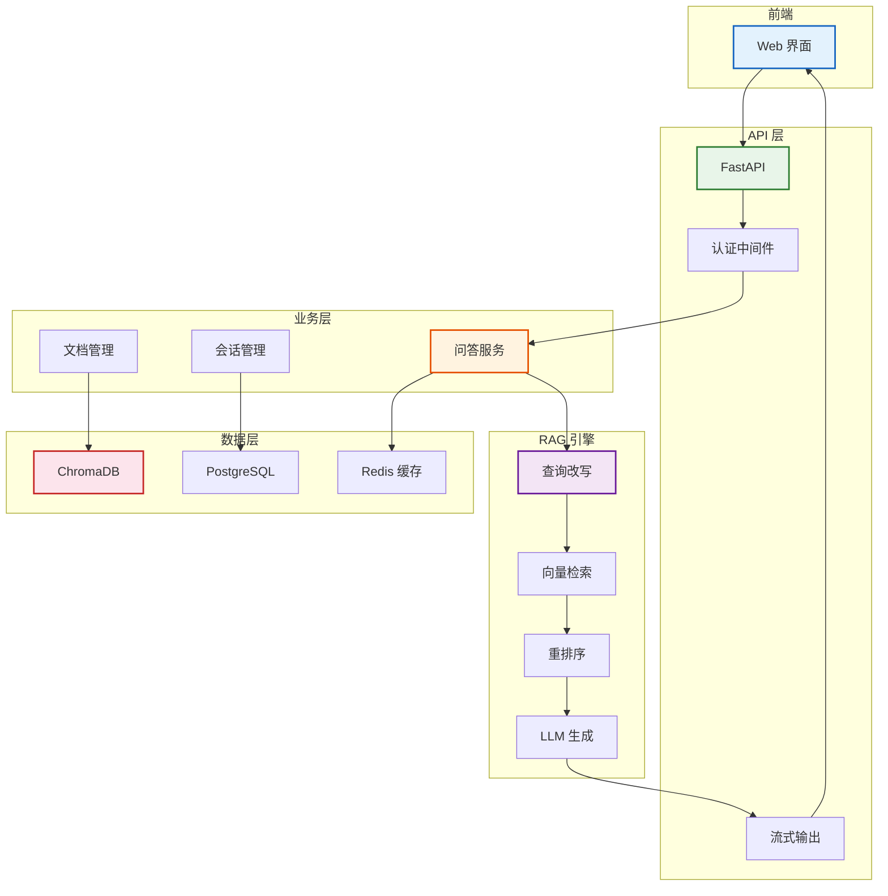
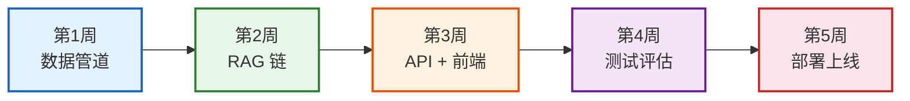

# 附录 E：端到端项目实战——企业知识库问答系统

> **定位**：一个完整的企业级知识库问答系统项目，从需求分析到部署上线全流程，可直接作为生产项目参考。

---

## 目录

1. [项目概述与架构](#1-项目概述与架构)
2. [数据准备管道](#2-数据准备管道)
3. [RAG 链构建](#3-rag-链构建)
4. [测试与评估](#4-测试与评估)
5. [API 服务部署](#5-api-服务部署)
6. [Docker 容器化](#6-docker-容器化)

---

## 1. 项目概述与架构

### 需求描述

- **目标**：构建一个企业内部知识库问答系统
- **用户**：企业员工通过 Web 界面提问
- **功能**：文档上传、智能问答、来源引用、多轮对话
- **规模**：10万级文档、100+ 并发用户

### 系统架构



> **图解说明**：系统五层架构——前端 Web 界面 → FastAPI 接口层 → 问答/文档/会话业务层 → RAG 引擎(查询改写→检索→重排序→生成) → 数据层(向量库+关系库+缓存)。每层职责清晰、独立扩展。

### 技术选型

| 组件 | 选型 | 原因 |
|------|------|------|
| 框架 | LangChain + LangGraph | 成熟生态 |
| LLM | GPT-4o-mini | 性价比 |
| Embedding | text-embedding-3-small | 兼容性好 |
| 向量库 | Chroma → Milvus | 开发用 Chroma，生产用 Milvus |
| 关系库 | PostgreSQL | 存会话/用户 |
| 缓存 | Redis | LLM 响应缓存 |
| API | FastAPI | 异步、自动文档 |
| 部署 | Docker Compose | 一键编排 |

---

## 2. 数据准备管道

### 目录结构

```
enterprise-qa/
├── docker-compose.yml
├── Dockerfile
├── requirements.txt
├── .env
├── app/
│   ├── __init__.py
│   ├── main.py              # FastAPI 入口
│   ├── config.py             # 配置管理
│   ├── pipeline/
│   │   ├── loader.py         # 文档加载
│   │   ├── splitter.py       # 分块
│   │   └── indexer.py        # 向量化入库
│   ├── rag/
│   │   ├── retriever.py      # 检索器
│   │   ├── reranker.py       # 重排序
│   │   └── chain.py          # RAG 链
│   ├── api/
│   │   ├── routes.py         # 路由
│   │   └── auth.py           # 认证
│   └── models/
│       └── schemas.py        # 数据模型
├── data/
│   ├── raw/                  # 原始文档
│   └── processed/            # 处理后
└── tests/
    └── test_rag.py
```

### 数据管道代码

```python
# app/pipeline/loader.py
from langchain_community.document_loaders import (
    PyPDFLoader, Docx2txtLoader, TextLoader, DirectoryLoader
)
from langchain_core.documents import Document
from pathlib import Path
import hashlib

class DocumentLoader:
    """统一文档加载器"""
    
    LOADERS = {
        ".pdf": PyPDFLoader,
        ".docx": Docx2txtLoader,
        ".txt": TextLoader,
        ".md": TextLoader,
    }
    
    def load_directory(self, dir_path: str) -> list:
        """加载目录下所有文档"""
        docs = []
        for file in Path(dir_path).rglob("*"):
            if file.suffix in self.LOADERS:
                loader = self.LOADERS[file.suffix](str(file))
                loaded = loader.load()
                # 添加唯一ID
                for d in loaded:
                    d.metadata["doc_id"] = hashlib.md5(
                        d.page_content.encode()
                    ).hexdigest()
                docs.extend(loaded)
        return docs
```

```python
# app/pipeline/indexer.py
from langchain_openai import OpenAIEmbeddings
from langchain_chroma import Chroma
from langchain_text_splitters import RecursiveCharacterTextSplitter
import re

class Indexer:
    """文档处理 + 向量化 + 入库"""
    
    def __init__(self, persist_dir: str, collection: str = "docs"):
        self.embeddings = OpenAIEmbeddings(model="text-embedding-3-small")
        self.splitter = RecursiveCharacterTextSplitter(
            chunk_size=500, chunk_overlap=50,
            separators=["\n\n", "\n", "。", ".", " ", ""],
        )
        self.vectorstore = Chroma(
            persist_directory=persist_dir,
            embedding_function=self.embeddings,
            collection_name=collection,
        )
    
    def process_and_index(self, docs: list) -> int:
        """完整处理管道"""
        # 1. 去重
        seen = set()
        unique = []
        for d in docs:
            if d.metadata["doc_id"] not in seen:
                seen.add(d.metadata["doc_id"])
                unique.append(d)
        
        # 2. 清洗
        for d in unique:
            d.page_content = re.sub(r'\s+', ' ', d.page_content).strip()
        
        # 3. 分块
        chunks = self.splitter.split_documents(unique)
        
        # 4. 标注
        for i, c in enumerate(chunks):
            c.metadata["chunk_id"] = i
        
        # 5. 过滤
        chunks = [c for c in chunks if len(c.page_content) > 10]
        
        # 6. 入库
        self.vectorstore.add_documents(chunks)
        
        return len(chunks)
```

---

## 3. RAG 链构建

### Advanced RAG 实现

```python
# app/rag/chain.py
from langchain_openai import ChatOpenAI
from langchain_core.prompts import ChatPromptTemplate
from langchain_core.output_parsers import StrOutputParser
from langchain_core.runnables import RunnablePassthrough, RunnableLambda
from langchain.retrievers import MultiQueryRetriever
from langchain.retrievers.document_compressors import CrossEncoderReranker
from langchain_community.cross_encoders import HuggingFaceCrossEncoder

class RAGChain:
    """Advanced RAG: 查询改写 → 检索 → 重排序 → 生成"""
    
    def __init__(self, vectorstore, config):
        self.llm = ChatOpenAI(
            model=config.model_name,
            temperature=0,
        ).with_retry(stop_after_attempt=3).with_fallbacks([
            ChatOpenAI(model="gpt-4o-mini"),
        ])
        
        # Multi-Query 查询改写
        self.retriever = MultiQueryRetriever.from_llm(
            retriever=vectorstore.as_retriever(search_kwargs={"k": 10}),
            llm=self.llm,
        )
        
        # 重排序
        self.reranker = CrossEncoderReranker(
            model=HuggingFaceCrossEncoder(model_name="BAAI/bge-reranker-base"),
            top_n=3,
        )
        
        self.prompt = ChatPromptTemplate.from_template("""
你是企业知识库助手。基于以下文档回答问题。
要求:
1. 只基于文档内容回答,不编造
2. 引用来源
3. 如果文档中没有答案,说"未找到相关信息"

文档:
{context}

问题: {question}
""")
    
    def _format(self, docs):
        return "\n\n".join(
            f"[来源:{d.metadata.get('source','未知')}]\n{d.page_content}"
            for d in docs
        )
    
    def build(self):
        """构建 RAG 链"""
        return (
            {
                "context": self.retriever | self.reranker | RunnableLambda(self._format),
                "question": RunnablePassthrough(),
            }
            | self.prompt
            | self.llm
            | StrOutputParser()
        )
    
    def build_streaming(self):
        """流式版本"""
        return self.build()
```

---

## 4. 测试与评估

### 测试用例

```python
# tests/test_rag.py
import pytest

class TestRAG:
    
    TEST_CASES = [
        {"q": "年假有几天?", "expect_keywords": ["年假", "天"]},
        {"q": "报销流程是什么?", "expect_keywords": ["报销", "流程"]},
        {"q": "入职需要什么材料?", "expect_keywords": ["入职", "材料"]},
    ]
    
    def test_retrieval_relevance(self, rag_chain):
        """测试检索相关性"""
        for case in self.TEST_CASES:
            result = rag_chain.invoke(case["q"])
            assert any(kw in result for kw in case["expect_keywords"])
    
    def test_no_hallucination(self, rag_chain):
        """测试不编造"""
        result = rag_chain.invoke("公司有火星基地吗?")
        assert "未找到" in result or "没有" in result
    
    def test_streaming(self, rag_chain):
        """测试流式输出"""
        import asyncio
        async def test():
            async for chunk in rag_chain.astream("年假有几天?"):
                assert len(chunk) > 0
        asyncio.run(test())
```

### RAGAS 评估

```python
from ragas import evaluate
from ragas.metrics import (
    faithfulness,        # 忠实度
    answer_relevancy,    # 回答相关性
    context_precision,   # 上下文精确率
    context_recall,      # 上下文召回率
)
from datasets import Dataset

# 构建评估数据集
eval_data = Dataset.from_dict({
    "question": ["年假有几天?", "报销流程是什么?"],
    "answer": [rag_chain.invoke(q) for q in [...]],
    "contexts": [[d.page_content for d in retriever.invoke(q)] for q in [...]],
    "ground_truth": ["年假5天", "提交发票到财务部"],
})

# 评估
results = evaluate(eval_data, metrics=[
    faithfulness, answer_relevancy,
    context_precision, context_recall,
])
print(results)
# 目标: faithfulness > 0.9, answer_relevancy > 0.85
```

---

## 5. API 服务部署

### FastAPI 实现

```python
# app/main.py
from fastapi import FastAPI, Depends
from fastapi.responses import StreamingResponse
from fastapi.middleware.cors import CORSMiddleware
from pydantic import BaseModel

app = FastAPI(title="企业知识库 API")
app.add_middleware(CORSMiddleware, allow_origins=["*"])

class Question(BaseModel):
    question: str
    session_id: str = "default"

@app.post("/ask")
async def ask(q: Question):
    result = await rag_chain.ainvoke({"question": q.question})
    return {"answer": result}

@app.post("/stream")
async def stream(q: Question):
    async def generate():
        async for chunk in rag_chain.astream({"question": q.question}):
            yield f"data: {chunk}\n\n"
        yield "data: [DONE]\n\n"
    return StreamingResponse(generate(), media_type="text/event-stream")

@app.post("/upload")
async def upload(file: UploadFile):
    # 保存文件 → 处理 → 入库
    path = f"data/raw/{file.filename}"
    with open(path, "wb") as f:
        f.write(await file.read())
    count = indexer.process_and_index([loader.load_single(path)])
    return {"status": "ok", "chunks": count}

@app.get("/health")
async def health():
    return {"status": "ok"}
```

---

## 6. Docker 容器化

### docker-compose.yml

```yaml
version: "3.9"
services:
  api:
    build: .
    ports:
      - "8000:8000"
    env_file: .env
    depends_on:
      - chroma
      - postgres
      - redis
    restart: always
    
  chroma:
    image: chromadb/chroma:latest
    ports:
      - "8001:8000"
    volumes:
      - chroma_data:/chroma/chroma
    restart: always
    
  postgres:
    image: postgres:16-alpine
    environment:
      POSTGRES_DB: enterprise_qa
      POSTGRES_USER: admin
      POSTGRES_PASSWORD: secret
    volumes:
      - pg_data:/var/lib/postgresql/data
    restart: always
    
  redis:
    image: redis:7-alpine
    restart: always

volumes:
  chroma_data:
  pg_data:
```

### Dockerfile

```dockerfile
FROM python:3.11-slim
WORKDIR /app
COPY requirements.txt .
RUN pip install --no-cache-dir -r requirements.txt
COPY . .
EXPOSE 8000
CMD ["uvicorn", "app.main:app", "--host", "0.0.0.0", "--port", "8000", "--workers", "2"]
```

### requirements.txt

```
langchain>=0.2.0
langchain-openai>=0.1.0
langchain-chroma>=0.1.0
langchain-community>=0.2.0
langchain-experimental>=0.0.60
fastapi>=0.110.0
uvicorn>=0.27.0
python-multipart>=0.0.6
ragas>=0.1.0
pytest>=8.0.0
```

---

## 项目里程碑



> **图解说明**：5 周项目里程碑——第1周数据管道、第2周 RAG 链构建、第3周 API+前端、第4周测试评估、第5周部署上线。

---

## 配套文档

- 📖 `知识库/16_RAG架构模式技术手册.md` — RAG 架构
- 📖 `知识库/17_文档解析与数据预处理技术参考.md` — 数据预处理
- 📖 `附录D_实战项目模板代码集.md` — 模板代码
