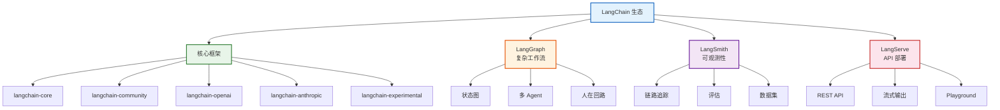
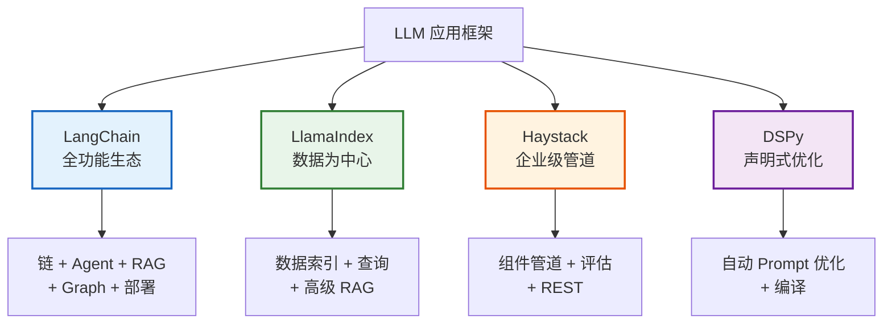
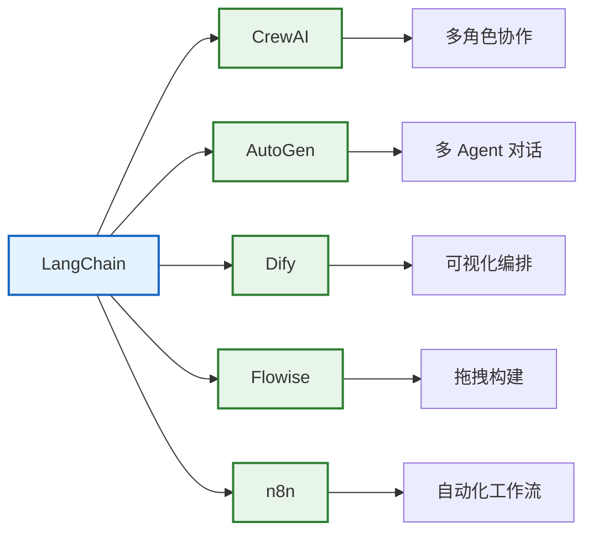
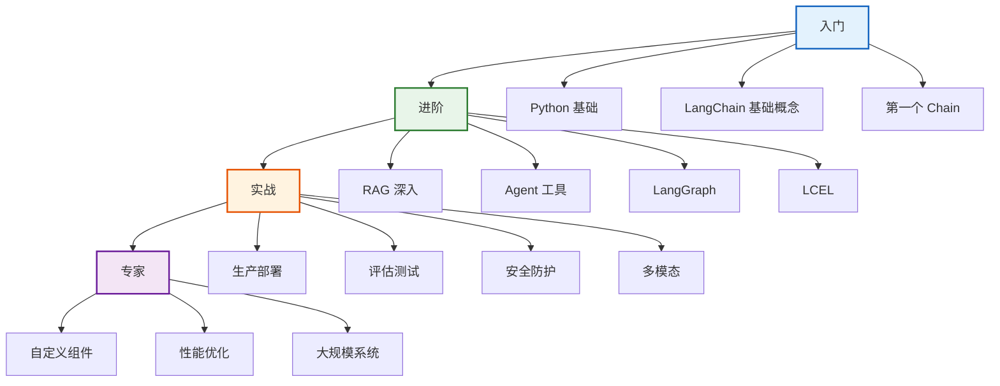

# 附录 F：LangChain 生态地图与集成指南

> **定位**：绘制 LangChain 在 LLM 应用生态中的完整地图，覆盖框架对比、工具集成、社区资源和学习路径，帮助开发者快速定位自己需要的能力。

---

## 目录

1. [LangChain 生态全景](#1-langchain-生态全景)
2. [四大框架对比](#2-四大框架对比)
3. [工具集成速查](#3-工具集成速查)
4. [社区资源与学习路径](#4-社区资源与学习路径)

---

## 1. LangChain 生态全景

> **图解说明**：LangChain 生态四大支柱——核心框架（包管理 + 集成 + 实验功能）、LangGraph（复杂工作流/多 Agent/人在回路）、LangSmith（链路追踪/评估/数据集）、LangServe（API 部署/流式/Playground）。四大支柱覆盖从开发到生产全链路。

### 包架构说明

| 包名 | 定位 | 安装 |
|------|------|------|
| langchain-core | 核心抽象 | 随 langchain 安装 |
| langchain-community | 社区集成 | `pip install langchain-community` |
| langchain-openai | OpenAI 集成 | `pip install langchain-openai` |
| langchain-anthropic | Anthropic 集成 | `pip install langchain-anthropic` |
| langchain-experimental | 实验功能 | `pip install langchain-experimental` |
| langgraph | 状态图 | `pip install langgraph` |
| langsmith | 可观测性 | `pip install langsmith` |

---

## 2. 四大框架对比

### 框架定位

> **图解说明**：四大 LLM 应用框架的定位——LangChain 是全功能生态（链/Agent/RAG/Graph/部署全覆盖）、LlamaIndex 以数据为中心（高级索引和查询）、Haystack 是企业级管道（组件化+评估）、DSPy 是声明式优化（自动优化 Prompt）。

### 对比表

| 维度 | LangChain | LlamaIndex | Haystack | DSPy |
|------|-----------|-----------|----------|------|
| **核心定位** | 全功能 | 数据中心 | 企业管道 | 声明式 |
| **学习曲线** | 中 | 中 | 中 | 高 |
| **RAG** | 强 | 极强 | 强 | 中 |
| **Agent** | 强 | 中 | 中 | 弱 |
| **工作流** | LangGraph | 弱 | Pipeline | 弱 |
| **Prompt优化** | 手动 | 手动 | 手动 | 自动 |
| **可观测性** | LangSmith | LlamaHub | 内置 | 内置 |
| **社区规模** | 最大 | 大 | 中 | 小 |
| **生态** | 最全 | 数据丰富 | 企业成熟 | 学术导向 |
| **适合** | 通用 | RAG为主 | 企业 | 研究 |

### 何时选哪个？

| 场景 | 推荐 | 原因 |
|------|------|------|
| 通用 AI 应用 | LangChain | 生态最全 |
| 数据密集 RAG | LlamaIndex | 索引能力强 |
| 企业生产 | Haystack | 管道+评估 |
| 自动优化 | DSPy | 编译器模式 |
| 多 Agent 协作 | LangChain + LangGraph | 图模型 |

---

## 3. 工具集成速查

### Agent 框架集成

> **图解说明**：LangChain 与常见工具的集成——CrewAI（多角色协作 Agent）、AutoGen（多 Agent 对话框架）、Dify（可视化编排平台）、Flowise（拖拽式构建）、n8n（自动化工作流）。可以互为补充。

### 集成方式速查

| 工具 | 类型 | 集成方式 | 适用场景 |
|------|------|---------|---------|
| CrewAI | Agent 框架 | LangChain 工具 → CrewAI Agent | 多角色协作 |
| AutoGen | Agent 框架 | LangChain LLM → AutoGen | 多 Agent 对话 |
| Dify | 低代码平台 | LangChain 链 → Dify API | 可视化编排 |
| Flowise | 低代码平台 | LangChain 组件 → Flowise 节点 | 拖拽构建 |
| n8n | 自动化 | LangChain API → n8n 节点 | 工作流自动化 |
| Hugging Face | 模型库 | `langchain-huggingface` | 开源模型 |
| Ollama | 本地模型 | `langchain-ollama` | 本地部署 |
| vLLM | 推理引擎 | `langchain-vllm` | 高速推理 |

### LLM 提供商集成

| 提供商 | 包名 | 安装 |
|--------|------|------|
| OpenAI | langchain-openai | `pip install langchain-openai` |
| Anthropic | langchain-anthropic | `pip install langchain-anthropic` |
| Google | langchain-google-genai | `pip install langchain-google-genai` |
| Cohere | langchain-cohere | `pip install langchain-cohere` |
| Hugging Face | langchain-huggingface | `pip install langchain-huggingface` |
| Ollama | langchain-ollama | `pip install langchain-ollama` |
| 百度千帆 | langchain-community | 内置 |

### 向量库集成

| 向量库 | 包名 | 安装 |
|--------|------|------|
| Chroma | langchain-chroma | `pip install langchain-chroma` |
| FAISS | langchain-community | 内置 |
| Pinecone | langchain-pinecone | `pip install langchain-pinecone` |
| Weaviate | langchain-weaviate | `pip install langchain-weaviate` |
| Qdrant | langchain-qdrant | `pip install langchain-qdrant` |
| Milvus | langchain-milvus | `pip install langchain-milvus` |
| pgvector | langchain-postgres | `pip install langchain-postgres` |

---

## 4. 社区资源与学习路径

### 官方资源

| 资源 | 地址 | 用途 |
|------|------|------|
| 官方文档 | python.langchain.com | API + 教程 |
| GitHub | github.com/langchain-ai/langchain | 源码 + Issues |
| LangSmith | smith.langchain.com | 追踪 + 评估 |
| LangGraph Academy | langchain-ai.github.io/langgraph | Graph 教程 |
| Discord | LangChain Discord | 社区讨论 |

### 学习路径推荐

> **图解说明**：四阶段学习路径——入门（Python+基础概念+第一个 Chain）→进阶（RAG/Agent/LangGraph/LCEL）→实战（部署/测试/安全/多模态）→专家（自定义组件/性能优化/大规模系统）。

### 版本与更新

| 版本 | 主要变化 | 时间 |
|------|---------|------|
| 0.0.x | 早期，大量 Chain 类 | 2023 |
| 0.1.x | LCEL 引入，开始迁移 | 2024初 |
| 0.2.x | 包拆分，废弃旧 Chain | 2024中 |
| 0.3.x | Pydantic 2.x，稳定 API | 2024末 |

### 迁移建议

| 从 | 到 | 动作 |
|----|----|----|
| LLMChain | LCEL 管道 | `prompt \| llm \| parser` |
| langchain 大包 | 子包 | `from langchain_openai import ...` |
| pydantic v1 | pydantic v2 | `pip install pydantic>=2.0` |
| AgentExecutor | create_tool_calling_agent | 用原生工具调用 |

---

## 生态合作矩阵

| 能力 | LangChain | LangGraph | LangSmith | LangServe |
|------|-----------|-----------|-----------|-----------|
| 开发 | ✅ 核心 | ✅ 工作流 | - | - |
| 调试 | - | ✅ 检查点 | ✅ 追踪 | - |
| 评估 | - | - | ✅ RAGAS | - |
| 部署 | - | - | - | ✅ API |
| 监控 | - | - | ✅ 告警 | - |

---

## 配套文档

- 📖 `知识库/06_生态对比.md` — 框架对比详情
- 📖 `知识库/13_最佳实践与反模式手册.md` — 最佳实践
- 📖 `附录A_环境搭建与快速入门指南.md` — 环境配置
- 📖 `附录D_实战项目模板代码集.md` — 项目模板
