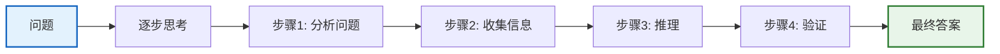
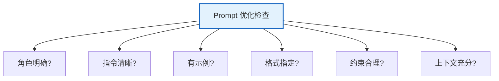

# 附录 G：Prompt 工程工具箱 — 模板与模式

> **附录 G · 工具书**
> 本手册收录 Prompt 工程中常用的模板、模式和最佳实践，可直接复制使用或按需修改。

---

## 目录

1. [基础 Prompt 模式](#1-基础-prompt-模式)
2. [高级推理模式](#2-高级推理模式)
3. [Few-shot 模式](#3-few-shot-模式)
4. [RAG 专用 Prompt 模板](#4-rag-专用-prompt-模板)
5. [Agent 专用 Prompt 模板](#5-agent-专用-prompt-模板)
6. [反模式与避坑指南](#6-反模式与避坑指南)

---

## 1. 基础 Prompt 模式

### 1.1 角色设定模式

```python
from langchain_core.prompts import ChatPromptTemplate

# 通用角色设定模板
role_prompt = ChatPromptTemplate.from_messages([
    ("system", """你是一个{role}。

你的职责：
- {responsibility}
- {skills}

回答要求：
1. 使用{tone}的语气
2. 回答长度控制在{max_length}字以内
3. 如果不确定，明确说明"""),
    ("human", "{question}")
])

# 使用示例
chain = role_prompt | llm
result = chain.invoke({
    "role": "Python后端架构师",
    "responsibility": "设计和实现可扩展的后端系统",
    "skills": "精通 Python, FastAPI, Docker, Kubernetes, PostgreSQL",
    "tone": "专业但易懂",
    "max_length": "500",
    "question": "如何设计一个高并发的API服务？"
})
```

### 1.2 结构化输出模式

```python
# 要求 LLM 输出特定格式
structured_prompt = ChatPromptTemplate.from_template("""请按照以下格式回答问题：

问题：{question}

请输出：
- 答案：直接回答，一句话
- 原因：为什么是这个答案
- 示例：举一个具体例子
- 注意：需要注意的事项

问题：{question}""")
```

### 1.3 对比分析模式

```python
compare_prompt = ChatPromptTemplate.from_template("""请对比以下两个选项：

选项A：{option_a}
选项B：{option_b}

请从以下维度对比：
| 维度 | 选项A | 选项B |
|------|-------|-------|
| 优点 | ... | ... |
| 缺点 | ... | ... |
| 成本 | ... | ... |
| 适用场景 | ... | ... |

最终推荐：选项X，因为...""")
```

---

## 2. 高级推理模式

### 2.1 Chain of Thought (CoT)



```python
# CoT 模板
cot_prompt = ChatPromptTemplate.from_template("""请一步步思考并回答以下问题：

问题：{question}

请按以下步骤：
1. 分析问题：问题的核心是什么？
2. 列出已知条件：有哪些信息？
3. 逐步推理：每一步的结论是什么？
4. 验证答案：答案合理吗？
5. 最终答案：用一句话总结。

问题：{question}""")
```

### 2.2 Tree of Thought (ToT)

```python
tot_prompt = ChatPromptTemplate.from_template("""请用"思维树"方法解决问题：

问题：{question}

请生成3个不同的解决思路，每个思路独立评估：

思路1：
- 方案：...
- 优点：...
- 缺点：...
- 可行性评分(1-10)：...

思路2：
- 方案：...
- 优点：...
- 缺点：...
- 可行性评分(1-10)：...

思路3：
- 方案：...
- 优点：...
- 缺点：...
- 可行性评分(1-10)：...

最优方案：选择思路X，因为...""")
```

### 2.3 ReAct 模式（推理+行动）

```python
react_prompt = ChatPromptTemplate.from_messages([
    ("system", """你是一个使用 ReAct 模式的 Agent。

每次回答遵循以下循环：
1. Thought: 分析当前状况，决定下一步
2. Action: 选择一个工具执行（或给出最终答案）
3. Observation: 观察工具返回的结果
4. 重复直到得出最终答案

可用工具：
- search(query): 搜索信息
- calculate(expression): 计算数学
- code_execute(code): 执行代码

格式：
Thought: [你的思考]
Action: [工具名(参数)]
Observation: [工具返回]
... (重复)
Thought: 我现在可以回答了
Final Answer: [最终答案]"""),
    ("human", "{question}")
])
```

---

## 3. Few-shot 模式

### 3.1 固定 Few-shot

```python
from langchain_core.prompts import FewShotChatMessagePromptTemplate

# 定义示例
examples = [
    {"input": "苹果", "output": "水果，红色或绿色，富含维生素"},
    {"input": "Python", "output": "编程语言，简洁易学，广泛用于AI和Web"},
    {"input": "DNA", "output": "遗传物质，双螺旋结构，存储生物信息"},
]

# 示例模板
example_prompt = ChatPromptTemplate.from_messages([
    ("human", "{input}"),
    ("ai", "{output}")
])

# Few-shot 模板
few_shot_prompt = FewShotChatMessagePromptTemplate(
    example_prompt=example_prompt,
    examples=examples,
)

# 完整模板
final_prompt = ChatPromptTemplate.from_messages([
    ("system", "你是一个知识解释助手。根据输入词给出简洁解释。"),
    few_shot_prompt,
    ("human", "{input}")
])
```

### 3.2 动态 Few-shot（语义检索）

```python
from langchain_chroma import Chroma
from langchain_openai import OpenAIEmbeddings
from langchain_core.prompts import FewShotChatMessagePromptTemplate
from langchain_core.example_selectors import SemanticSimilarityExampleSelector

# 语义相似度选择示例
example_selector = SemanticSimilarityExampleSelector.from_examples(
    examples=examples,
    embeddings=OpenAIEmbeddings(),
    vectorstore_cls=Chroma,
    k=2  # 选最相似的2个示例
)

dynamic_few_shot = FewShotChatMessagePromptTemplate(
    example_prompt=example_prompt,
    example_selector=example_selector,
)
```

---

## 4. RAG 专用 Prompt 模板

### 4.1 标准 RAG 模板

```python
rag_prompt = ChatPromptTemplate.from_messages([
    ("system", """你是一个知识问答助手。请基于以下检索到的上下文回答问题。

要求：
1. 只基于上下文中的信息回答
2. 如果上下文没有相关信息，说"根据已知信息无法回答"
3. 回答时引用信息来源（如"根据文档1..."）

上下文：
{context}"""),
    ("human", "{question}")
])
```

### 4.2 带对话历史的 RAG

```python
from langchain_core.prompts import ChatPromptTemplate, MessagesPlaceholder

rag_with_history = ChatPromptTemplate.from_messages([
    ("system", """你是一个知识问答助手。基于上下文回答。

上下文：
{context}"""),
    MessagesPlaceholder(variable_name="history"),
    ("human", "{question}")
])
```

### 4.3 多文档对比 RAG

```python
multi_doc_rag = ChatPromptTemplate.from_template("""请基于多个文档来源回答问题。

文档1（{source_1}）：
{content_1}

文档2（{source_2}）：
{content_2}

问题：{question}

请综合两个文档的信息回答。如果文档之间有冲突，指出差异。""")
```

---

## 5. Agent 专用 Prompt 模板

### 5.1 工具选择 Agent

```python
agent_prompt = ChatPromptTemplate.from_messages([
    ("system", """你是一个智能助手，可以使用以下工具：

{tools}

使用规则：
1. 如果需要使用工具，调用对应函数
2. 一次只调用一个工具
3. 观察结果后决定是否继续使用工具或给出最终答案
4. 不确定时优先使用工具获取信息

工具格式：{{"name": "工具名", "args": {{参数}}}}"""),
    MessagesPlaceholder(variable_name="history", optional=True),
    ("human", "{input}")
])
```

### 5.2 角色化 Agent

```python
character_agent = ChatPromptTemplate.from_messages([
    ("system", """你是{character_name}。

你的性格：
{personality}

你的说话风格：
{speaking_style}

你的专业领域：
{expertise}

约束：
1. 始终保持角色设定
2. 用符合角色的语气回答
3. 在专业领域内给出高质量建议"""),
    MessagesPlaceholder(variable_name="history"),
    ("human", "{input}")
])
```

---

## 6. 反模式与避坑指南

### 6.1 常见反模式

| 反模式 | 问题 | 修正方法 |
|--------|------|---------|
| 模糊指令 | "写得好一点" | 明确标准："控制在300字内，使用专业术语" |
| 过多约束 | 10条以上规则 | 精简到3-5条核心规则 |
| 矛盾指令 | "详细但简洁" | 明确优先级："先简洁，必要时展开" |
| 缺少上下文 | 不给背景就问复杂问题 | 先给背景再提问 |
| 不给示例 | 期望LLM自己理解格式 | 提供2-3个Few-shot示例 |
| 过度信任 | 不验证LLM输出 | 加入验证步骤或要求引用来源 |

### 6.2 Prompt 优化检查清单



| 检查项 | 通过标准 |
|--------|---------|
| 角色明确 | LLM 知道自己是谁 |
| 指令清晰 | 具体可操作，非模糊描述 |
| 有示例 | 至少2个Few-shot |
| 格式指定 | 输出格式明确 |
| 约束合理 | 3-5条，不矛盾 |
| 上下文充分 | 包含必要背景信息 |

### 6.3 温度参数指南

| 任务类型 | 推荐温度 | 理由 |
|---------|---------|------|
| 事实问答 | 0 | 需要准确稳定 |
| 代码生成 | 0-0.2 | 代码需要精确 |
| 数据提取 | 0 | 结构化输出需要稳定 |
| 创意写作 | 0.7-1.0 | 需要多样性和创意 |
| 头脑风暴 | 0.8-1.2 | 需要发散思维 |
| 翻译 | 0-0.3 | 需要忠实原文 |
| 对话聊天 | 0.5-0.7 | 自然但不离题 |

---

## 相关文档

- [学习课程第 03 课：Prompt](../学习课程/第03课_Prompt_设计好的指令.md) — 入门
- [知识库 07：LCEL 深入](../知识库/07_LCEL深入技术手册.md) — Runnable 接口
- [附录 B：术语表与 API 速查卡](./附录B_术语表与API速查卡.md) — API 参考
