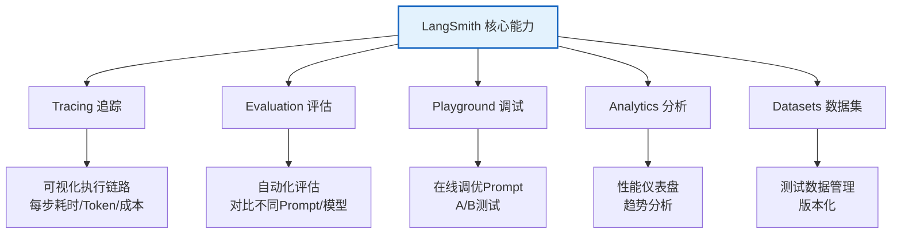
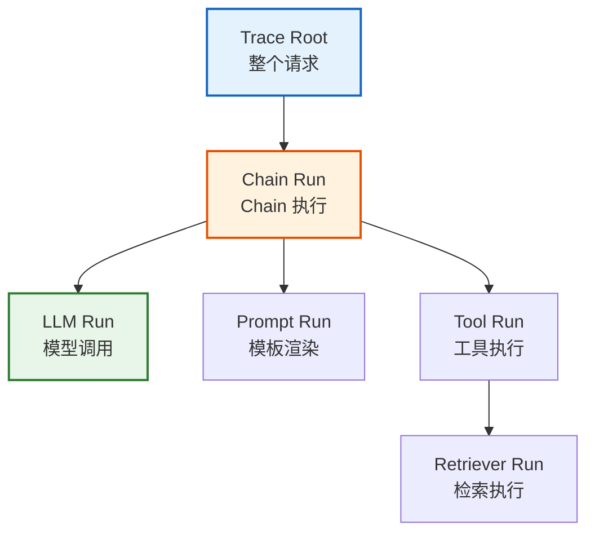
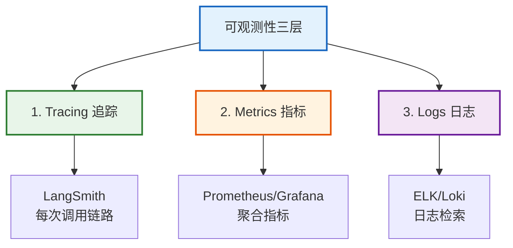

# 附录 H：LangSmith 与可观测性深度指南

> **附录 H · 工具书**
> 本手册系统介绍 LangSmith 的配置、使用和最佳实践，以及 LangChain 应用的可观测性体系。

---

## 目录

1. [LangSmith 概述](#1-langsmith-概述)
2. [配置与接入](#2-配置与接入)
3. [Tracing 详解](#3-tracing-详解)
4. [评估数据集与测试](#4-评估数据集与测试)
5. [Playground 与调试](#5-playground-与调试)
6. [生产环境可观测性](#6-生产环境可观测性)

---

## 1. LangSmith 概述

### 1.1 什么是 LangSmith

LangSmith 是 LangChain 官方的可观测性和调试平台，用于追踪、评估和优化 LLM 应用。



### 1.2 为什么需要可观测性

| 没有 LangSmith | 有 LangSmith |
|---------------|-------------|
| LLM 是黑盒 | 完整执行链路可视化 |
| 不知道哪步慢 | 每步耗时精确到毫秒 |
| 不知道 Token 花在哪 | 精确 Token 和成本统计 |
| 线上问题无法复现 | 每次调用完整记录 |
| Prompt 改了不知道好坏 | A/B 对比评估 |

---

## 2. 配置与接入

### 2.1 环境变量配置

```python
import os

# 方式 1: 环境变量（推荐，生产环境）
os.environ["LANGSMITH_TRACING"] = "true"
os.environ["LANGSMITH_API_KEY"] = "ls__xxxxx"  # 从 LangSmith 网站获取
os.environ["LANGSMITH_PROJECT"] = "my-langchain-app"
os.environ["LANGSMITH_ENDPOINT"] = "https://api.smith.langchain.com"

# 方式 2: .env 文件
# .env 文件内容：
# LANGSMITH_TRACING=true
# LANGSMITH_API_KEY=ls__xxxxx
# LANGSMITH_PROJECT=my-langchain-app

# 方式 3: 代码内设置
from langchain_core.tracers.langchain import LangChainTracer
tracer = LangChainTracer(project_name="my-langchain-app")
```

### 2.2 验证接入

```python
from langchain_openai import ChatOpenAI

llm = ChatOpenAI(model="gpt-4o")

# 调用一次，自动上传 Trace
response = llm.invoke("Hello, LangSmith!")

# 检查 LangSmith Dashboard 是否有记录
# 访问 https://smith.langchain.com 查看项目
```

### 2.3 本地 Tracing（离线模式）

```python
from langchain.callbacks.tracers import ConsoleCallbackHandler

# 方式 1: 控制台输出 Trace
llm.invoke("Hello", config={"callbacks": [ConsoleCallbackHandler()]})

# 方式 2: 保存到本地文件
import json
from langchain_core.tracers.langchain import LangChainTracer

class FileTracer(LangChainTracer):
    def __init__(self, filepath="trace.json"):
        super().__init__()
        self.filepath = filepath
        self.traces = []
    
    def on_llm_end(self, response, **kwargs):
        self.traces.append({
            "timestamp": str(kwargs.get("run_id", "")),
            "response": response.dict() if hasattr(response, 'dict') else str(response)
        })
        with open(self.filepath, "w") as f:
            json.dump(self.traces, f, indent=2, ensure_ascii=False)
```

---

## 3. Tracing 详解

### 3.1 Trace 结构



### 3.2 每个节点记录的信息

| 字段 | 说明 | 示例 |
|------|------|------|
| name | 执行的组件名 | ChatOpenAI |
| type | 组件类型 | llm/chain/tool/retriever/prompt |
| input | 输入数据 | {"messages": [...]} |
| output | 输出数据 | {"content": "LangChain是..."} |
| start_time | 开始时间 | 2026-08-26T10:00:00 |
| end_time | 结束时间 | 2026-08-26T10:00:02 |
| metadata | 元数据 | {"model": "gpt-4o", "temperature": 0} |
| tokens | Token 统计 | {"prompt": 50, "completion": 200} |
| cost | 成本 | $0.0035 |
| error | 错误信息（如有） | "RateLimitError" |

### 3.3 自定义 Metadata

```python
from langchain_core.runnables import RunnableConfig

# 添加自定义元数据到 Trace
response = llm.invoke(
    "介绍LangChain",
    config=RunnableConfig(
        metadata={
            "user_id": "user_123",
            "session_id": "session_456",
            "version": "v1.2.0",
            "environment": "production",
        },
        tags=["rag", "customer-service"],
        run_name="introduction_llm_call",
    )
)
```

### 3.4 使用上下文管理器

```python
from langchain_core.tracers.context import tracing_context

# 使用上下文管理器自动追踪一段代码
with tracing_context(
    project_name="my-experiment",
    metadata={"experiment": "v2", "model": "gpt-4o"},
    tags=["experiment", "v2"]
):
    response = chain.invoke({"input": "测试问题"})
    # 所有在此上下文中的 LLM 调用都会被追踪
```

---

## 4. 评估数据集与测试

### 4.1 创建数据集

```python
from langsmith import Client

client = Client()

# 创建数据集
dataset = client.create_dataset(
    name="rag-eval-dataset",
    description="RAG 系统评估数据集"
)

# 添加测试样本
examples = [
    {"input": "什么是LangChain？", "expected": "LangChain是一个用于开发LLM应用的框架"},
    {"input": "RAG是什么？", "expected": "RAG是检索增强生成的缩写"},
    {"input": "如何使用Memory？", "expected": "通过ConversationBufferMemory等组件管理对话历史"},
]

for ex in examples:
    client.create_example(
        inputs={"question": ex["input"]},
        outputs={"answer": ex["expected"]},
        dataset_id=dataset.id
    )
```

### 4.2 运行评估

```python
from langsmith import Client
from langchain_openai import ChatOpenAI

client = Client()

# 定义评估函数
def correctness_evaluator(run, example):
    """评估回答正确性"""
    prediction = run.outputs.get("answer", "")
    expected = example.outputs.get("answer", "")
    
    # 用 LLM 判断是否正确
    eval_llm = ChatOpenAI(model="gpt-4o", temperature=0)
    eval_result = eval_llm.invoke(f"""判断以下回答是否正确：

问题：{example.inputs.get("question")}
期望回答：{expected}
实际回答：{prediction}

回答 "correct" 或 "incorrect"，并说明原因。""")
    
    is_correct = "correct" in eval_result.content.lower()
    
    return {
        "score": 1 if is_correct else 0,
        "comment": eval_result.content
    }

# 运行评估
results = client.run_on_dataset(
    dataset_name="rag-eval-dataset",
    llm_or_chain_factory=lambda: chain,  # 你的 Chain
    evaluation={" evaluators": [correctness_evaluator]},
    verbose=True
)
```

### 4.3 内置评估器

```python
from langsmith.evaluation import EvaluationResult, RunEvaluator

# 常用评估指标
evaluators = {
    "exact_match": "精确匹配",
    "contains": "包含关键词",
    "regex_match": "正则匹配",
    "llm_judge": "LLM 判断",
    "semantic_similarity": "语义相似度",
    "custom": "自定义函数",
}

# 示例：语义相似度评估
def semantic_eval(run, example):
    from langchain_openai import OpenAIEmbeddings
    import numpy as np
    
    embeddings = OpenAIEmbeddings()
    pred_vec = embeddings.embed_query(run.outputs["answer"])
    expect_vec = embeddings.embed_query(example.outputs["answer"])
    
    similarity = np.dot(pred_vec, expect_vec) / (np.linalg.norm(pred_vec) * np.linalg.norm(expect_vec))
    
    return {"score": float(similarity), "comment": f"相似度: {similarity:.3f}"}
```

---

## 5. Playground 与调试

### 5.1 在线 Playground

访问 LangSmith 网站的 Playground 功能可以：
- 在线编辑 Prompt 模板
- 切换不同模型对比输出
- 修改参数（temperature、max_tokens 等）
- 查看每次修改的 Trace

### 5.2 从 Trace 创建测试

```python
# 从线上的 Trace 创建测试样本
client = Client()

# 获取某个 Trace
runs = client.list_runs(project_name="my-langchain-app", limit=10)

for run in runs:
    if run.error is None:  # 成功的运行
        # 创建为测试样本
        client.create_example(
            inputs=run.inputs,
            outputs=run.outputs,
            dataset_name="from-production-traces",
            metadata={"source_run_id": str(run.id)}
        )
```

### 5.3 对比实验

```python
# 对比不同 Prompt 版本
prompt_v1 = ChatPromptTemplate.from_template("回答：{question}")
prompt_v2 = ChatPromptTemplate.from_template("请详细回答：{question}")

# 在 LangSmith 中创建对比实验
results = client.compare_runs(
    dataset_name="rag-eval-dataset",
    chain_factories={
        "v1": lambda: prompt_v1 | llm,
        "v2": lambda: prompt_v2 | llm,
    },
    evaluators=[correctness_evaluator, semantic_eval]
)

# 查看哪个版本表现更好
for name, metrics in results.items():
    print(f"{name}: accuracy={metrics['mean_score']:.2%}")
```

---

## 6. 生产环境可观测性

### 6.1 可观测性三层架构



### 6.2 关键监控指标

| 指标 | 说明 | 告警阈值 |
|------|------|---------|
| 请求延迟 (P95) | 95% 请求的响应时间 | > 5s |
| 请求延迟 (P99) | 99% 请求的响应时间 | > 10s |
| 错误率 | 失败请求占比 | > 5% |
| Token 使用量 | 每日 Token 消耗 | > 预算 80% |
| 成本 | 每日 API 费用 | > 预算 80% |
| 首 Token 延迟 | 流式首字时间 | > 2s |
| 工具调用率 | Agent 使用工具的比例 | 根据场景 |
| 检索准确率 | RAG 检索命中率 | < 70% |

### 6.3 与 Prometheus 集成

```python
from prometheus_client import Counter, Histogram, start_http_server

# 定义指标
REQUEST_COUNT = Counter('langchain_requests_total', 'Total requests', ['endpoint'])
REQUEST_LATENCY = Histogram('langchain_request_duration_seconds', 'Request duration')
TOKEN_USAGE = Counter('langchain_tokens_total', 'Token usage', ['type'])

# 包装 Chain
class MonitoredChain:
    def __init__(self, chain):
        self.chain = chain
    
    def invoke(self, inputs):
        REQUEST_COUNT.labels(endpoint='chat').inc()
        with REQUEST_LATENCY.time():
            result = self.chain.invoke(inputs)
            # 记录 Token
            if hasattr(result, 'usage_metadata'):
                TOKEN_USAGE.labels(type='prompt').inc(
                    result.usage_metadata.get('input_tokens', 0)
                )
                TOKEN_USAGE.labels(type='completion').inc(
                    result.usage_metadata.get('output_tokens', 0)
                )
        return result

# 启动 Prometheus 指标端点
start_http_server(9090)
```

### 6.4 日志最佳实践

```python
import logging
import json
from datetime import datetime

# 结构化日志
logger = logging.getLogger("langchain_app")

class StructuredFormatter(logging.Formatter):
    def format(self, record):
        log_data = {
            "timestamp": datetime.utcnow().isoformat(),
            "level": record.levelname,
            "message": record.getMessage(),
            "module": record.module,
            "function": record.funcName,
            "line": record.lineno,
        }
        if hasattr(record, 'request_id'):
            log_data["request_id"] = record.request_id
        if hasattr(record, 'user_id'):
            log_data["user_id"] = record.user_id
        return json.dumps(log_data, ensure_ascii=False)

# 配置
handler = logging.StreamHandler()
handler.setFormatter(StructuredFormatter())
logger.addHandler(handler)
logger.setLevel(logging.INFO)

# 使用
logger.info("LLM调用完成", extra={
    "request_id": "req_123",
    "user_id": "user_456",
    "model": "gpt-4o",
    "latency_ms": 1250,
    "tokens": 350
})
```

### 6.5 成本监控仪表盘

```python
# 每日成本统计
def daily_cost_report(client, project_name, date):
    """生成每日成本报告"""
    runs = client.list_runs(
        project_name=project_name,
        start_time=date,
        end_time=date + timedelta(days=1)
    )
    
    total_cost = 0
    total_tokens = {"prompt": 0, "completion": 0}
    by_model = {}
    
    for run in runs:
        if run.type == "llm" and run.total_cost:
            total_cost += run.total_cost
            model = run.extra.get("model_name", "unknown")
            if model not in by_model:
                by_model[model] = {"cost": 0, "count": 0}
            by_model[model]["cost"] += run.total_cost
            by_model[model]["count"] += 1
    
    return {
        "date": date.strftime("%Y-%m-%d"),
        "total_cost": round(total_cost, 4),
        "total_requests": len(runs),
        "by_model": by_model,
    }
```

---

## 相关文档

- [知识库 09：评估测试与成本优化](../知识库/09_评估测试与成本优化技术手册.md) — 评估基础
- [知识库 12：生产部署与可观测性](../知识库/12_生产部署模式与可观测性技术参考.md) — 部署监控
- [附录 A：环境搭建与快速入门](./附录A_环境搭建与快速入门.md) — 环境配置
