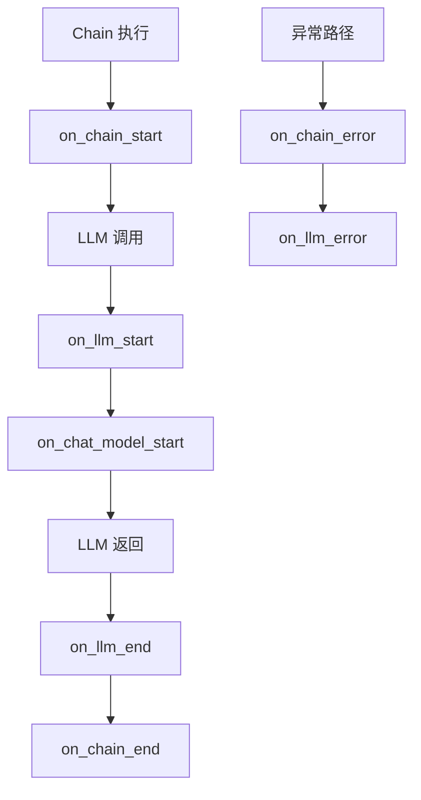
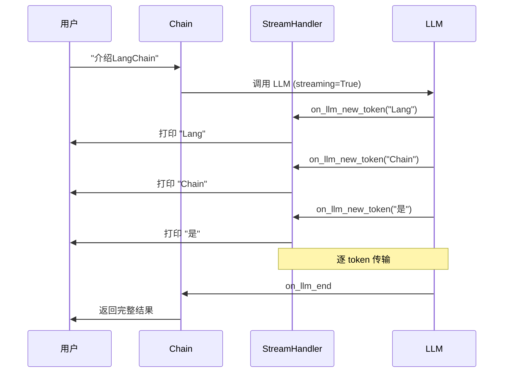
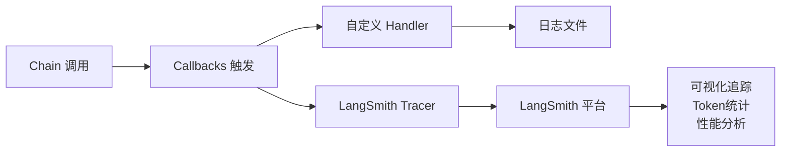
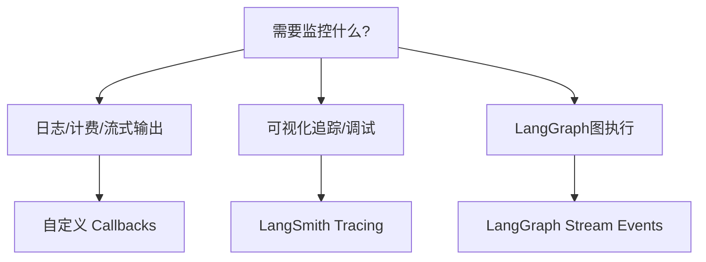

# 附录 I：LangChain Callbacks 与事件系统指南

> **定位**：参考指南 | **前置知识**：基础 Python | **难度**：中级

---

## 1. Callbacks 系统概述

Callbacks 是 LangChain 的**事件钩子系统**，允许你在 Chain/Agent 执行的关键节点插入自定义逻辑。



### 核心事件一览

| 事件 | 触发时机 | 用途 |
|------|---------|------|
| `on_chain_start` | Chain 开始执行 | 记录输入、计时 |
| `on_chain_end` | Chain 结束执行 | 记录输出、耗时 |
| `on_chain_error` | Chain 执行出错 | 错误日志、告警 |
| `on_llm_start` | LLM 开始推理 | 记录 prompt、计时 |
| `on_llm_end` | LLM 返回结果 | 记录 response、token 用量 |
| `on_llm_new_token` | 流式生成每个 token | 实时展示 |
| `on_tool_start` | 工具开始执行 | 记录工具调用 |
| `on_tool_end` | 工具返回结果 | 记录工具输出 |
| `on_tool_error` | 工具执行出错 | 错误处理 |
| `on_retriever_start` | 检索器开始 | 记录查询 |
| `on_retriever_end` | 检索器返回 | 记录检索结果 |

---

## 2. BaseHandler 自定义回调

```python
from langchain_core.callbacks import BaseCallbackHandler
from typing import Any, Dict, List, Optional
from uuid import UUID
import time

class LoggingHandler(BaseCallbackHandler):
    """日志记录回调"""
    
    def __init__(self):
        self.start_time = {}
        self.log_file = "langchain_log.txt"
    
    def on_chain_start(
        self, serialized: Dict[str, Any],
        inputs: Dict[str, Any], *,
        run_id: UUID, **kwargs
    ):
        chain_name = serialized.get("name", "unknown")
        self.start_time[run_id] = time.time()
        self._log(f"[Chain开始] {chain_name} | 输入: {str(inputs)[:200]}")
    
    def on_chain_end(
        self, outputs: Dict[str, Any], *,
        run_id: UUID, **kwargs
    ):
        duration = time.time() - self.start_time.get(run_id, 0)
        self._log(f"[Chain结束] 输出: {str(outputs)[:200]} | 耗时: {duration:.2f}s")
    
    def on_chain_error(
        self, error: Exception, *,
        run_id: UUID, **kwargs
    ):
        self._log(f"[Chain错误] {type(error).__name__}: {error}")
    
    def on_llm_start(
        self, serialized: Dict[str, Any],
        prompts: List[str], *,
        run_id: UUID, **kwargs
    ):
        self.start_time[run_id] = time.time()
        model = serialized.get("name", "unknown")
        self._log(f"[LLM开始] 模型: {model} | Prompt: {prompts[0][:100]}")
    
    def on_llm_end(
        self, response, *,
        run_id: UUID, **kwargs
    ):
        duration = time.time() - self.start_time.get(run_id, 0)
        token_usage = response.llm_output.get("token_usage", {})
        self._log(
            f"[LLM结束] 耗时: {duration:.2f}s | "
            f"Tokens: {token_usage}"
        )
    
    def on_tool_start(
        self, serialized: Dict[str, Any],
        input_str: str, *,
        run_id: UUID, **kwargs
    ):
        tool_name = serialized.get("name", "unknown")
        self._log(f"[工具开始] {tool_name} | 输入: {input_str}")
    
    def on_tool_end(
        self, output: str, *,
        run_id: UUID, **kwargs
    ):
        self._log(f"[工具结束] 输出: {output[:200]}")
    
    def _log(self, message: str):
        from datetime import datetime
        timestamp = datetime.now().strftime("%Y-%m-%d %H:%M:%S")
        line = f"{timestamp} {message}\n"
        print(line.strip())
        with open(self.log_file, "a") as f:
            f.write(line)
```

### 使用方式

```python
from langchain_openai import ChatOpenAI
from langchain_core.prompts import ChatPromptTemplate

# 方式1：构造时传入
llm = ChatOpenAI(
    model="gpt-4",
    callbacks=[LoggingHandler()]  # 全局回调
)

# 方式2：调用时传入
llm.invoke("你好", config={"callbacks": [LoggingHandler()]})

# 方式3：Chain 级别
prompt = ChatPromptTemplate.from_template("{question}")
chain = prompt | llm
chain.invoke(
    {"question": "什么是RAG?"},
    config={"callbacks": [LoggingHandler()]}
)
```

---

## 3. Streaming Handler 流式回调

```python
class StreamHandler(BaseCallbackHandler):
    """流式输出回调：逐 token 打印"""
    
    def on_llm_new_token(self, token: str, **kwargs):
        """每生成一个 token 触发"""
        print(token, end="", flush=True)
    
    def on_llm_end(self, response, **kwargs):
        print()  # 换行

# 使用：开启流式
llm = ChatOpenAI(
    model="gpt-4",
    streaming=True,  # 必须开启
    callbacks=[StreamHandler()]
)

response = llm.invoke("用200字介绍LangChain")
# 输出会逐字打印，类似打字机效果
```



---

## 4. Token 计费回调

```python
class TokenUsageHandler(BaseCallbackHandler):
    """Token 使用量跟踪"""
    
    def __init__(self):
        self.total_prompt_tokens = 0
        self.total_completion_tokens = 0
        self.total_cost = 0
        self.pricing = {
            "gpt-4": {"prompt": 0.03, "completion": 0.06},  # per 1K tokens
            "gpt-3.5-turbo": {"prompt": 0.0005, "completion": 0.0015},
        }
    
    def on_llm_end(self, response, **kwargs):
        usage = response.llm_output.get("token_usage", {})
        model = response.llm_output.get("model_name", "gpt-3.5-turbo")
        
        prompt_t = usage.get("prompt_tokens", 0)
        completion_t = usage.get("completion_tokens", 0)
        
        self.total_prompt_tokens += prompt_t
        self.total_completion_tokens += completion_t
        
        # 计算费用
        rates = self.pricing.get(model, self.pricing["gpt-3.5-turbo"])
        cost = (prompt_t / 1000 * rates["prompt"] +
                completion_t / 1000 * rates["completion"])
        self.total_cost += cost
    
    def get_summary(self) -> dict:
        return {
            "prompt_tokens": self.total_prompt_tokens,
            "completion_tokens": self.total_completion_tokens,
            "total_tokens": self.total_prompt_tokens + self.total_completion_tokens,
            "total_cost_usd": round(self.total_cost, 4)
        }

# 使用
handler = TokenUsageHandler()
llm = ChatOpenAI(model="gpt-4", callbacks=[handler])

llm.invoke("什么是RAG?")
llm.invoke("LangChain有哪些组件?")
llm.invoke("如何部署LangChain应用?")

print(handler.get_summary())
# {'prompt_tokens': 156, 'completion_tokens': 432, 'total_tokens': 588, 'total_cost_usd': 0.0301}
```

---

## 5. Async Callback Handler

```python
from langchain_core.callbacks import AsyncCallbackHandler

class AsyncLogHandler(AsyncCallbackHandler):
    """异步回调处理器"""
    
    async def on_chain_start(self, serialized, inputs, *, run_id, **kwargs):
        await self._async_log(f"Chain开始: {serialized.get('name')}")
    
    async def on_chain_end(self, outputs, *, run_id, **kwargs):
        await self._async_log(f"Chain结束: {str(outputs)[:100]}")
    
    async def on_llm_start(self, serialized, prompts, *, run_id, **kwargs):
        await self._async_log(f"LLM开始: {serialized.get('name')}")
    
    async def on_llm_end(self, response, *, run_id, **kwargs):
        await self._async_log(f"LLM结束")
    
    async def _async_log(self, msg: str):
        import asyncio
        # 模拟异步写日志
        await asyncio.sleep(0.001)
        print(f"[ASYNC] {msg}")

# 异步使用
import asyncio

async def main():
    llm = ChatOpenAI(model="gpt-4", callbacks=[AsyncLogHandler()])
    await llm.ainvoke("你好")

asyncio.run(main())
```

---

## 6. Callbacks 与 LangSmith 集成

```python
from langchain_core.tracers.context import tracing_v2_enabled
import os

os.environ["LANGSMITH_TRACING"] = "true"
os.environ["LANGSMITH_API_KEY"] = "ls__xxxxx"
os.environ["LANGSMITH_PROJECT"] = "my-rag-app"

# 方式1：环境变量全局开启
llm = ChatOpenAI(model="gpt-4")
# 所有调用自动上报到 LangSmith

# 方式2：代码上下文临时开启
with tracing_v2_enabled(project_name="debug-session"):
    response = llm.invoke("测试问题")
    # 仅此段调用上报到 LangSmith
```



---

## 7. 事件系统对比

| 特性 | Callbacks | LangSmith Tracing | LangGraph Stream |
|------|-----------|-------------------|------------------|
| 定位 | 代码级钩子 | 平台级追踪 | 图执行流 |
| 实时性 | 同步/异步 | 异步上报 | 实时流 |
| 持久化 | 需自己实现 | 平台存储 | Checkpointer |
| 可视化 | 无 | 有 | 有 |
| 粒度 | 事件级 | 运行级 | 节点级 |
| 适用场景 | 日志/计费/流式 | 调试/评估/监控 | 图调试 |

### 选型建议



---

## 8. 常用回调模式速查

| 模式 | 场景 | 关键方法 |
|------|------|---------|
| 日志记录 | 全链路日志 | on_chain_start/end |
| 流式输出 | 打字机效果 | on_llm_new_token |
| Token 计费 | 成本控制 | on_llm_end |
| 错误监控 | 异常告警 | on_*_error |
| 工具审计 | 安全合规 | on_tool_start/end |
| 性能分析 | 耗时分析 | start_time + end |
| 检索监控 | RAG 调优 | on_retriever_start/end |
