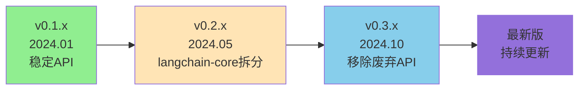
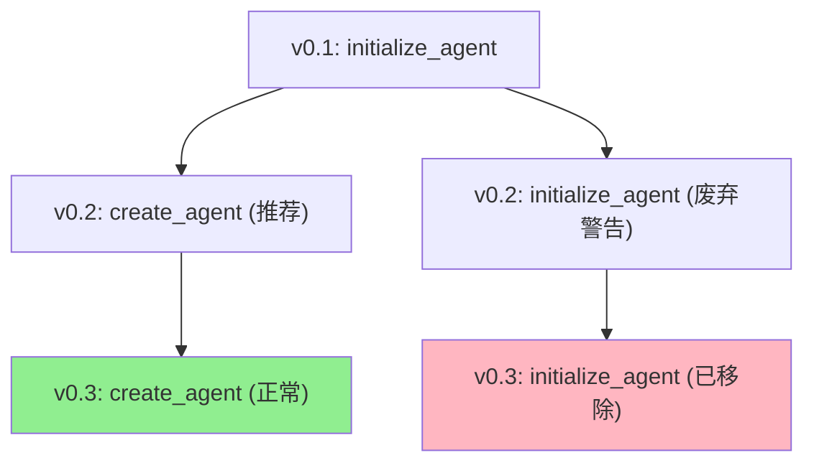
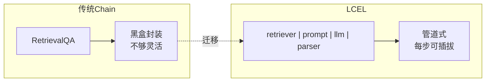
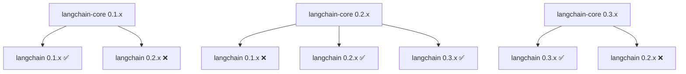

# 附录 J：LangChain 版本迁移与升级指南

> **定位**：参考指南 | **前置知识**：基础 Python | **难度**：中级

---

## 1. LangChain 版本演进概览



### 各版本关键变化

| 版本 | 发布时间 | 核心变化 | 迁移影响 |
|------|---------|---------|---------|
| v0.1.x | 2024.01 | 首个稳定API | 无（基准） |
| v0.2.x | 2024.05 | langchain-core 拆分 | `import` 路径变更 |
| v0.3.x | 2024.10 | 移除 v0.1 废弃API | 旧代码必须更新 |

---

## 2. v0.1 → v0.2 迁移

### 核心变化：langchain-core 拆分

v0.2 将核心抽象拆分到 `langchain-core` 包，减少依赖。

```python
# v0.1（旧）
from langchain.schema import HumanMessage, AIMessage
from langchain.prompts import ChatPromptTemplate
from langchain.runnables import RunnablePassthrough

# v0.2（新）
from langchain_core.messages import HumanMessage, AIMessage
from langchain_core.prompts import ChatPromptTemplate
from langchain_core.runnables import RunnablePassthrough
```

### Import 路径映射表

| v0.1 路径 | v0.2 路径 |
|-----------|-----------|
| `from langchain.schema import ...` | `from langchain_core.messages import ...` |
| `from langchain.prompts import ...` | `from langchain_core.prompts import ...` |
| `from langchain.runnables import ...` | `from langchain_core.runnables import ...` |
| `from langchain.tools import ...` | `from langchain_core.tools import ...` |
| `from langchain.embeddings import ...` | `from langchain_core.embeddings import ...` |
| `from langchain.document_loaders import ...` | `from langchain_community.document_loaders import ...` |
| `from langchain.vectorstores import ...` | `from langchain_community.vectorstores import ...` |

### 自动迁移脚本

```python
import os
import re

# v0.1 → v0.2 import 路径替换规则
MIGRATIONS = [
    (r'from langchain\.schema import', 'from langchain_core.messages import'),
    (r'from langchain\.prompts import', 'from langchain_core.prompts import'),
    (r'from langchain\.runnables import', 'from langchain_core.runnables import'),
    (r'from langchain\.tools import', 'from langchain_core.tools import'),
    (r'from langchain\.embeddings import', 'from langchain_core.embeddings import'),
    (r'from langchain\.document_loaders import',
     'from langchain_community.document_loaders import'),
    (r'from langchain\.vectorstores import',
     'from langchain_community.vectorstores import'),
    (r'from langchain\.text_splitter import',
     'from langchain_text_splitters import'),
    (r'from langchain\.retrievers import',
     'from langchain.retrievers import'),  # 保持在 langchain
]

def migrate_file(filepath: str):
    """迁移单个文件"""
    with open(filepath, 'r') as f:
        content = f.read()
    
    original = content
    for old_pattern, new_pattern in MIGRATIONS:
        content = re.sub(old_pattern, new_pattern, content)
    
    if content != original:
        with open(filepath, 'w') as f:
            f.write(content)
        print(f"已迁移: {filepath}")
    else:
        print(f"无需迁移: {filepath}")

def migrate_project(directory: str):
    """迁移整个项目"""
    for root, _, files in os.walk(directory):
        for file in files:
            if file.endswith('.py'):
                migrate_file(os.path.join(root, file))

# 使用
migrate_project("./my_project")
```

---

## 3. v0.2 → v0.3 迁移

### 核心变化：移除废弃 API

v0.3 正式移除了 v0.1 中标记为 deprecated 的 API。

### 关键废弃项

```python
# ❌ v0.2 仍可用（带警告），v0.3 已移除
from langchain.agents import initialize_agent, AgentType
agent = initialize_agent(
    tools, llm, agent=AgentType.ZERO_SHOT_REACT_DESCRIPTION
)

# ✅ v0.3 正确写法
from langchain.agents import create_react_agent, AgentExecutor
agent = create_react_agent(llm, tools, prompt)
executor = AgentExecutor(agent=agent, tools=tools)
```

### Agent 创建方式对照

| 废弃写法 | 新写法 |
|---------|--------|
| `initialize_agent(tools, llm, agent=...)` | `create_react_agent(llm, tools, prompt)` |
| `AgentType.ZERO_SHOT_REACT_DESCRIPTION` | `create_react_agent()` |
| `AgentType.OPENAI_FUNCTIONS` | `create_tool_calling_agent(llm, tools, prompt)` |
| `AgentType.STRUCTURED_CHAT_ZERO_SHOT` | `create_structured_chat_agent(llm, tools, prompt)` |

### Memory 类变化

```python
# ❌ v0.2 写法（v0.3 中部分废弃）
from langchain.memory import (
    ConversationBufferMemory,
    ConversationBufferWindowMemory,
    ConversationSummaryMemory,
    ConversationSummaryBufferMemory,
    VectorStoreRetrieverMemory,
    EntityMemory,
    ConversationKGMemory,
)

# ✅ v0.3 推荐写法
# 传统 Memory 类仍可用，但官方推荐迁移到 LangGraph StateGraph
# 对于新项目，直接用 LangGraph
```



---

## 4. Memory → LangGraph 迁移

这是 v0.3 最重要的架构变化：**Memory 类将被 LangGraph StateGraph 替代**。

### 传统 Memory → LangGraph 对照

```python
# === 传统方式 ===
from langchain.memory import ConversationBufferMemory
from langchain.chains import ConversationChain

memory = ConversationBufferMemory(return_messages=True)
chain = ConversationChain(llm=llm, memory=memory)
response = chain.invoke({"input": "你好"})
```

```python
# === LangGraph 方式 ===
from langgraph.graph import StateGraph, END
from langgraph.graph.message import add_messages
from langgraph.checkpoint.memory import MemorySaver
from typing import Annotated, TypedDict

class State(TypedDict):
    messages: Annotated[list, add_messages]

def chatbot(state: State):
    response = llm.invoke(state["messages"])
    return {"messages": [response]}

graph = StateGraph(State)
graph.add_node("chatbot", chatbot)
graph.set_entry_point("chatbot")
graph.add_edge("chatbot", END)

app = graph.compile(checkpointer=MemorySaver())
config = {"configurable": {"thread_id": "user_1"}}
response = app.invoke(
    {"messages": [{"role": "user", "content": "你好"}]},
    config
)
```

### 迁移对照表

| 功能 | 传统 Memory | LangGraph |
|------|------------|-----------|
| 保存对话 | `memory.save_context()` | `graph.invoke()` 自动保存 |
| 加载历史 | `memory.load_memory_variables()` | Checkpointer 自动恢复 |
| 隔离用户 | `session_id` | `thread_id` |
| 滑动窗口 | `ConversationBufferWindowMemory` | 代码控制 `messages[-k:]` |
| 摘要记忆 | `ConversationSummaryMemory` | 自定义节点做摘要 |
| 向量记忆 | `VectorStoreRetrieverMemory` | 节点中做向量检索 |
| 持久化 | Redis/PG 后端 | Checkpointer 后端 |

---

## 5. LCEL 表达式迁移

### 传统 Chain → LCEL

```python
# === 传统 Chain ===
from langchain.chains import LLMChain
from langchain_core.prompts import PromptTemplate

prompt = PromptTemplate.from_template("{question} 用一句话回答")
chain = LLMChain(llm=llm, prompt=prompt)
result = chain.run("什么是RAG?")
```

```python
# === LCEL 方式 ===
chain = prompt | llm
result = chain.invoke({"question": "什么是RAG?"})
```

### RAG Chain 迁移

```python
# === 传统 RetrievalQA ===
from langchain.chains import RetrievalQA

qa = RetrievalQA.from_chain_type(
    llm=llm,
    retriever=retriever,
    chain_type="stuff"
)
result = qa.run("什么是LangChain?")
```

```python
# === LCEL 方式 ===
from langchain_core.runnables import RunnablePassthrough
from langchain_core.output_parsers import StrOutputParser

rag_chain = (
    {"context": retriever, "question": RunnablePassthrough()}
    | prompt
    | llm
    | StrOutputParser()
)
result = rag_chain.invoke("什么是LangChain?")
```



---

## 6. Community 包迁移

v0.2 将第三方集成从 `langchain` 拆分到 `langchain-community` 和专门的 partner 包。

### 安装变化

```bash
# v0.1：一个包搞定
pip install langchain

# v0.2+：按需安装
pip install langchain langchain-core
pip install langchain-community      # 社区集成
pip install langchain-openai         # OpenAI 专用
pip install langchain-cohere         # Cohere 专用
pip install langchain-postgres       # PostgreSQL 专用
pip install langchain-text-splitters # 文本分割
```

### Import 变化

```python
# v0.1
from langchain.llms import OpenAI
from langchain.chat_models import ChatOpenAI
from langchain.embeddings import OpenAIEmbeddings

# v0.2+
from langchain_openai import OpenAI, ChatOpenAI, OpenAIEmbeddings
```

| v0.1 路径 | v0.2+ 路径 | 需安装 |
|-----------|-----------|--------|
| `langchain.llms.OpenAI` | `langchain_openai.OpenAI` | `langchain-openai` |
| `langchain.chat_models.ChatOpenAI` | `langchain_openai.ChatOpenAI` | `langchain-openai` |
| `langchain.embeddings.OpenAIEmbeddings` | `langchain_openai.OpenAIEmbeddings` | `langchain-openai` |
| `langchain.llms.Cohere` | `langchain_cohere.Cohere` | `langchain-cohere` |
| `langchain.vectorstores.PGVector` | `langchain_postgres.PGVector` | `langchain-postgres` |

---

## 7. 版本检查与兼容性

### 检查当前版本

```python
import langchain
import langchain_core

print(f"langchain: {langchain.__version__}")
print(f"langchain-core: {langchain_core.__version__}")
```

### 兼容性矩阵



### requirements.txt 推荐配置

```txt
# v0.3.x 稳定配置
langchain>=0.3.0,<0.4.0
langchain-core>=0.3.0,<0.4.0
langchain-community>=0.3.0,<0.4.0
langchain-openai>=0.2.0
langchain-text-splitters>=0.3.0
langgraph>=0.2.0
```

---

## 8. 迁移检查清单

### v0.1 → v0.2 检查项

- [ ] 所有 `from langchain.schema import` → `from langchain_core.messages import`
- [ ] 所有 `from langchain.prompts import` → `from langchain_core.prompts import`
- [ ] 所有 `from langchain.tools import` → `from langchain_core.tools import`
- [ ] 第三方模型从 partner 包导入
- [ ] `requirements.txt` 添加 `langchain-core` 和 `langchain-community`
- [ ] 运行 `python -W all` 检查废弃警告

### v0.2 → v0.3 检查项

- [ ] 移除所有 `initialize_agent` 调用
- [ ] 移除所有 `AgentType` 引用
- [ ] 移除所有 `LLMChain` 使用（改 LCEL）
- [ ] 移除所有 `RetrievalQA` 使用（改 LCEL）
- [ ] 移除所有 `ConversationChain` 使用（改 LCEL 或 LangGraph）
- [ ] 检查 Memory 类是否需要迁移到 LangGraph
- [ ] 运行测试确认无 `ImportError`

### 迁移后验证

```python
# 验证脚本
def verify_migration():
    """验证迁移是否完成"""
    checks = []
    
    # 检查 import
    try:
        from langchain_core.messages import HumanMessage
        checks.append(("langchain_core.messages", True))
    except ImportError:
        checks.append(("langchain_core.messages", False))
    
    try:
        from langchain_core.tools import tool
        checks.append(("langchain_core.tools", True))
    except ImportError:
        checks.append(("langchain_core.tools", False))
    
    try:
        from langchain_openai import ChatOpenAI
        checks.append(("langchain_openai", True))
    except ImportError:
        checks.append(("langchain_openai", False))
    
    # 检查废弃 API
    try:
        from langchain.agents import initialize_agent
        checks.append(("initialize_agent 仍可用(应移除)", False))
    except ImportError:
        checks.append(("initialize_agent 已移除", True))
    
    for name, ok in checks:
        status = "✅" if ok else "❌"
        print(f"{status} {name}")
    
    return all(ok for _, ok in checks)

verify_migration()
```

---

## 9. 常见迁移问题

| 问题 | 原因 | 解决 |
|------|------|------|
| `ImportError: No module named 'langchain_core'` | 未安装 langchain-core | `pip install langchain-core` |
| `ImportError: No module named 'langchain_openai'` | 未安装 partner 包 | `pip install langchain-openai` |
| `AttributeError: 'function' has no attribute 'run'` | 使用了废弃的 `.run()` | 改用 `.invoke()` |
| `DeprecationWarning: initialize_agent is deprecated` | 使用废弃API | 改用 `create_react_agent` |
| `TypeError: unexpected keyword argument 'memory'` | v0.3 不再支持 Memory 参数 | 迁移到 LangGraph |

---

## 10. 版本选择建议

| 场景 | 推荐版本 | 原因 |
|------|---------|------|
| 新项目 | 最新 v0.3.x | 最新API，长期支持 |
| 维护旧项目 | 先升 v0.2，再升 v0.3 | 渐进迁移，降低风险 |
| 学习教程 | 最新 v0.3.x + LangGraph | 教程已更新到新版 |
| 生产环境 | v0.3.x + 锁定依赖 | 稳定且安全 |

**核心建议**：新项目直接使用 v0.3.x + LangGraph，跳过所有传统 Memory/Chain/Agent API，用 LCEL + LangGraph 构建应用。
