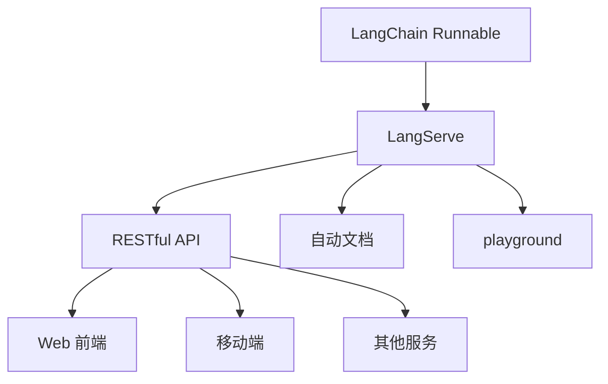
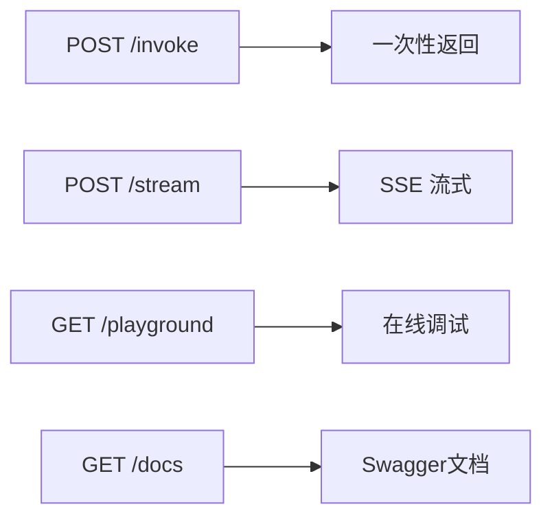
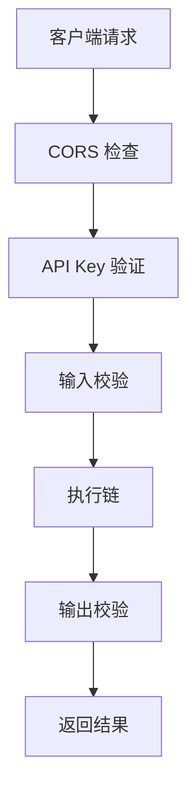
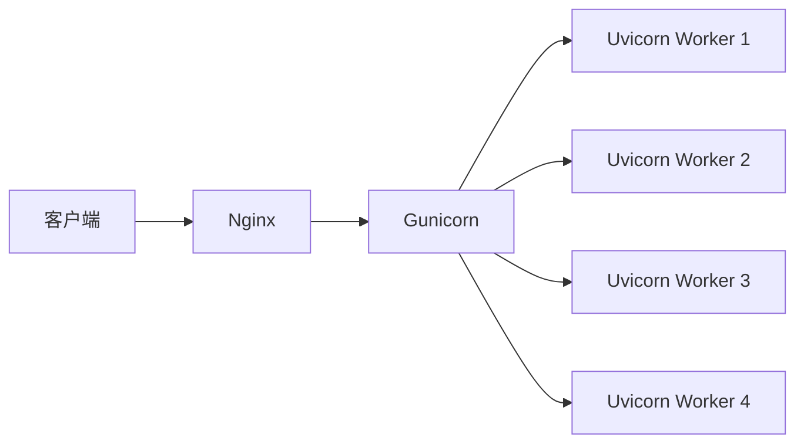

# 附录K：LangServe 与 API 服务部署指南

> **定位**：参考指南 | **前置知识**：LCEL、基本链构建 | **难度**：中高级

---

## 1. LangServe 概述

LangServe 将 LangChain 的链/Runnable 包装为 **RESTful API**，让外部应用可以通过 HTTP 调用。



| 特性 | 说明 |
|------|------|
| 一键部署 | 几行代码把链变成 API |
| 自动文档 | OpenAPI/Swagger 自动生成 |
| 在线调试 | 内置 playground |
| 流式支持 | SSE 流式输出 |
| 类型校验 | Pydantic 输入/输出校验 |

---

## 2. 快速部署

### 基础部署

```python
from fastapi import FastAPI
from langserve import add_routes
from langchain_openai import ChatOpenAI
from langchain_core.prompts import ChatPromptTemplate
from langchain_core.output_parsers import StrOutputParser

# 创建链
prompt = ChatPromptTemplate.from_template("讲一个关于{topic}的笑话")
model = ChatOpenAI(model="gpt-3.5-turbo")
chain = prompt | model | StrOutputParser()

# 创建 FastAPI 应用
app = FastAPI(
    title="LangChain API",
    version="1.0",
    description="LangChain 服务 API"
)

# 添加路由
add_routes(
    app,
    chain,
    path="/joke",
)

# 启动: uvicorn server:app --host 0.0.0.0 --port 8000
```

### 访问方式

```bash
# 直接调用
curl -X POST "http://localhost:8000/joke/invoke" \
  -H "Content-Type: application/json" \
  -d '{"input": {"topic": "程序员"}}'

# 流式
curl -N "http://localhost:8000/joke/stream" \
  -X POST \
  -H "Content-Type: application/json" \
  -d '{"input": {"topic": "猫"}}'

# 自动文档
open http://localhost:8000/docs

# Playground
open http://localhost:8000/joke/playground
```



---

## 3. 多链部署

```python
from langchain_core.prompts import ChatPromptTemplate
from langchain_core.output_parsers import StrOutputParser

# 链1：笑话生成
joke_chain = (
    ChatPromptTemplate.from_template("讲一个关于{topic}的笑话")
    | ChatOpenAI()
    | StrOutputParser()
)

# 链2：翻译
translate_chain = (
    ChatPromptTemplate.from_template("将以下内容翻译为{language}:\n{text}")
    | ChatOpenAI()
    | StrOutputParser()
)

# 链3：摘要
summary_chain = (
    ChatPromptTemplate.from_template("用3句话总结:\n{text}")
    | ChatOpenAI()
    | StrOutputParser()
)

# 全部添加
app = FastAPI(title="Multi-Chain API")

add_routes(app, joke_chain, path="/joke")
add_routes(app, translate_chain, path="/translate")
add_routes(app, summary_chain, path="/summary")
```

---

## 4. 自定义输入输出

```python
from pydantic import BaseModel, Field

# 定义输入模型
class JokeInput(BaseModel):
    topic: str = Field(description="笑话主题")
    count: int = Field(default=1, description="笑话数量", ge=1, le=5)

# 定义输出模型
class JokeOutput(BaseModel):
    jokes: list[str] = Field(description="笑话列表")
    topic: str = Field(description="主题")

# 自定义处理函数
def generate_jokes(input_data: JokeInput) -> JokeOutput:
    jokes = []
    for _ in range(input_data.count):
        result = joke_chain.invoke({"topic": input_data.topic})
        jokes.append(result)
    return JokeOutput(jokes=jokes, topic=input_data.topic)

# 添加为 Runnable
from langchain_core.runnables import RunnableLambda

joke_runnable = RunnableLambda(generate_jokes)
add_routes(app, joke_runnable, path="/custom-joke")
```

---

## 5. 认证与安全

### API Key 认证

```python
from fastapi import FastAPI, Depends, HTTPException, Security
from fastapi.security import APIKeyHeader

API_KEY = "your-secret-key"
api_key_header = APIKeyHeader(name="X-API-Key")

async def verify_api_key(api_key: str = Security(api_key_header)):
    if api_key != API_KEY:
        raise HTTPException(status_code=403, detail="Invalid API Key")
    return api_key

# 在路由中添加认证
add_routes(
    app,
    chain,
    path="/secure-joke",
    dependencies=[Depends(verify_api_key)],
)
```

### CORS 配置

```python
from fastapi.middleware.cors import CORSMiddleware

app.add_middleware(
    CORSMiddleware,
    allow_origins=["https://your-frontend.com"],
    allow_credentials=True,
    allow_methods=["*"],
    allow_headers=["*"],
)
```



---

## 6. 生产部署

### Gunicorn + Uvicorn

```bash
# 安装
pip install gunicorn uvicorn

# 启动（多 worker）
gunicorn -w 4 -k uvicorn.workers.UvicornWorker server:app --bind 0.0.0.0:8000
```

### Docker 部署

```dockerfile
# Dockerfile
FROM python:3.11-slim

WORKDIR /app
COPY requirements.txt .
RUN pip install --no-cache-dir -r requirements.txt

COPY . .
EXPOSE 8000

CMD ["gunicorn", "-w", "4", "-k", "uvicorn.workers.UvicornWorker", "server:app", "--bind", "0.0.0.0:8000"]
```

```yaml
# docker-compose.yml
version: "3.9"
services:
  langchain-api:
    build: .
    ports:
      - "8000:8000"
    environment:
      - OPENAI_API_KEY=${OPENAI_API_KEY}
    restart: unless-stopped
```

### Nginx 反向代理

```nginx
upstream langchain_api {
    server 127.0.0.1:8000;
}

server {
    listen 80;
    server_name api.example.com;

    # 流式支持
    proxy_http_version 1.1;
    proxy_set_header Connection "";
    proxy_buffering off;  # 流式必须关闭缓冲

    location / {
        proxy_pass http://langchain_api;
        proxy_set_header Host $host;
        proxy_set_header X-Real-IP $remote_addr;
    }
}
```



---

## 7. 流式输出

```python
from fastapi import FastAPI
from fastapi.responses import StreamingResponse
import json

@app.post("/chat/stream")
async def stream_chat(message: str):
    async def generate():
        async for chunk in chain.astream(message):
            yield f"data: {json.dumps({'content': chunk})}\n\n"
        yield "data: [DONE]\n\n"
    
    return StreamingResponse(
        generate(),
        media_type="text/event-stream"
    )
```

### 前端消费

```javascript
const eventSource = new EventSource("/chat/stream?message=你好");

eventSource.onmessage = (event) => {
    if (event.data === "[DONE]") {
        eventSource.close();
        return;
    }
    const data = JSON.parse(event.data);
    document.getElementById("output").textContent += data.content;
};
```

---

## 8. 监控与日志

```python
import logging
from datetime import datetime

logging.basicConfig(level=logging.INFO)
logger = logging.getLogger("langserve")

@app.middleware("http")
async def log_requests(request, call_next):
    start = datetime.now()
    response = await call_next(request)
    duration = (datetime.now() - start).total_seconds()
    
    logger.info(
        f"{request.method} {request.url.path} "
        f"status={response.status_code} "
        f"duration={duration:.3f}s"
    )
    return response
```

| 监控指标 | 工具 | 说明 |
|---------|------|------|
| 请求量 | Prometheus | QPS |
| 延迟 | Prometheus | P50/P95/P99 |
| 错误率 | Prometheus | 5xx 比例 |
| 资源 | Grafana | CPU/内存 |
| 链路追踪 | LangSmith | 每次调用追踪 |

---

## 9. 部署检查清单

| 检查项 | 说明 | 状态 |
|--------|------|------|
| 认证 | API Key 或 OAuth | □ |
| CORS | 限制来源 | □ |
| 限流 | 防止滥用 | □ |
| HTTPS | TLS 加密 | □ |
| 日志 | 请求日志 | □ |
| 监控 | Prometheus/Grafana | □ |
| 健康检查 | /health 端点 | □ |
| 优雅关闭 | SIGTERM 处理 | □ |
| 多 Worker | Gunicorn | □ |
| 反向代理 | Nginx | □ |
