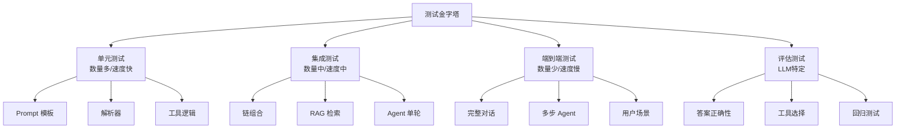
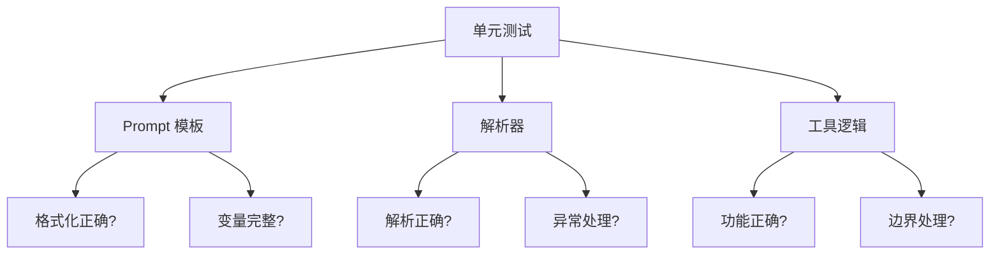
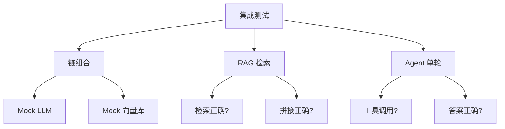
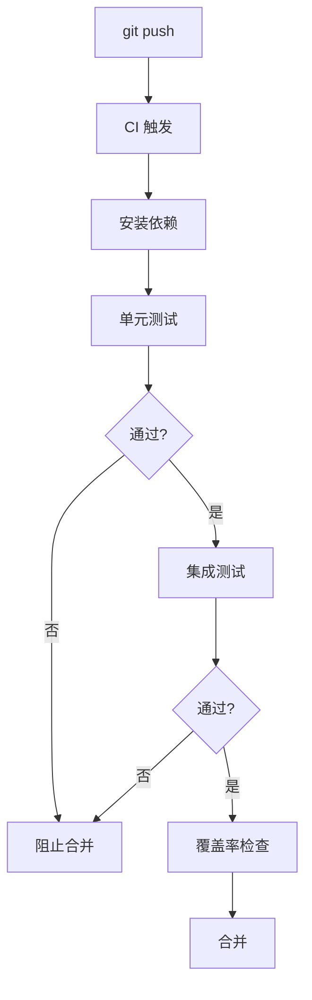

# 附录L：LangChain 测试策略与最佳实践

> **定位**：参考指南 | **前置知识**：基本链构建、Agent | **难度**：中高级

---

## 1. 测试分层



| 层级 | 测什么 | 用什么 | 运行频率 |
|------|--------|--------|---------|
| 单元 | Prompt/解析器/工具 | pytest + Mock | 每次提交 |
| 集成 | 链组合/RAG/Agent单轮 | pytest + Mock LLM | 每次提交 |
| 端到端 | 完整流程 | pytest + 真实 LLM | 每天/每周 |
| 评估 | 答案质量 | LangSmith | 每周 |

---

## 2. 单元测试

### Prompt 模板测试

```python
import pytest
from langchain_core.prompts import ChatPromptTemplate

class TestPromptTemplates:
    
    def test_basic_template(self):
        prompt = ChatPromptTemplate.from_template("你好，{name}!")
        result = prompt.format(name="张三")
        assert result == "你好，张三!"
    
    def test_multi_variable(self):
        prompt = ChatPromptTemplate.from_messages([
            ("system", "你是{role}"),
            ("human", "{question}"),
        ])
        result = prompt.format(role="助手", question="你好")
        assert "助手" in result
        assert "你好" in result
    
    def test_template_no_missing_vars(self):
        """确保模板没有遗漏变量"""
        prompt = ChatPromptTemplate.from_template("分析{topic}的{aspect}")
        # 如果遗漏变量会报错
        result = prompt.format(topic="AI", aspect="发展")
        assert "AI" in result
        assert "发展" in result
```

### 解析器测试

```python
from langchain_core.output_parsers import StrOutputParser, JsonOutputParser, PydanticOutputParser
from pydantic import BaseModel, Field

class TestData(BaseModel):
    name: str = Field(description="名称")
    age: int = Field(description="年龄")

class TestParsers:
    
    def test_string_parser(self):
        parser = StrOutputParser()
        result = parser.parse("Hello World")
        assert result == "Hello World"
    
    def test_json_parser(self):
        parser = JsonOutputParser()
        result = parser.parse('{"name": "张三", "age": 25}')
        assert result["name"] == "张三"
        assert result["age"] == 25
    
    def test_pydantic_parser(self):
        parser = PydanticOutputParser(pydantic_object=TestData)
        json_str = '{"name": "李四", "age": 30}'
        result = parser.parse(json_str)
        assert isinstance(result, TestData)
        assert result.name == "李四"
        assert result.age == 30
    
    def test_parser_handles_partial_json(self):
        """解析器应处理不完整 JSON"""
        parser = JsonOutputParser()
        # 应该能处理或抛出明确异常
        with pytest.raises(Exception):
            parser.parse('{"name": "张三"')  # 不完整
```

### 工具测试

```python
from langchain_core.tools import tool

@tool
def calculate(expression: str) -> str:
    """计算数学表达式"""
    try:
        result = eval(expression)  # 生产中用安全的方式
        return str(result)
    except:
        return "计算错误"

class TestTools:
    
    def test_calculate_add(self):
        assert calculate.invoke("2+3") == "5"
    
    def test_calculate_multiply(self):
        assert calculate.invoke("4*5") == "20"
    
    def test_calculate_invalid(self):
        assert calculate.invoke("abc") == "计算错误"
    
    def test_tool_has_description(self):
        """工具应该有描述"""
        assert calculate.description is not None
        assert len(calculate.description) > 0
    
    def test_tool_has_args_schema(self):
        """工具应该有参数 schema"""
        assert calculate.args_schema is not None
```



---

## 3. Mock LLM 测试

### 固定返回 Mock

```python
from langchain_core.messages import AIMessage
from langchain_core.language_models import BaseChatModel
from langchain_core.outputs import ChatGeneration, ChatResult
from typing import List, Optional

class MockLLM(BaseChatModel):
    """用于测试的 Mock LLM"""
    
    responses: list = []
    call_count: int = 0
    
    def _generate(self, messages, stop=None, run_manager=None, **kwargs):
        if self.call_count < len(self.responses):
            content = self.responses[self.call_count]
            self.call_count += 1
        else:
            content = "mock exhausted"
        
        return ChatResult(
            generations=[ChatGeneration(message=AIMessage(content=content))]
        )
    
    @property
    def _llm_type(self):
        return "mock"
    
    def reset(self):
        self.call_count = 0

# 使用
def test_chain_with_mock():
    mock = MockLLM(responses=["这是一个笑话"])
    
    chain = prompt | mock | StrOutputParser()
    result = chain.invoke({"topic": "程序员"})
    
    assert result == "这是一个笑话"
    assert mock.call_count == 1  # 确认调用了1次
```

### 条件返回 Mock

```python
class ConditionalMockLLM(BaseChatModel):
    """根据输入内容返回不同响应"""
    
    response_map: dict = {}
    
    def _generate(self, messages, stop=None, run_manager=None, **kwargs):
        # 获取最后一条消息内容
        last_msg = messages[-1].content
        
        # 根据内容匹配返回
        for pattern, response in self.response_map.items():
            if pattern in last_msg:
                return ChatResult(
                    generations=[ChatGeneration(message=AIMessage(content=response))]
                )
        
        return ChatResult(
            generations=[ChatGeneration(message=AIMessage(content="default"))]
        )
    
    @property
    def _llm_type(self):
        return "conditional-mock"

# 使用
def test_conditional_chain():
    mock = ConditionalMockLLM(response_map={
        "翻译": "translated text",
        "摘要": "summary text",
        "笑话": "joke text",
    })
    
    translate_chain = translate_prompt | mock | StrOutputParser()
    result = translate_chain.invoke({"text": "hello", "language": "中文"})
    assert result == "translated text"
```

---

## 4. 集成测试

### 链组合测试

```python
class TestChainIntegration:
    
    def test_full_chain_with_mock(self):
        """测试完整链（用 Mock LLM）"""
        mock = MockLLM(responses=[
            "分析结果：这是一个优质产品",  # 第一次调用
        ])
        
        chain = prompt | mock | StrOutputParser()
        result = chain.invoke({"topic": "iPhone"})
        
        assert "分析结果" in result
        assert mock.call_count == 1
    
    def test_multi_step_chain(self):
        """测试多步链"""
        mock = MockLLM(responses=[
            "步骤1：检索信息",
            "步骤2：分析信息",
            "步骤3：生成答案",
        ])
        
        # 3次调用的链
        step1 = step1_prompt | mock | StrOutputParser()
        step2 = step2_prompt | mock | StrOutputParser()
        step3 = step3_prompt | mock | StrOutputParser()
        
        # 用 LCEL 组合
        chain = (
            RunnablePassthrough.assign(step1_result=step1)
            | RunnablePassthrough.assign(step2_result=step2)
            | step3
        )
        
        result = chain.invoke({"input": "测试"})
        assert "步骤3" in result
```

### RAG 集成测试

```python
class TestRAGIntegration:
    
    @pytest.fixture
    def mock_vector_store(self):
        """Mock 向量库"""
        store = Mock()
        store.similarity_search = Mock(return_value=[
            Document(page_content="Python 是一门编程语言"),
            Document(page_content="Python 简单易学"),
        ])
        return store
    
    def test_rag_retrieval(self, mock_vector_store):
        """测试 RAG 检索"""
        retriever = mock_vector_store.as_retriever()
        docs = retriever.invoke("Python")
        
        assert len(docs) == 2
        assert "Python" in docs[0].page_content
    
    def test_rag_full_chain(self, mock_vector_store):
        """测试完整 RAG 链"""
        mock_llm = MockLLM(responses=["Python是一门简单易学的编程语言"])
        
        rag_chain = (
            {"context": mock_vector_store.as_retriever(), "question": RunnablePassthrough()}
            | prompt
            | mock_llm
            | StrOutputParser()
        )
        
        result = rag_chain.invoke("什么是Python？")
        assert "Python" in result
        assert mock_llm.call_count == 1
```



---

## 5. Agent 测试

### 单轮测试

```python
class TestAgent:
    
    @pytest.fixture
    def mock_agent(self):
        mock_llm = ConditionalMockLLM(response_map={
            "需要搜索": "",  # 决定用工具
            "最终答案": "答案是42",
        })
        
        mock_tool = Mock()
        mock_tool.name = "search"
        mock_tool.invoke = Mock(return_value="搜索结果")
        
        return create_react_agent(mock_llm, [mock_tool]), mock_tool
    
    def test_agent_calls_tool(self, mock_agent):
        agent, mock_tool = mock_agent
        result = agent.invoke({"messages": [{"role": "user", "content": "需要搜索答案"}]})
        
        assert mock_tool.invoke.call_count >= 1
    
    def test_agent_returns_answer(self, mock_agent):
        agent, _ = mock_agent
        result = agent.invoke({"messages": [{"role": "user", "content": "最终答案是什么"}]})
        
        last_msg = result["messages"][-1].content
        assert "42" in last_msg
```

---

## 6. pytest 配置

```ini
# pytest.ini
[pytest]
testpaths = tests
python_files = test_*.py
python_classes = Test*
python_functions = test_*
addopts = -v --tb=short --strict-markers
markers =
    unit: 单元测试
    integration: 集成测试
    e2e: 端到端测试
    slow: 慢测试
    requires_llm: 需要真实 LLM
```

### conftest.py

```python
import pytest
from pathlib import Path

@pytest.fixture
def mock_llm():
    """默认 Mock LLM"""
    from tests.mocks import MockLLM
    return MockLLM(responses=["default response"])

@pytest.fixture
def sample_documents():
    """测试文档"""
    return [
        Document(page_content="文档1：AI 是人工智能"),
        Document(page_content="文档2：ML 是机器学习"),
        Document(page_content="文档3：DL 是深度学习"),
    ]

@pytest.fixture
def temp_vector_store(sample_documents):
    """临时向量库"""
    from langchain_community.vectorstores import FAISS
    from langchain_openai import OpenAIEmbeddings
    # 用 mock embeddings
    return FAISS.from_documents(sample_documents, mock_embeddings)
```

### 运行命令

```bash
# 全部单元测试
pytest -m unit

# 跳过需要真实 LLM 的测试
pytest -m "not requires_llm"

# 只跑集成测试
pytest -m integration

# 慢测试单独跑
pytest -m slow

# 生成覆盖率
pytest --cov=src --cov-report=html
```

---

## 7. CI/CD 集成

```yaml
# .github/workflows/test.yml
name: Tests
on: [push, pull_request]

jobs:
  unit-tests:
    runs-on: ubuntu-latest
    steps:
      - uses: actions/checkout@v4
      - uses: actions/setup-python@v4
        with:
          python-version: "3.11"
      - run: pip install -r requirements.txt
      - run: pip install pytest pytest-cov
      - name: Run unit tests
        run: pytest -m unit --cov=src --cov-report=xml
      - name: Run integration tests
        run: pytest -m integration
      - name: Upload coverage
        uses: codecov/codecov-action@v3
```



---

## 8. 测试最佳实践

| 实践 | 说明 | 优先级 |
|------|------|--------|
| Mock 优先 | CI 不依赖真实 LLM | 高 |
| 测试独立 | 每个测试不依赖其他 | 高 |
| 测试可重复 | 同样的输入同样的结果 | 高 |
| 覆盖边界 | 测空输入、超长、特殊字符 | 中 |
| 命名清晰 | test_模块_功能 格式 | 中 |
| AAA 模式 | Arrange-Act-Assert | 中 |
| Fixture 复用 | conftest.py 管理公共 fixture | 中 |

### 测试命名规范

```python
# 好的命名
def test_prompt_formats_correctly():
    ...

def test_parser_handles_invalid_json():
    ...

def test_agent_calls_search_tool_when_needed():
    ...

# 不好的命名
def test_1():
    ...
def test_stuff():
    ...
```

### AAA 模式

```python
def test_calculate_addition():
    # Arrange - 准备
    expression = "2 + 3"
    expected = "5"
    
    # Act - 执行
    result = calculate.invoke(expression)
    
    # Assert - 断言
    assert result == expected
```

---

## 9. 测试检查清单

| 检查项 | 说明 | 状态 |
|--------|------|------|
| 单元测试 | Prompt/解析器/工具 | □ |
| Mock LLM | CI 不用真实 LLM | □ |
| 集成测试 | 链组合/RAG | □ |
| Agent 测试 | 工具调用+答案 | □ |
| 边界测试 | 空/超长/特殊字符 | □ |
| 覆盖率 | > 80% | □ |
| CI/CD | 自动化流水线 | □ |
| 回归测试 | 防止退化 | □ |
| 命名规范 | 清晰一致 | □ |
| Fixture 管理 | conftest.py | □ |
