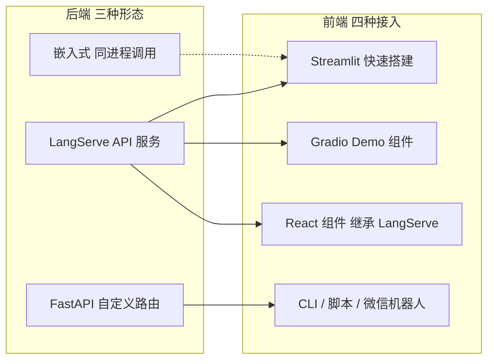
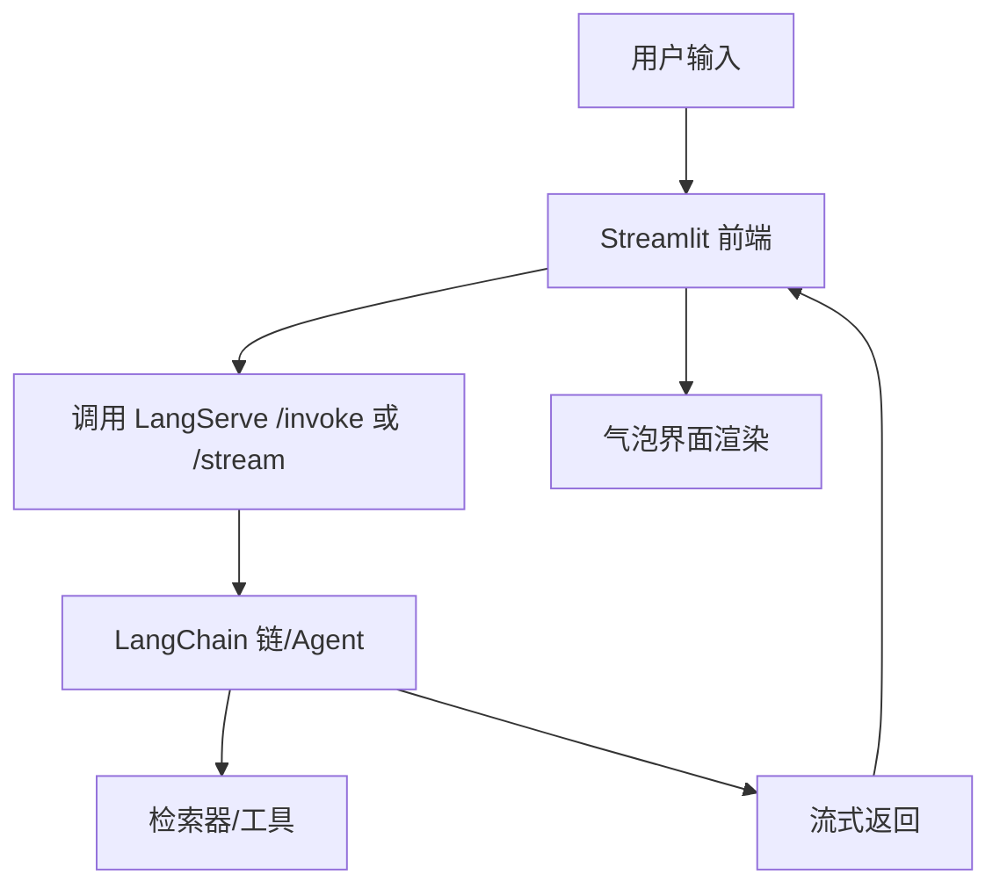
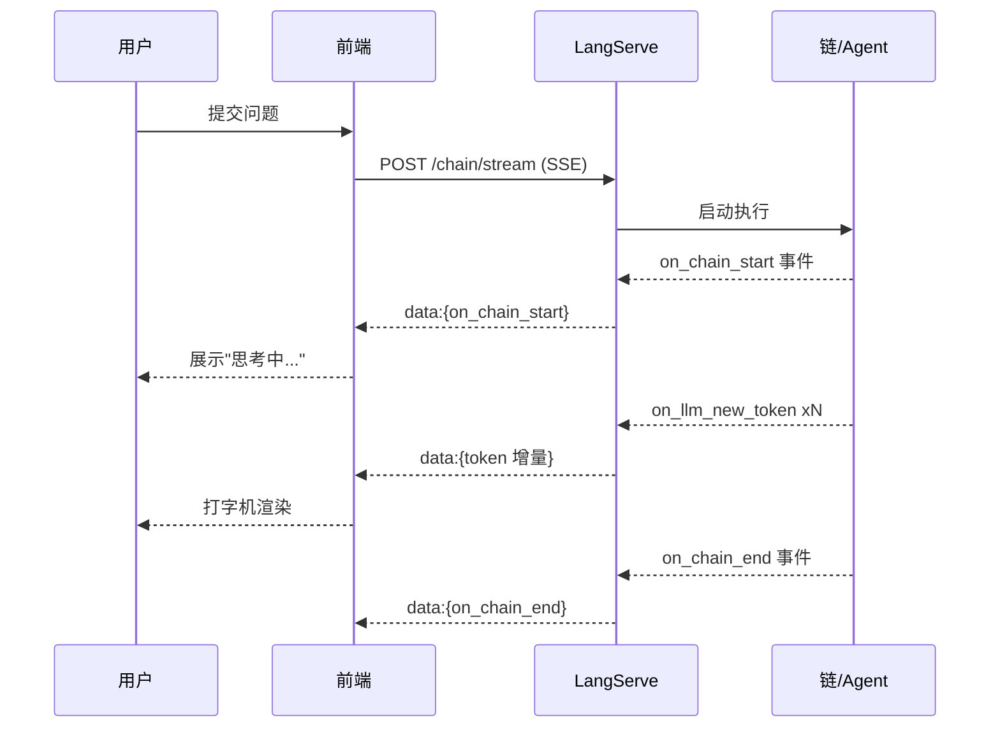

# 附录M 前端集成指南：把 LangChain 应用接入用户界面

> 定位：附录第 13 篇（M）· v8.0 · 37 课完整版系列
> 前置要求：已完成 LangServe 部署（附录K）、链与 Agent 开发
> 学习目标：掌握四种主流 LangChain 应用前端接入方式，理解流式交互与部署形态选型

---

## 1. 前端集成全景

LangChain 应用本身是后端服务，前端接入的核心问题有两个：
1. **如何暴露接口**（同步/流式/事件流）
2. **如何承载交互**（Web 页面、聊天组件、桌面端、命令行）



选型速查：快速演示用 Streamlit/Gradio；产品级 Web 用 React 继承；工作流自动化用 CLI/脚本；聊天应用用封装组件。

---

## 2. 方式一：LangServe + API 直接调用

LangServe 部署后（详见附录K），前端通过 REST 调用：

```python
import requests

resp = requests.post(
    "http://localhost:8000/chain/invoke",
    json={"input": {"question": "LangChain 是什么？"}},
)
print(resp.json()["output"])
```

流式调用（打字机效果）：

```python
import requests

with requests.post(
    "http://localhost:8000/chain/stream",
    json={"input": {"question": "写一段产品介绍"}},
    stream=True,
) as r:
    for chunk in r.iter_content(chunk_size=256):
        print(chunk.decode(), end="", flush=True)
```

---

## 3. 方式二：Streamlit 快速搭建（推荐起步）

Streamlit 最适合把 LangChain 应用 20 分钟内变成可交互页面：

```python
import streamlit as st
from langchain_core.messages import AIMessage, HumanMessage
from langchain_openai import ChatOpenAI

st.set_page_config(page_title="我的 AI 助手", page_icon="🤖")
st.title("LangChain Demo")

if "messages" not in st.session_state:
    st.session_state.messages = []

for msg in st.session_state.messages:
    st.chat_message(msg.type).write(msg.content)

prompt = st.chat_input("输入你的问题...")
if prompt:
    st.session_state.messages.append(HumanMessage(content=prompt))
    st.chat_message("human").write(prompt)

    llm = ChatOpenAI(model="gpt-4o-mini")
    with st.chat_message("assistant"):
        response = st.write_stream(llm.stream(prompt))
    st.session_state.messages.append(AIMessage(content="".join(response)))
```

要点：
- `st.chat_message` 渲染气泡；`st.write_stream` 支持流式输出
- 会话历史存 `st.session_state`（刷新丢失，仅演示用）
- 生产替换为服务端持久化 + 后端 API 调用



---

## 4. 方式三：LangServe + 前端

产品级 Web 前端（React）通过 LangServe 包的 `RemoteRunnable` 复用后端链对象：

```javascript
// 前端 JS 侧（示意）
const response = await fetch("http://localhost:8000/agent/stream", {
  method: "POST",
  headers: { "Content-Type": "application/json" },
  body: JSON.stringify({ input: { question: "你好" } }),
  // 使用 fetch + ReadableStream 处理 SSE 流
});
```

亦可在服务端返回流式事件（`application/json + SSE`），前端用 EventSource/ReadableStream 逐段渲染——实现打字机效果的同时保留结构化事件（工具调用、检索结果）。

---

## 5. 方式四：命令行与自动化脚本

无需浏览器场景：

```python
# cli_ask.py —— 三行完成命令行问答
import requests

while True:
    q = input("你: ")
    if q.lower() in ("exit", "quit"):
        break
    r = requests.post("http://localhost:8000/chain/invoke",
                      json={"input": {"question": q}})
    print("AI:", r.json()["output"])
```

扩展场景：企业微信/钉钉/如流机器人回调 → 调用 LangServe → 返回文本；GitHub Action 触发每日报告生成等。

---

## 6. 流式协议与事件类型

LangServe 流式分为三类事件（前端可逐步消费）：

| 事件 | 载荷 | 前端用途 |
| --- | --- | --- |
| `data: {"event": "on_chain_start"...}` | 链开始 | 显示"思考中..." |
| `data: {"event": "on_llm_new_token"...}` | token 增量 | 打字机效果 |
| `data: {"event": "on_tool_end"...}` | 工具结果 | 展示"已检索 N 条" |



---

## 7. 部署形态对比

| 形态 | 适用 | 优点 | 缺点 |
| --- | --- | --- | --- |
| Streamlit 单机 | 内部工具/演示 | 快、内置聊天组件 | 多用户并发弱 |
| Gradio 分享链接 | 快速共享给他人 | 一行 `launch(share=True)` | 非产品级 UI |
| React + LangServe | 产品级 Web | 可定制、可扩展 | 前端开发成本高 |
| CLI/机器人 | 自动化工作流 | 零 UI 成本、易集成 | 交互受限 |
| 移动端 | 面向 C 端 | 触达广 | 需后端平台支持 |

---

## 8. 常见问题排查

| 问题 | 原因 | 解决 |
| --- | --- | --- |
| 前端拿不到流式输出 | 用了 `/invoke` 而非 `/stream` | 改用流式端点 |
| CORS 报错 | 未配置跨域 | LangServe `add_cors_middleware` |
| 会话串号 | 未传 thread_id | 前端维护会话 ID 传后端 |
| 流中断 | 后端异常/超时 | 前端加超时重试与错误提示 |
| 敏感信息泄露 | 日志/错误信息上抛 | 前端只展示脱敏结果 |

---

## 9. 检查清单

- [ ] 确定接入形态（demo/产品/自动化）
- [ ] 流式输出已通过 `/stream` 端点在浏览器验证
- [ ] 会话 thread_id 由前端生成并持久化
- [ ] CORS 与鉴权已配置（生产必选）
- [ ] 错误处理：前端有兜底的错误提示
- [ ] 打字机/加载态体验达标
- [ ] 测试 5 条典型问题 + 2 条异常输入

相关章节：附录K LangServe 部署、附录G Prompt 工具箱、附录I Callback 事件。