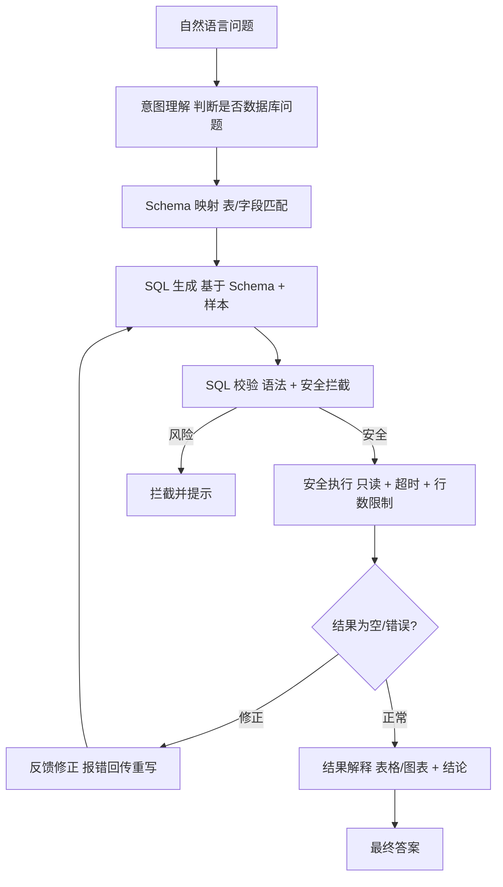
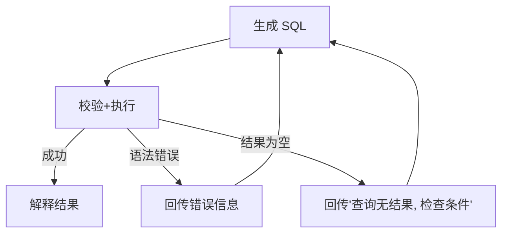
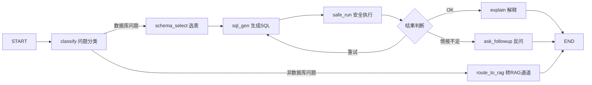

# 附录N 数据库 Agent 与 Text-to-SQL 深入指南

> 定位：附录第 14 篇（N）· v8.0 · 37 课完整版系列
> 前置要求：已完成 SQL 基础、Agent 工具集成、LangGraph 状态管理
> 学习目标：掌握从自然语言到 SQL 的完整链路，安全地构建数据库 Agent

---

## 1. 为什么要数据库 Agent

企业数据大多存在关系型数据库中。用户没有 SQL 技能，但问题往往直接对应查询需求：

```
"上季度华东区各产品线的销售额排名"
→ SELECT product_line, SUM(amount) FROM sales
  WHERE region='华东' AND quarter='Q3' GROUP BY product_line ORDER BY 2 DESC
```

数据库 Agent = **自然语言 → SQL 生成 → 执行验证 → 结果解释** 的闭环，让非技术人员也能"用嘴查数据库"。

在 Agentic RAG 体系里，它是结构化数据通道（区别于向量文本通道），两者互补。

---

## 2. 系统架构



---

## 3. 核心模块详解

### 3.1 Schema 感知（决定生成质量）

给 LLM 的提示中必须包含**准确的结构化信息**，而不是整库 DDL：

```python
schema_context = """
数据库: sales_db
表 sales:
  id INT PK          # 销售单主键
  region VARCHAR     # 区域: 华东/华北/华南/西南
  product_line VARCHAR  # 产品线
  amount DECIMAL(12,2)  # 金额 元
  sale_date DATE     # 销售日期
常见业务口径:
  - 销售额 = SUM(amount)，不包含退货单(status='CANCELED')
"""
```

要点：
- 字段注释（业务口径）比字段名更有效
- 只注入当前问题相关的 2-4 张表，避免大表 Schema 撑爆上下文
- 提供 2-3 条"问题→SQL"样本（few-shot）显著提升准确率

### 3.2 SQL 生成链

```python
from langchain_core.prompts import ChatPromptTemplate

sql_prompt = ChatPromptTemplate.from_template("""
你是一名资深数据工程师。根据 Schema 回答用户问题，只输出 SQL。

Schema:
{schema}

用户问题: {question}

要求:
1. 只输出 SQL 语句，不要解释
2. 使用 COUNT(*) 而非 COUNT(具体列) 做聚合
3. 时间过滤使用 sale_date，统一格式 YYYY-MM-DD
4. 不含 DELETE/UPDATE/INSERT/DROP 等写操作

SQL:
""")

sql_chain = sql_prompt | llm | StrOutputParser()
```

### 3.3 安全执行器（红线）

```python
import sqlite3, re

DISALLOWED = re.compile(r"\b(DELETE|UPDATE|INSERT|DROP|ALTER|CREATE|GRANT|ATTACH)\b", re.I)

def safe_execute(sql: str, db_path: str, max_rows: int = 200) -> dict:
    if DISALLOWED.search(sql):
        return {"ok": False, "error": "拒绝执行写操作", "sql": sql}
    conn = sqlite3.connect(db_path, timeout=5)
    conn.execute("PRAGMA query_only = ON")     # 数据库层只读兜底
    conn.execute(f"PRAGMA max_mem = 1000")      # 资源限制示意
    try:
        cur = conn.execute(sql + " LIMIT " + str(max_rows))
        cols = [d[0] for d in cur.description]
        rows = cur.fetchall()
        return {"ok": True, "columns": cols, "rows": rows}
    except Exception as e:
        return {"ok": False, "error": str(e)}
    finally:
        conn.close()
```

安全四重保障：
1. **正则黑白名单**：拦截写操作关键字
2. **数据库层只读**：`PRAGMA query_only`（SQLite）/ 只读连接（Postgres `default_transaction_read_only`）
3. **资源限制**：行数 LIMIT、超时、内存上限
4. **专用账号**：仅授予 SELECT 的最小权限，连接串不入提示

---

## 4. 自愈循环：报错回传重新生成

SQL 生成必然有出错率。标准做法是把执行错误作为反馈再次生成：

```python
def text_to_sql_with_retry(question, schema, max_tries=3):
    for i in range(max_tries):
        sql = sql_chain.invoke({"schema": schema, "question": question})
        result = safe_execute(sql, DB_PATH)
        if result["ok"]:
            return sql, result
        # 回传错误，要求修正
        feedback = f"你的 SQL 执行失败: {result['error']}\n请重新生成正确 SQL:"
        prompt = (原问题 + feedback)
    return None, {"ok": False, "error": "重试次数用尽"}
```



> 提示：空结果不一定是错误——可能是"真的没数据"。修正反馈应引导模型区分"条件太严"与"数据不存在"，必要时建议放宽条件或反问用户。

---

## 5. 结果解释与可视化输出

```python
explain_prompt = PromptTemplate.from_template("""
基于查询结果回答用户问题。
问题: {question}
SQL: {sql}
结果列: {columns}
结果行: {rows}

请用自然语言回答，若适合表格或排行请用要点的形式；结果中有明显的数字结论请突出。
""")
```

输出前做一次"合理性校验"：让 LLM 复核结果是否与问题一致（数值量级、单位），减少"答非所问"的返回。

---

## 6. 基于 LangGraph 的数据库 Agent



状态设计：`question / schema / sql / result / attempts`；条件边根据 `attempts < 3 and not result.ok` 决定是否回到 `sql_gen`。

---

## 7. 常见陷阱清单

| 陷阱 | 表现 | 对策 |
| --- | --- | --- |
| Schema 注入过全 | 上下文爆炸、选错表 | 按问题选 2-4 张表注入 |
| 无口径注释 | 字段含义猜测错误 | Schema 里写业务口径 |
| 忘记写操作拦截 | 高危命令执行 | 多重只读兜底（必做） |
| 返回全表数据 | 大表拖垮响应/超限 | 强制 LIMIT + 聚合提示 |
| 日期格式混乱 | 时间过滤失效 | 统一格式指令 + 校验 |
| 报错回传循环 | 同一错误反复生成 | 记录已尝试 SQL，黑名单去重 |

---

## 8. 生产上线检查清单

- [ ] 只读账号（SELECT-only）、连接串机密化管理
- [ ] SQL 黑白名单 + 数据库层只读 + 行数/超时限制（三重）
- [ ] Schema 注入自动选表 + 口径注释维护机制
- [ ] 自愈循环上限与尝试黑名单
- [ ] 敏感表/敏感字段脱敏或禁止查询
- [ ] 结果解释前合理性校验
- [ ] 评估集：30-50 条 Q-SQL 标准对，跟踪准确率
- [ ] 审计日志：记录生成 SQL 与执行结果

相关章节：知识库33 Agentic RAG（SQL 通道）、知识库13 生产部署、附录L 测试策略。