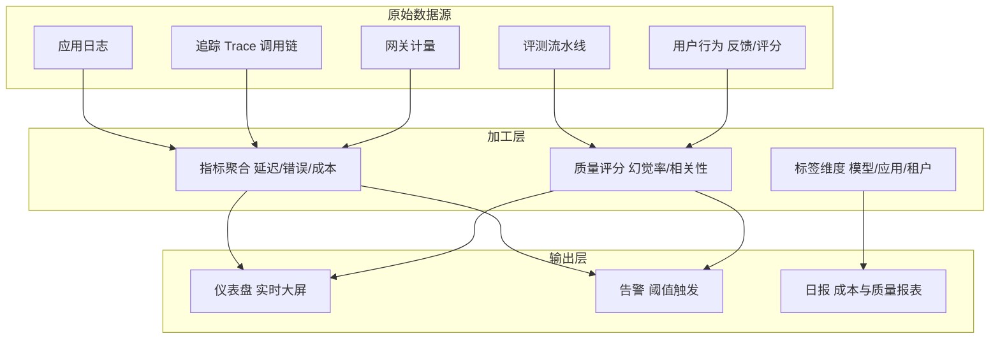
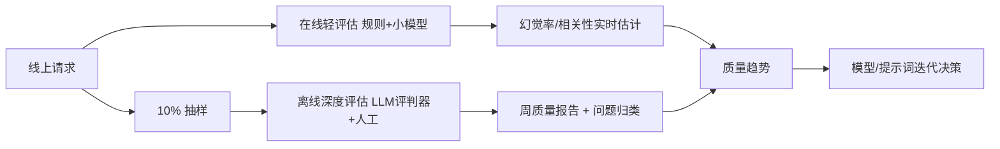

# 附录O 生产监控与告警体系指南

> 定位：附录第 15 篇（O）· v9.0 · 41 课完整版系列
> 前置要求：已完成 LangSmith 可观测性（附录H）、生产部署（KB12）、LLM 网关（KB35）
> 学习目标：搭建 LLM 应用生产监控体系——指标定义、追踪、告警、成本与质量监控

---

## 1. 监控什么：四类黄金指标

LLM 应用监控不止看服务器健康，还要看**模型表现与业务质量**：

| 类别 | 指标 | 说明 |
| --- | --- | --- |
| 性能 | 首 token 延迟、总延迟、吞吐 | 用户体验直接指标 |
| 可靠性 | 错误率、重试率、超时率、模型故障率 | 稳定性 |
| 成本 | token 消耗、单价、缓存命中率 | 钱花在哪 |
| 质量 | 幻觉率、用户负反馈率、拒答率 | 回答好不好 |



---

## 2. 追踪（Tracing）：一请求一链路

每个用户请求必须能还原完整调用链：输入 → 检索 → 工具调用 → LLM 调用 → 输出。

LangSmith 提供开箱即用追踪，生产组合建议：

```
请求 ID 贯穿: 网关 → 应用 → 链 → 工具/检索器/模型
每个 span 记录: 输入摘要, 输出摘要, 耗时, token, 错误信息
```

```python
# LangSmith 环境变量（LangChain 生态内自动生效）
export LANGCHAIN_TRACING_V2="true"
export LANGCHAIN_API_KEY="..."
export LANGCHAIN_PROJECT="rag-production"
```

自定义 span 埋点（非 LangChain 组件也要监控）：

```python
from langchain_core.callbacks import (
    BaseCallbackHandler, CallbackManager
)

class MetricsHandler(BaseCallbackHandler):
    def on_llm_start(self, serialized, prompts, **kwargs):
        start_time[serialized.get("id")] = time.time()
    def on_llm_end(self, response, **kwargs):
        record("llm_latency", time.time() - last_start())
    def on_tool_error(self, error, **kwargs):
        record("tool_error", str(error)[:200])
```

---

## 3. 告警设计

### 3.1 告警分级

| 级别 | 触发示例 | 响应 |
| --- | --- | --- |
| P0 紧急 | 错误率 > 10% 持续 5 分钟；模型大面积故障 | 立即通知 + 自动降级 |
| P1 高 | 延迟 P95 超阈值；成本单日超预算 80% | 值班确认 |
| P2 中 | 缓存命中率骤降；单模型错误率升高 | 当日处理 |
| P3 低 | 质量评分小幅波动 | 周报关注 |

### 3.2 关键告警规则示例

```yaml
# alert_rules.yaml 示意
rules:
  - name: error_rate_high
    metric: error_rate
    condition: "> 0.10 for 5m"
    severity: P0
    action: pager + auto_fallback

  - name: cost_daily_spike
    metric: daily_cost
    condition: "> 80% of cap"
    severity: P1
    action: slack + quota_check

  - name: llm_latency_p95
    metric: latency_p95
    condition: "> 5s for 10m"
    severity: P1
    action: pager

  - name: hallucination_rate
    metric: hallucination_rate
    condition: "> 0.15 for 24h"
    severity: P2
    action: quality_review
```

### 3.3 告警质量三问

1. 告警可行动吗？（收到后知道怎么处理）
2. 有误报抑制吗？（重复告警合并、静默期）
3. 有导向根因吗？（告警消息带 trace_id 和日志链接）

---

## 4. 质量监控：把评测搬进生产

生产质量监控思路：**抽样复盘 + 在线轻评估**。



| 评估手段 | 位置 | 成本 | 频率 |
| --- | --- | --- | --- |
| 规则检查（引用、长度） | 在线 | 低 | 每个请求 |
| 轻量 LLM 评判 | 在线抽样 10% | 中 | 持续 |
| 深度评判 + 人工 | 离线 | 高 | 每日/每周 |
| 回归测试集 | CI/定时 | 中 | 每次发布 |

---

## 5. 监控体系搭建清单

- [ ] 四类黄金指标（性能/可靠性/成本/质量）全部有数据源（必须）
- [ ] 请求级全链路追踪（LangSmith/自建），trace_id 贯穿（必须）
- [ ] 告警分级 + 阈值 + 通知渠道 + 值班响应（必须）
- [ ] 成本按 租户/应用/模型 标签化日报告（必须）
- [ ] 质量抽样评估 + 周报告（建议）
- [ ] 仪表盘：实时概览（错误率、延迟、成本、活跃用户）（建议）
- [ ] 告警演练：季度故障演练验证响应链路（建议）
- [ ] 监控自身健康：避免监控死掉而无人知（建议）

---

## 6. 相关主题导航

| 相关章节 | 内容 |
| --- | --- |
| 附录H LangSmith | 追踪与分析工具 |
| KB35 LLM 网关 | 网关计量与配额 |
| KB37 幻觉检测 | 质量监控的检测手段 |
| 附录P 知识库治理 | 数据质量与维护 |