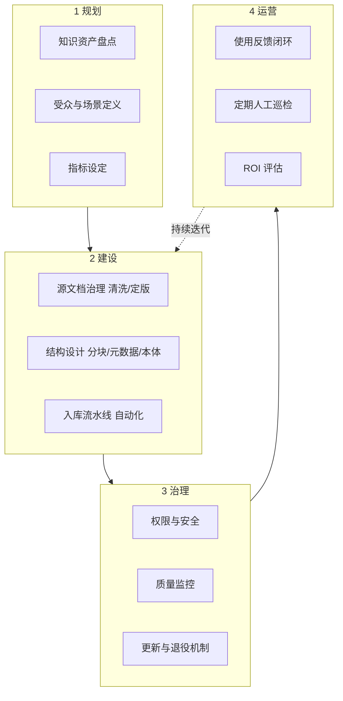
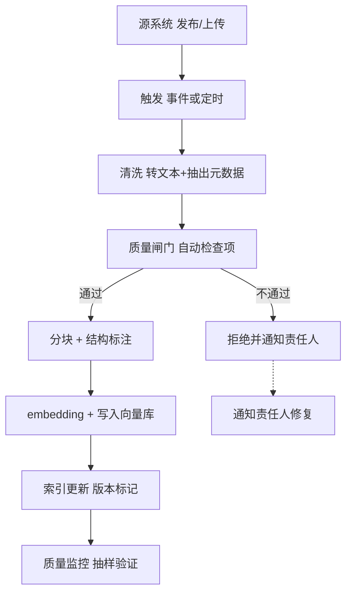

# 附录P 企业知识库建设与治理指南

> 定位：附录第 16 篇（P）· v9.0 · 41 课完整版系列
> 前置要求：已完成文档解析与预处理（KB17）、向量库选型（KB15）、RAG 架构（KB16）
> 学习目标：掌握企业级 RAG 知识库的规划、建设、治理与运营方法论——从"能跑"到"好用、敢信"

---

## 1. 知识库建设全景

RAG 系统的质量天花板 80% 由**知识库本身**决定，而非模型。文档杂乱、口径冲突、版本失控，再好的检索也是"垃圾进垃圾出"。



---

## 2. 知识资产盘点与分类

先盘清"有什么"，再决定"怎么进"：

| 知识类型 | 特点 | 入库策略 | 典型来源 |
| --- | --- | --- | --- |
| 规章制度 | 权威、少变 | 全文入库 + 版本号 | 制度库、审批文件 |
| 产品文档 | 更新频繁 | 增量同步 + 版本管理 | 产品手册、FAQ |
| 项目和案例 | 经验沉淀 | 结构化模板后入库 | 项目复盘、案例库 |
| 行业知识 | 时效性 | 定期更新 + 标注日期 | 研报、新闻 |
| 内部数据 | 敏感 | 权限隔离 + 脱敏 | 报表、合同 |

**分类维度设计**：`domain（域）` + `owner（责任人）` + `trust（可信等级）` + `version（版本）` + `expire（有效期）`——每个文档都要能回答"谁管的、可信吗、过期没"。

---

## 3. 文档治理的"三板斧"

### 第一斧：清洗与定版

```yaml
入库前检查项:
  - 格式: 统一为规范来源（原始pdf/word保留备份）
  - 结构: 标题层级规范, 标题能表达内容
  - 口径: 冲突内容标记, 以最新/权威版本为准
  - 敏感: 脱敏或排除
  - 质量: 检出空白页/乱码/重复
```

### 第二斧：元数据与分块设计

| 元数据字段 | 示例 | 用途 |
| --- | --- | --- |
| doc_id / title | POL-2026-018 休假制度 | 溯源、去重 |
| domain | 人力资源 | 权限过滤 |
| owner | HR 制度组 | 责任人 |
| version / effective_date | v3 / 2026-01-01 | 时效管理 |
| trust_level | 官方 | 排序加权 |
| source_url | ... | 溯源跳转 |

分块原则（与 KB17 衔接）：按语义成块、块内自足、块间不重不漏；标记块所属文档，支持引用回跳。

### 第三斧：入库流水线自动化



---

## 4. 权限与安全（知识库专用要点）

企业知识库权限是 RAG 安全的关键场景：

| 层级 | 控制点 | 手段 |
| --- | --- | --- |
| 文档级 | 谁能检索到某文档 | 向量库元数据过滤（domain + 租户） |
| 内容级 | 检索到的内容敏感字段 | 脱敏后入库 |
| 返回级 | 引用与溯源开放范围 | 源权限联动 |
| 审计级 | 谁检索了什么 | 全量检索日志 |

```python
# 检索时强制注入权限过滤
def secure_search(query, user, k=5):
    filters = {
        "domain": {"$in": user.allowed_domains},
        "trust_level": {"$gte": user.min_trust},
        "effective_date": {"$lte": today},
    }
    return vector_store.similarity_search(query, k=k, filter=filters)
```

**关键原则：权限过滤在检索层强制执行，不依赖提示词提醒模型"别泄露"。**

---

## 5. 更新、退役与质量运营

### 生命周期管理

| 阶段 | 动作 |
| --- | --- |
| 有效期内 | 可检索、排序加权 |
| 即将过期 | 预警责任人确认 |
| 已过期 | 从检索结果降权/移除（保留历史版本存档） |
| 新版本发布 | 旧版本标记 superseded，防止新旧并存 |

### 质量运营节奏

- **每日**：流水线成功/失败数、新增文档数
- **每周**：抽样检索质量、过期文档清单
- **每月**：知识库覆盖度检查（高频问题是否都能命中）
- **每季**：全面盘点——删除无效文档、合并重复、修订老旧

### 反馈闭环

用户"找不到答案""答案不对"的反馈应回流到治理流程：问题归类 → 缺什么文档 → 找责任人 → 补文档 → 验证检索命中。**让知识库随真实使用持续生长。**

---

## 6. 治理成熟度评估清单

- [ ] 有知识资产盘点清单与分类体系（必须）
- [ ] 每篇入库文档有 责任人/版本/有效期 元数据（必须）
- [ ] 入库流水线有质量闸门与失败通知（必须）
- [ ] 权限过滤在检索层强制（必须）
- [ ] 过期文档有预警与退役机制（建议）
- [ ] 检索质量周报 + 用户反馈闭环（建议）
- [ ] 知识库覆盖度与 ROI 按季评估（建议）

---

## 7. 相关主题导航

| 相关章节 | 内容 |
| --- | --- |
| KB17 文档解析与预处理 | 清洗与分块技术 |
| KB15 向量库选型 | 存储与过滤能力 |
| KB16 RAG 架构 | 检索链路设计 |
| KB34 Agent 安全 | 权限与数据隔离 |
| 附录O 监控告警 | 质量监控指标 |