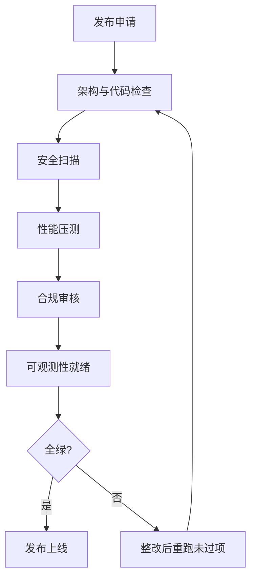

# 附录Q 生产上线检查清单

> 系列：LangChain / LangGraph 系统学习 · 附录 Q（v10.0 第十轮）
> 定位：工具型附录 — 上线前逐项打勾的清单
> 配套：知识库 34（安全）、KB38（性能）、KB41（合规）、附录 O（监控）

## 使用说明

本清单面向"从开发环境走向生产环境"的 AI 应用。按六个维度逐项打勾：**全绿才准上线，有红就地整改**。清单可以裁剪，但删掉任一项前请先说明理由。

## 一、架构与代码检查

- [ ] 模块划分清晰：检索 / 生成 / 工具 / 记忆各自独立
- [ ] 模型、提示词、知识库版本号统一管理（后续可复现）
- [ ] 不变量：同样的输入 + 同版本 = 同样的链路行为
- [ ] 环境变量管理密钥，代码与配置分离
- [ ] 语言模型供应商故障时有降级路径（备用模型/降级回答）
- [ ] 依赖锁定版本，构建可复现

## 二、安全扫描

- [ ] 提示注入防护已启用（输入隔离 + 指令冲突检测）——KB34
- [ ] 敏感工具（写库/发消息/外呼）有人工确认或白名单——KB34
- [ ] 输出内容安全检测已接入（敏感词 + 分类器）——KB41
- [ ] 密钥、Token 不落日志、不进代码库

## 三、性能与成本

- [ ] 交互场景已开流式，TTFT < 1s——KB38
- [ ] 已配置至少一种缓存（精确/语义）——KB38
- [ ] 已按任务复杂度分级路由模型——KB38
- [ ] 上下文有裁剪策略，prompt 不无限膨胀——KB36
- [ ] 单请求成本已核算，有预算告警阈值——附录 O

## 四、合规与数据

- [ ] 数据流向图已绘制：输入 → 处理 → 存储 → 输出 → 日志
- [ ] PII 已识别并在必要时脱敏（含日志）——KB41
- [ ] 出境/重要数据已走区域化部署或评估
- [ ] 对用户明示 AI 生成内容
- [ ] 涉及公众服务自查算法备案要求——KB41

## 五、可观测性就绪

- [ ] 全链路 Tracing 接通，请求 ID 贯通——附录 O
- [ ] 四类黄金指标有基线：QPS / 延迟(P95) / 错误率 / 成本——附录 O
- [ ] 告警规则已配置：P0 紧急 / P1 严重 / P2 警告
- [ ] 日志脱敏、留存期限与访问权限已定义

## 六、评测与回归

- [ ] 统一评测集已建立（正确性/溯源/风格/误导），有基线分
- [ ] 反例回流机制已启用（线上答错的进评测集）
- [ ] 每次模型/提示词变更都跑评测回归
- [ ] 上线前完成对抗样例抽查（违规语料、诱导套话）

## 上线后 24 小时观察项

- [ ] QPS / 延迟曲线与压测预估一致
- [ ] 缓存命中率符合预期（过低说明键设计有问题）
- [ ] 敏感词命中与投诉率处于正常水位
- [ ] 成本曲线在预算区间内

> 配套阅读：附录 O《生产监控与告警体系指南》、知识库 41《LLM 应用合规、隐私与治理》。