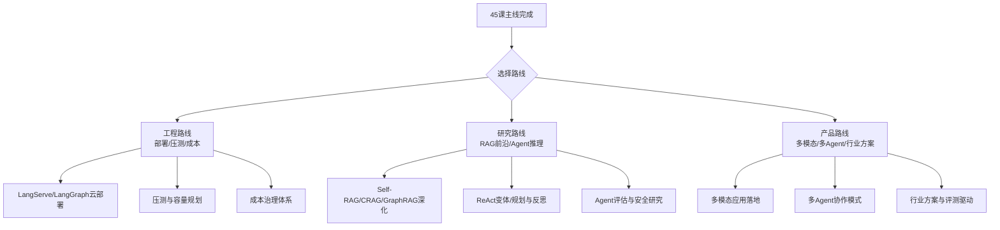

# 附录R 进阶学习路线与资源导航

> 系列：LangChain / LangGraph 系统学习 · 附录 R（v10.0 第十轮）
> 定位：工具型附录 — 45 课之后的进阶地图与资源清单
> 配套：全部 45 课之后的"下一步"导航

## 使用说明

完成 45 课主线后，按本附录选择进阶方向。三条路线（工程 / 研究 / 产品）可并行，也可先专精一条。所有的"资源"均为公开渠道，可按名称检索获取。

## 1 进阶学习路线图

## 2 工程路线：把项目做到能打

| 阶段 | 要做的事 | 对应已学知识 |
| --- | --- | --- |
| 部署 | 用 LangServe 把链/图封装为 API（第 33 课思路） | 附录 K |
| 压测 | 用 locust 等做并发压测，建立容量基线 | 知识库 38 |
| 加固 | 安全纵深 + 合规清单全量过一遍 | KB34 / KB41 / 附录 Q |
| 成本治理 | 建立"模型 × 任务"路由成本台账，月度复盘 | KB38 / KB35 |
| 云化 | 评估 LangGraph 云 / 自建推理集群方案 | KB35 / KB40 |

**资源导航**：
- 官方部署文档：LangServe、LangGraph 平台（按名称检索官网文档）
- 实践项目：把第 45 课毕业项目真实部署，压测并调优

## 3 研究路线：追前沿、读论文

| 方向 | 入门阅读建议 | 与主线衔接 |
| --- | --- | --- |
| 检索增强演进 | Self-RAG、CRAG、Corrective RAG 论文 | 深化 KB33（Agentic RAG） |
| 知识图谱增强 | GraphRAG 论文与开源实现 | 深化 KB30 |
| Agent 推理 | ReAct 原论文、Plan-and-Execute、反思模式 | 深化 KB20/26/29 |
| 评估研究 | RAGAS、Llamaindex 评估思路 | 深化 KB09/27 |
| 多模态检索 | ColPali 论文及开源实现 | 深化 KB40 |

**学习方法建议**：
- 每篇论文配一张"问题-方法-实验-结论"卡片；
- 看完一篇，用你学会的 LangChain/LangGraph 写一个最小复现；
- 论文代码优先看官方实现，再对照框架封装。

## 4 产品路线：做出可用、可卖、可持续的应用

| 里程碑 | 交付物 | 关键动作 |
| --- | --- | --- |
| M1 潜力验证 | 可演示 Demo | 选定行业场景，用 45 课技能搭出核心链路 |
| M2 价值验证 | 小范围试用 | 收集真实反馈，建反例回流机制（KB39 思路） |
|M3 规模验证 | 生产上线 | 附录 Q 清单全绿，监控看板运行 |
| M4 持续迭代 | 版本演进 | 评测驱动：分数说话，数据飞轮转起来 |

**行业方向参考**（任选其一即可深入）：
- 客服：企业知识问答 + 意图路由 + 工单工具（KB22）
- 质检：多模态拍摄 + 分级告警（KB40）
- 知识管理：GraphRAG 构建企业知识图谱（KB30）
- 洞察：数据库 Agent / Text-to-SQL（附录 N）

## 5 通用资源清单

| 类别 | 资源 | 说明 |
| --- | --- | --- |
| 官方文档 | LangChain / LangGraph 官网与 API 参考 | 权威第一手来源 |
| 论文 | ArXiv 上的 RAG / Agent 最新论文 | 按关键词检索 |
| 开源 | LangChain、LangGraph、RAGAS、ColPali 等开源库 | 读源码是最好的进阶 |
| 社区 | 开发者论坛、公众号、技术博客 | 关注工程落地经验 |
| 数据集 | 领域公开评测集 + 自建业务集 | 评测驱动一切改进 |

## 6 最终建议

1. **学以致用**：45 课学完不等于会做，第 45 课毕业项目一定要亲手做一遍；
2. **评测说话**：所有改进用同一套评测集回归，防止"优化 A 劣化 B"；
3. **保持迭代**：LLM 技术变化快，每季度花一天把官方更新扫一遍；
4. **文档沉淀**：延续本项目习惯，把你踩过的坑写成自己的"避坑手册"。

> 至此，LangChain / LangGraph 系统学习 45 课全部结束。祝你在 AI 应用开发之路上越走越远！