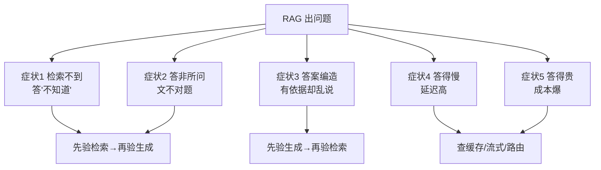

# 附录S RAG故障诊断速查手册

> 系列：LangChain / LangGraph 系统学习 · 附录 S（v11.0 第十一轮）
> 定位：工具型附录 — 症状 → 定位 → 修复的一站式查表
> 配套：知识库 17（预处理）、KB25（重排与查询变换）、KB28（调优）、KB42（评测）

## 使用说明

当 RAG 系统"不对劲"时，先按下面的**症状 → 嫌疑环节 → 验证 → 修复**顺序排查。五类经典症状覆盖 90% 的问题。每类都给出"最快验证动作"。

## 一、症状 1：检索不到，模型说"不知道"

**嫌疑环节**：切块 → 嵌入 → 检索 TopK → 重排。

**最快验证**：把问题的关键词直接在一个测试文档里 `grep`，确认"文档里确实有答案"。

| 层级 | 检查点 | 修复 |
| --- | --- | --- |
| 切块 | 答案是否被切散到两个块 | 加大块重叠/按语义切块（KB17） |
| 嵌入 | 领域术语嵌入区分度低 | 换 Embedding 模型/加领域样本微调嵌入（KB19） |
| 检索 | TopK 太小 | 提高 TopK（5→10）再靠重排兜底 |
| 查询 | 问题太长太泛 | 查询变换/问题分解（KB25） |
| 索引 | 文档没进库/增量遗漏 | 检查入库 pipeline 与更新时间戳 |

## 二、症状 2：答非所问，文不对题

**嫌疑环节**：检索回了错的文档（召回噪声）→ 生成被带偏。

| 检查点 | 方法 | 修复 |
| --- | --- | --- |
| 看检索结果 | 打印 TopK 原文，人眼判断相关性 | 相关性差 → 修检索（混合检索/重排） |
| 看提示词 | 是否把"不相关上下文"也喂给模型 | 指令明确"只依据相关段落" |
| 看输出限制 | 是否允许模型自由发挥 | 加"无依据就拒绝回答"约束（KB37） |

> 关键化验：把检索结果**抽出来测**——如果上下文相关但答案差，是生成问题；上下文都不相关，是检索问题（对齐 KB42 的"进哪个班"）。

## 三、症状 3：答案编造，有依据却乱说

**嫌疑环节**：生成层 —— 模型不忠实于上下文。

| 修复手段 | 操作 |
| --- | --- |
| 提示词约束 | 明确"只能引用给定材料，未提及的内容回答不知道" |
| 输出校验 | 生成后做证据核查：每个声明找依据，找不到就拦截（KB37） |
| 温度调低 | temperature 降到 0-0.2 |
| 模型换强 | 弱模型更容易"脑补"，换更强模型测试对比 |
| 反例测试 | 用"无答案问题"测乱编率（KB42 评测集必备项） |

## 四、症状 4：答得慢

**嫌疑环节**：上下文太长 → 输入 token 多 → 生成慢。

| 检查点 | 修复 |
| --- | --- |
| 塞了多少上下文 | 压缩/裁剪历史（KB36），TopK 减半 |
| 是否开了流式 | 开 `stream()`（KB38） |
| 是否重复调用 | 语义缓存/精确缓存（KB38） |
| 是否用了大模型做简单事 | 分级路由小模型（KB38/KB35） |
| 是否有串行子任务 | 并行化（Send/batch，KB38） |

## 五、症状 5：答得贵

**嫌疑环节**：token 消耗结构。

**最快验证**：看一次典型请求的输入/输出 token 占比（LangSmith/网关账单）。

| 开销大头 | 修复 |
| --- | --- |
| 输入 token 高 | 精简上下文（KB36）、缓存命中（KB38） |
| 输出 token 高 | 设 max_tokens、结构化输出（KB18） |
| 全用旗舰模型 | 路由到 mini 模型（KB38/KB35） |
| 重复检索 | 检索结果缓存/向量库复用 |
| 多次重试 | 反思轮次设上限（KB45） |

## 六、诊断工具箱速查

| 工具/手法 | 用途 |
| --- | --- |
| 打印检索 TopK 原文 | 定位"检索 vs 生成"责任（最重要的一招） |
| 单文档命中测试 | 排除切块/索引问题 |
| 反例集 | 测乱编率（KB42） |
| RAGAS 三指标 | 分层定位：忠实度/答案相关性/上下文相关性 |
| Tracing（LangSmith） | 看每步输入输出与耗时 |
| 网关账单 | 成本结构与配额（KB35） |

## 七、记录与防复发

- 每次诊断记一张卡片：`症状 → 根因 → 修复 → 验证`；
- 反例加入评测集（KB42），防止同类问题回归；
- 每月跑一次"五症状体检"，主动发现问题而非等投诉。

> 配套：知识库 42《RAG 评测体系与 RAGAS 实操》、附录 Q《生产上线检查清单》。