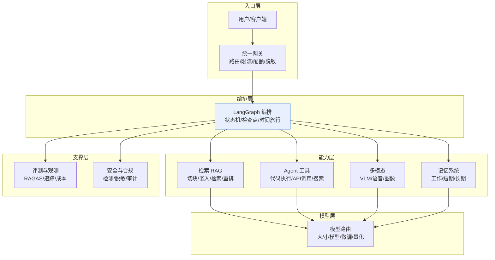
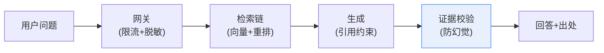
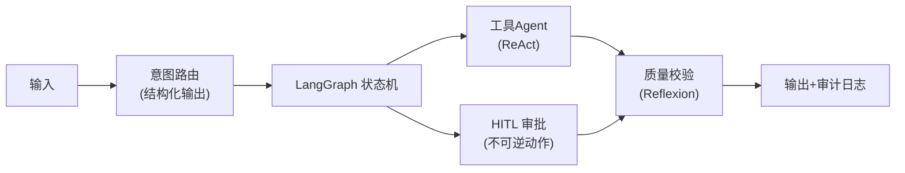

# 附录T LLM应用架构蓝图与组件速查

> 系列：LangChain / LangGraph 系统学习 · 附录 T（v11.0 第十一轮收官附录）
> 定位：工具型附录 — 全链路参考架构图 + 各层组件速查矩阵
> 配套：全部 49 课与附录 A-S 的"合订本"

## 使用说明

本附录是整套学习资料的**架构总索引**：第 1 部分给出全链路参考蓝图（把 49 课的所有组件放到一张图里）；第 2-4 部分按层给"组件 → 对应文档 → 关键决策"速查矩阵；第 5 部分给出两套可直接照抄的起步架构。

## 1 全链路参考架构蓝图

## 2 入口层组件速查

| 组件 | 决策要点 | 对应文档 |
| --- | --- | --- |
| 网关 | 逻辑/物理模型名、限流配额、语义缓存 | KB35 |
| 输入安全 | 提示注入检测、PII 脱敏 | KB34 / KB41 |
| 认证授权 | API Key、租户隔离 | KB35 / KB43 |
| 可观测采样 | 全量采样还是抽样式 | 附录 O |

## 3 编排层与能力层速查

| 组件 | 核心决策 | 对应文档 |
| --- | --- | --- |
| 图结构 | 节点划分、状态 schema、循环边界 | KB26 / KB29 |
| 状态持久化 | 检查点开关、线程粒度 | KB24 / KB32 |
| 检索管线 | 切块策略、嵌入模型、TopK、重排 | KB04/08/17/25/28 |
| Agent 工具 | 工具封装、错误处理、沙箱 | KB22 / KB31 |
| 多 Agent | 范式选型（监督者/移交/平权/图式） | KB44 / KB45 |
| 记忆 | 归属（共享 State / 私有）、裁剪 | KB23 / KB36 |
| 流式异步 | stream / astream / batch | KB21 / KB38 |

## 4 模型层与支撑层速查

| 组件 | 核心决策 | 对应文档 |
| --- | --- | --- |
| 模型路由 | 任务分级、成本预算 | KB38 / KB35 |
| 模型接入 | 自定义封装、供应商切换 | KB29 |
| 微调 | LoRA 规模、训练数据、评测 | KB39 |
| 评测 | 指标选择、评测集、回归门槛 | KB42 / KB27 |
| 监控告警 | 四类黄金指标、告警分级 | 附录 O |
| 安全纵深 | 四层防线、红队演练 | KB34 |
| 合规治理 | 三道闸门、审计留痕 | KB41 |
| 部署发布 | 三环境、灰度、回滚 | KB43 / 附录 K/Q |

## 5 两套可直接照抄的起步架构

### 5.1 知识问答型（最简单可上线）

对应文档快速路线：KB08/16（RAG）→ KB37（防幻觉）→ KB42（评测）→ 附录 Q（上线）。

### 5.2 流程处理型（多步骤 + 工具）

对应文档快速路线：KB18（结构化）→ KB26/29（工作流）→ KB22/KB45（Agent 模式）→ KB41/KB43（合规与发布）。

## 6 快速择路表：需求 → 蓝图位置

| 你遇到的需求 | 从哪张蓝图看起 | 必读文档 |
| --- | --- | --- |
| 问知识库 | 5.1 知识问答型 | KB08 → KB42 |
| 多步业务流程 | 5.2 流程处理型 | KB26 → KB44 |
| 要调用外部工具 | 编排层 + 能力层 | KB22 → KB45 |
| 多模型省钱 | 模型层 + 入口层 | KB35 → KB38 |
| 要上生产 | 支撑层全查 | 附录 Q → KB41 |
| 要排故障 | 附录 S 五症状 | 附录 S → KB42 |

> 至此，LangChain / LangGraph 系统学习 49 课 + 附录 A-T 全部就绪。祝开发顺利！