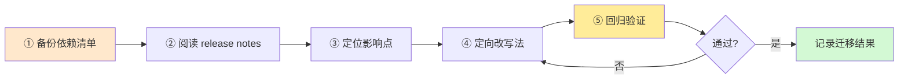

# 附录 U 版本升级迁移速查手册

> 定位：工程工具。升级 LangChain/LangGraph 时的随查手册：版本速查、破坏性变更对照、迁移检查清单、常见报错对照。
> 配套学习课程：第 52 课《平滑升级》、第 50 课《新特性追踪》。

---

## 1. 版本速查（截至 2026-08）

| 组件 | 稳定版本 | 版本线特点 | 升级关注 |
| --- | --- | --- | --- |
| langchain-core | 1.5.x | 主版本 1，API 稳定 | minor 升 minor 基本兼容 |
| langchain | 1.x | 顶层包，集成分离 | 检查依赖树与 import 路径 |
| langgraph | 1.0.x（核心）/ 0.6.x（API 演进线） | 0.x 快速演进但有兼容承诺 | 关注弃用警告与 breaking notes |
| langgraph-cli | 0.4.x | 工具链稳定 | 新命令以 CLI 文档为准 |
| langsmith | 跟随 SaaS 更新 | 平台侧更新免升级 | 适配 SDK 小版本 |

> 提示：`pip index versions <包名>` 可查全部已发布版本；`pip show <包名>` 看当前环境版本。

##2. 版本判断口诀

- **主版本升级（X.y.z → X+1.0.0）**：先读 Breaking changes，再升；
- **次版本升级（X.y.z → X.y+1.0）**：新功能为主，通常兼容；
- **修订升级（.z+1）**：修 bug，放心升；
- **0.x 版本**：框架仍快速演进，升级前必看 changelog；
- **弃用警告（DeprecattonWarning）**：等于官方提醒"这个写法快过时了，去迁移"。

##3. 已知破坏性变更对照表（重点）

| 变更 | 旧写法 | 新写法 | 生效版本 | 说明 |
| --- | --- | --- | --- | --- |
| 运行时上下文 | `config_schema=Config` + `config['configurable']` | `context_schema=Context` + `runtime.context` | langgraph v0.6 弃用，v2.0 移除 | 有迁移指南与兼容期 |
| 包拆分 | `from langchain.llms import ...` | `from langchain_openai import ...` 等 | langchain v1 | 集成移至独立包 |
| 社区集成归类 | `langchain.llms/embeddings/vectorstores` 旧路径 | `langchain_community` | langchain v1 | 按官方迁移指南批量替换 import |
| 图配置 | 各参数混传 | 统一 `context`/`runtime` 入口 | langgraph v0.6+ | 见知识库 47 |

> 注：具体某版本是否影响你的代码，以官方 changelog "Breaking changes / Deprecations" 段为准，本表为常见模式汇总。

##4. 升级迁移检查清单（升级前后逐项勾选）

**升级前：**
- [ ] 备份依赖清单：`pip freeze > requirements_old.txt`
- [ ] 记录当前各包版本：`pip show langchain-core langgraph`
- [ ] 阅读本次 release notes 的 Breaking changes / Deprecations
- [ ] 查看官方 Migrate 指南是否有对应迁移条目
- [ ] 确认回滚方式（`pip install <包>==<旧版>`）

**升级中：**
- [ ] 一次只改一类写法，改完立即跑最小示例
- [ ] 搜日志中的 DeprecattonWarning 并逐一处理
- [ ] 用 `pip check` 校验依赖关系

**升级后：**
- [ ] 最小示例（一条链/一个图）通过
- [ ] 原评估集回归，关键指标不低于升级前（如 RAGAS 忠实度/相关性）
- [ ] 流式/异步/批处理三个形态各测一次（若用到）
- [ ] 检查点（store/checkpointer）数据可正常读写
- [ ] 无新增弃用警告
- [ ] 在追踪表（本附录 §6）记录升级结果

##5. 升级迁移五步流程全景图

> 五步对应升级前（①②）、升级中（③④）、升级后（⑤）三个环节；任一步回归失败可回滚到旧版本（见 §6 追踪表备注列）。

##6. 常见报错速查表

| 报错特征 | 可能原因 | 对策 |
| --- | --- | --- |
| `AttributeError: ... config_schema` | 旧 API 被移除 | 改用 context_schema |
| `KeyError: 'configurable'` | 旧注入写法失效 | 改用 context/context 参数 |
| `ModuleNotFoundError: langchain.llms` | 包拆分后旧路径失效 | 改导入 langchain_openai / langchain_community 等 |
| 序列化/JSON 错误（自定义对象） | State 里放了不可序列化对象 | 移入 Context 或 Store |
| `pip check` 依赖冲突 | 版本要求互相矛盾 | 按官方 requirements 版本组合安装 |
| 弃用警告刷屏 | 代码或依赖用了旧写法 | 逐一升级，先用时忽略但要登记 |

##6. 个人特性追踪表模板（复制使用）

| 特性名 | 出现版本 | 取代对象 | 是否破坏 | 影响我的代码 | 学习状态 | 备注 |
| --- | --- | --- | --- | --- | --- | --- |
| Runtime/Context API | langgraph 0.6.0 | config['configurable'] | 否（弃用兼容） | 学习项目无 | 已学（知识库47） | v2.0 移除需记住 |
| 子图（Subgraph） | langgraph 0.3 | 手写内联流程 | 否 | 无 | 已学（知识库48） | 适合拆模块 |
| MCP 接入 | 2025 主流化 | 各家专有 SDK | 否 | 无 | 已学（知识库49） | 工具生态必选项 |
| langchain v1 包拆分 | v1.x | 全家桶 langchain | 是 | 无 | 已学（知识库46） | 导入路径变化 |

##7. 附录 U 使用方式

1. **升级前**：读 §1 版本速查 + §2 口诀，判断升级级别；
2. **升级中**：对照 §3 已知变更，按 §4 清单逐项进行；
3. **遇报错**：查 §5 速查表；
4. **沉淀**：每次升级结束向 §6 追踪表追加一行。

---

> 下一页：附录 V《新特性更新日志导读与生态导航》。