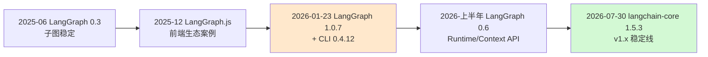
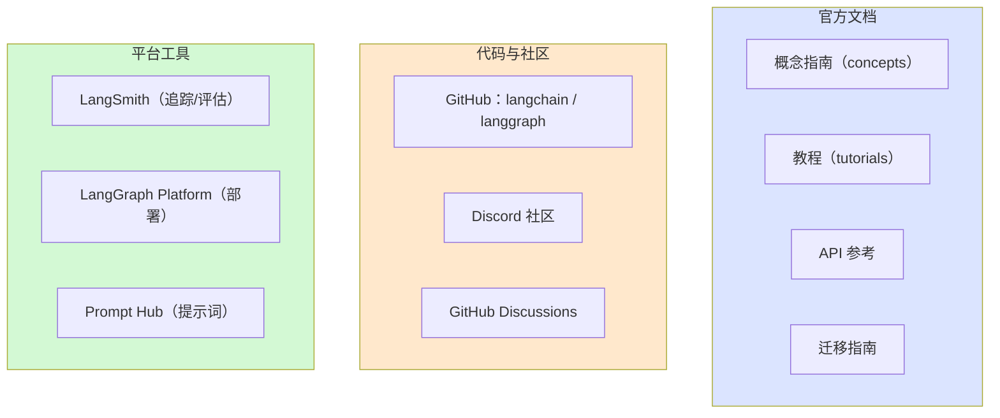

# 附录 V 新特性更新日志导读与生态导航

> 定位：工程工具。告诉你去哪看更新日志、怎么看，以及 2026 年 LangChain 生态的官方资源地图。
> 配套学习课程：第 50 课《新特性追踪》、第 53 课《收官展望》。

---

## 1. 更新日志导读：去哪看、看什么

| 信息源 | URL 线索 | 内容特点 | 使用频率 |
| --- | --- | --- | --- |
| GitHub Releases（langchain-ai/langchain） | github.com/langchain-ai/langchain/releases | 每次发布明细，含 Breaking changes | 每月 |
| GitHub Releases（langchain-ai/langgraph） | github.com/langchain-ai/langgraph/releases | LangGraph 演进记录（0.6 Context、1.0 等） | 每月 |
| 官方文档 What's New | docs.langchain.com 对应入口 | 新功能教程化呈现 | 大版本 |
| 官方迁移指南（Migrate） | 文档站搜 "Migrate" | 旧→新写法对照 | 升级前 |
| 官方博客 | langchain.com/blog（示意入口） | 动机与原理讲解 | 大版本 |
| PyPI 版本页 | pypi.org/project/langchain-core | 全版本列表 | 查证 |
| 本地运行警告 | 运行日志 DeprecattonWarning | 你项目的真实提示 | 每次运行 |

##2. 版本里程碑时间线（2025—2026 重点）

阅读建议：把时间线贴在笔记里，新版本出现时在对应位置补充——你正在参与一个快速演进的生态，这份时间线就是你的"编年史"。

##3. 新版本发布后 10 分钟跟进法

1. 打开 GitHub Releases，读标题与 "Breaking changes / Deprecations" 两段（2 分钟）；
2. 判断是否会"影响我的写法"（1 分钟）——不影响：在追踪表记一行即可；
3. 影响：打开官方 Migrate 指南，把对照表存进附录 U（3 分钟）；
4. 若恰逢大版本：安排 1-2 小时读官方博客 + 补一篇知识库笔记（可选）（4 分钟起）。

##4. 官方资源导航地图

| 用途 | 首选资源 | 说明 |
| --- | --- | --- |
| 学概念 | 官方概念指南 | 演进快，先概念后 API |
| 查写法 | API 参考 / 教程 | 跟着官方示例写 |
| 遇 bug | GitHub Discussions / Discord | 搜 issue 或直接提问 |
| 看趋势 | 官方博客 / Releases | 大版本讲解文章 |
| 练评估 | LangSmith 免费额度 | 边学边观测 |

##5. 生态名词速查（避免被新词吓到）

| 名词 | 一句话解释 | 对应文档 |
| --- | --- | --- |
| LCEL | 用 `|` 组合链的声明式语法 | 知识库 07 |
| MCP | 工具接入的统一协议 | 知识库 49 |
| Subgraph | 图内嵌图，可复用子流程 | 知识库 48 |
| Runtime/Context | 节点访问运行信息的统一入口 | 知识库 47 |
| Checkpoint | 图状态持久化与断点恢复 | 知识库 25 |
| Deep Agents | 规划+子智能体+文件系统的 Agent 打法 | 知识库 49 |
| LangSmith Studio | 可视化搭建/配置 Agent 的环境 | 知识库 49 |
| LangGraph Platform | 托管部署：服务+持久化+队列+监控 | 知识库 48 |

##6. 学习者每周/每月跟进模板

**每周（10 分钟）：**
- [ ] 扫一眼两个仓库 Releases 新条目（本周有发布吗）
- [ ] 有发布：记追踪表一行

**每月（30 分钟）：**
- [ ] 重读一遍附录 U §1 版本速查（知道现在最新版本号）
- [ ] 挑一个本月新特性读 5 分钟概念文章
- [ ] 运行自己项目确认无新增弃用警告

**每季度（1-2 小时）：**
- [ ] 读一次官方 What's New / 博客合集
- [ ] 给自己的知识库补一篇新特性笔记
- [ ] 更新 README 版本与索引

##7. 附录 V 使用方式

1. 想找资源 → 用 §4 导航地图；
2. 遇到新词 → 查 §5 名词速查；
3. 想养成跟进习惯 → 抄 §6 模板到自己的日历；
4. 想了解历史 → 看 §2 时间线。

---

> 附录 U、V 与知识库 46-49、课程 50-53 共同构成 v12.0「新特性跟进」专题。回到 README-53课完整版 查看全系列索引。