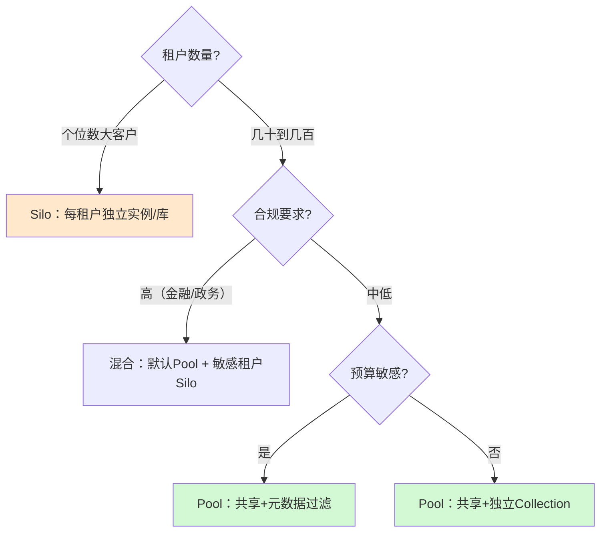

# 附录 W 多租户架构选型速查手册

> 定位：工程工具。多租户方案设计时的随查手册：选型决策树、隔离矩阵、租户配置清单、验收测试清单。
> 配套学习课程：第 54—57 课；对应知识库：50—53。

---

## 1. 选型决策树（30 秒出结论）

记口诀：**大客户独栋（Silo）、小客户合租（Pool）、敏感客户特别照顾（混合）**。

## 2. 隔离决策矩阵（按层选手段）

| 层面 | 共享方案（Pool） | 独享方案（Silo） | 决策依据 |
| --- | --- | --- | --- |
| 模型 | 共享模型+路由 | 独立模型/微调实例 | 定制需求、合规 |
| 提示词 | 租户模板+公共安全指令 | 独立模板体系 | 品牌定制度 |
| 知识库（向量） | 独立 Collection 或 metadata 过滤 | 独立向量库实例 | 数据敏感度、量级 |
| 记忆/会话 | store 命名空间分区 | 独立存储 | 合规、隔离要求 |
| 检查点 | 键含 tenant_id | 独立 checkpointer | 会话隔离要求 |

## 3. 租户配置清单（开通新租户走一遍）

- [ ] 分配全局唯一 `tenant_id`（不可复用）
- [ ] 网关/认证：签发租户级凭证（JWT 携带租户）
- [ ] 绑定模型策略：哪些模型可用、默认档位
- [ ] 分配知识库分区：创建 Collection / 配置过滤策略
- [ ] 设置配额：每日 token、每分钟请求、并发上限、月预算
- [ ] 配置告警渠道：邮件/IM/Webhook 收件人
- [ ] 选数据区域：数据驻留地域（若支持多区域）
- [ ] 指定审计策略：日志保留期、是否导出
- [ ] 初始化测试：跑一轮"串租户测试"（§4）
- [ ] 记录到台账并通知租户管理员

## 4. 租户隔离验收测试清单

| 用例 | 操作 | 通过标准 | 对应缺陷 |
| --- | --- | --- | --- |
| T01 检索串访 | 租户A问题查询 | 结果 0 条含 B 文档 | 知识层隔离失效 |
| T02 记忆串访 | 读其他租户命名空间 | 拒绝或为空 | 记忆层隔离失效 |
| T03 会话串访 | 用 B 的凭证打开 A 的会话 | 无法打开 | 检查点隔离失效 |
| T04 缺标识 | 请求无 tenant_id | 4xx 拒绝 | 标识漏传 |
| T05 伪造标识 | 篡改 token 租户字段 | 签名校验失败 | 鉴权漏洞 |
| T06 配额超限 | 触发硬配额 | 429 + 告警 | 配额未生效 |
| T07 删除清理 | 删除租户后检索 | 无残留数据 | 数据残留 |
| T08 并发隔离 | 多租户同时读写 | 互不影响 | 资源竞争 |

## 5. 常见架构错误与纠正

| 错误 | 表现 | 纠正 |
| --- | --- | --- |
| tenant_id 有默认值 | 漏传时"静默进共享桶" | 移除默认值，必填校验 |
| 检索不强制过滤 | 只靠"约定" | 网关/节点双重强制 filter |
| Context 里放可变数据 | 与状态混淆、检查点出错 | 只放运行环境信息 |
| 配额只设月总额 | 突发流量打爆平台 | 增加分钟级硬配额 |
| 降级不透明 | 用户莫名感觉变笨 | 响应头/文档明示 |
| 没做串租户测试 | 上线后事故 | 验收清单 T01-T08 必跑 |

## 6. 配套速查索引

| 问题 | 去查 |
| --- | --- |
| 选型拿不准 | 本附录 §1 决策树 |
| 隔离怎么落地 | 知识库 51 §2-§4 |
| 配额怎么设 | 知识库 52 §3 + 本附录 §3 |
| 运营指标怎么盯 | 附录 X |
| 防雪崩 | 知识库 53 §6 |

---

> 下一页：附录 X《租户运营指标与 SLA 速查》。