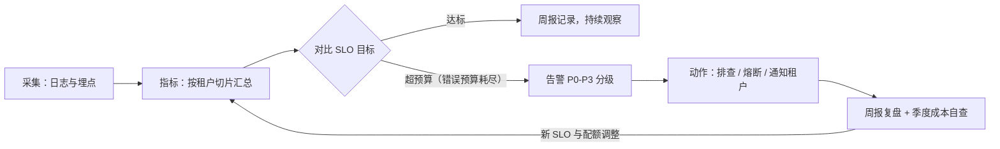

# 附录 X 租户运营指标与 SLA 速查

> 定位：工程工具。多租户平台的"驾驶舱仪表盘字典"：指标怎么定义、SLA/SLO 怎么定、告警怎么配、运营周报怎么写。
> 配套学习课程：第 57 课《平台运营》；对应知识库：53。

---

## 0. 一张图看懂：监控闭环怎么转



> 阅读顺序：§1 定指标 → §2 定 SLO/SLA → §3 配告警 → §4 写周报 → §5 季度自查，正好是上图一个完整闭环。

---

## 1. 指标字典（租户维度）

每项指标都注明**维度**（按租户/按租户×模型 切片）与**口径**：

| 指标 | 口径 | 典型目标 | 切片 |
| --- | --- | --- | --- |
| 可用性 | 成功请求 / 总请求（排除 4xx） | ≥ 99.9% | 租户 |
| p95 延迟 | 95% 请求端到端耗时 | ≤ 3s | 租户 |
| p99 延迟 | 99% 请求耗时 | ≤ 8s | 租户 |
| 错误率 | 5xx + 严重业务错误 / 总请求 | ≤ 0.5% | 租户 |
| 令牌用量 | 输入+输出+缓存 token | 依配额 | 租户×模型 |
| 请求量 | QPS / 日请求数 | 依容量 | 租户 |
| 成本 | 按模型单价折算 | 依预算 | 租户×模型 |
| 缓存命中率 | 命中请求 / RAG 同类请求 | ≥ 30%（可调） | 租户 |
| 检索空结果率 | 无结果检索 / 总检索 | ≤ 15% | 租户 |
| 无效率 | 被内容安全拦截 / 总请求 | 记录即可 | 租户 |

## 2. SLA 三层定义模板

| 层 | 内容 | 示例 |
| --- | --- | --- |
| SLI（实测指标） | 上周期实际数值 | 8 月可用性 99.92% |
| SLO（目标） | 本周期承诺目标 | 可用性 ≥ 99.9%，p95 ≤ 3s |
| SLA（合同承诺） | 违约补偿条款 | 可用性 < 99.5% 时补偿当月 10% 费用 |

- 多档 SLO：标准租户 / 大客户（更严）/ 内部租户（最松）；
- **SLO 预算（错误预算）**：1 - SLO，如 99.9% → 每月最多 43 分钟不可用，超了就停止发布、专注稳定性。

## 3. 告警规则清单（租户级）

| 告警 | 触发条件 | 级别 | 动作 |
| --- | --- | --- | --- |
| 延迟恶化 | p95 超过 SLO 1.5 倍持续 10 分钟 | P2 | 排查 + 通知 |
| 错误率飙升 | 错误率 > 1% 持续 5 分钟 | P1 | 熔断评估 + 排查 |
| 配额预警 | 用量达软配额 80% | P3 | 通知租户管理员 |
| 配额封顶 | 达硬配额 100% | P2 | 确认降级策略生效 |
| 预算告急 | 成本达预算 80% | P3 | 通知 + 建议优化 |
| 串租户嫌疑 | 出口复核丢弃文档 > 0 | P0 | 立即停用该租户 + 调查 |
| 内容安全拦截激增 | 拦截率 > 5% | P2 | 复核安全策略 |
| 模型供应商异常 | 5xx 率 > 10% | P1 | 熔断/切换备用模型 |

## 4. 运营周报模板

```
【平台运营周报】第 X 周（M/D - M/D）
一、全局健康
  - 可用性 / p95 / 错误率（对比上周、是否达标 SLO）
  - 总请求量 / 总成本 / 缓存命中率
二、租户透视
  - Top 5 用量租户（请求量、成本）
  - 异常租户列表（错误率、延迟、配额封顶）
三、SLO 达成
  - 达标 / 未达标（附未达标原因与改善项）
四、发布与变更
  - 本周灰度/上线项 + 回滚记录
五、风险与下周计划
```

## 5. 成本效率自查（每季度）

- [ ] 缓存命中率是否被错误计费口径影响（见知识库 52 §5）
- [ ] 是否有关闭但仍在消耗的租户资源
- [ ] 是否有租户长期使用高成本模型但用量低（建议降档）
- [ ] 是否存在未绑定配额的新租户（配置遗漏）

## 6. 速查用法

| 场景 | 查哪里 |
| --- | --- |
| 定义指标 | §1 指标字典 |
| 签合同承诺 | §2 SLA 模板 |
| 配告警阈值 | §3 告警规则清单 |
| 写周报 | §4 模板 |
| 季度复盘 | §5 自查清单 |

---

> 附录 W、X 与知识库 50-53、课程 54-57 共同构成 v13.0「多租户治理深化」专题。回到 README-57课完整版 查看全系列索引。