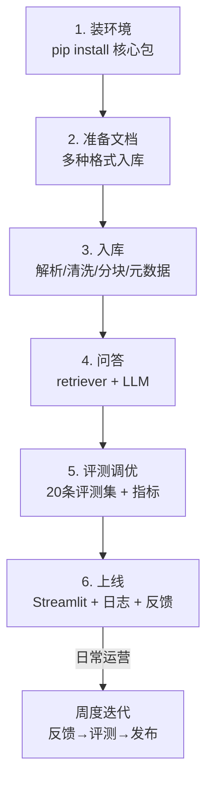

# 附录 Y 端到端实战速查卡：命令、配置与检查清单

> 定位：工程工具。毕业实战全程的"卡片式速查"：环境安装、核心代码骨架、调优参数、上线清单，一页一主题，遇到卡点先翻这里。

---

## 0. 速查总览：一张图走完全流程



---

## 1. 环境安装速查

```bash
# 核心包
pip install langchain langchain-community langchain-text-splitters \
            langchain-openai chromadb sentence-transformers

# 文档解析
pip install pymupdf docx2txt beautifulsoup4 openpyxl

# Web 界面
pip install streamlit

# 评测辅助
pip install ragas  # 可选，进阶评测
```

> 中文 Embedding 推荐：`BAAI/bge-small-zh-v1.5`（体积小、效果好）；备选 `BAAI/bge-base-zh-v1.5`（更准、更慢）。

---

## 2. 核心代码骨架速查

### 2.1 入库（文档 → 向量库）

```python
from langchain_community.document_loaders import DirectoryLoader, TextLoader, PyMuPDFLoader, Docx2txtLoader
from langchain_text_splitters import RecursiveCharacterTextSplitter
from langchain_community.embeddings import HuggingFaceEmbeddings
from langchain_community.vectorstores import Chroma

LOADERS = {
    ".md":  lambda p: TextLoader(p, encoding="utf-8").load(),
    ".txt": lambda p: TextLoader(p, encoding="utf-8").load(),
    ".pdf": lambda p: PyMuPDFLoader(p).load(),
    ".docx": lambda p: Docx2txtLoader(p).load(),
}

def ingest(path, embed_model="BAAI/bge-small-zh-v1.5", chunk=500, overlap=80):
    docs = []
    import os
    for root, _, files in os.walk(path):
        for f in files:
            ext = os.path.splitext(f)[1].lower()
            if ext in LOADERS:
                docs += LOADERS[ext](os.path.join(root, f))
    splitter = RecursiveCharacterTextSplitter(chunk_size=chunk, chunk_overlap=overlap)
    chunks = splitter.split_documents(docs)
    emb = HuggingFaceEmbeddings(model_name=embed_model)
    vs = Chroma.from_documents(chunks, emb, persist_directory="./chroma_db")
    return vs

vectorstore = ingest("./docs")
```

### 2.2 问答

```python
from langchain_openai import ChatOpenAI

retriever = vectorstore.as_retriever(search_kwargs={"k": 3})
llm = ChatOpenAI(model="gpt-4o-mini", temperature=0)

def ask(q):
    ctx = "\n\n".join(d.page_content for d in retriever.invoke(q))
    return llm.invoke(f"仅根据资料回答（没有请说'未找到'）：\n{ctx}\n\n问题：{q}").content
```

### 2.3 带元数据过滤

```python
retriever = vectorstore.as_retriever(
    search_kwargs={"k": 3, "filter": {"doc_type": "制度"}}
)
```

---

## 3. 调优参数速查

| 参数 | 默认 | 调整方向 | 影响 |
| --- | --- | --- | --- |
| chunk_size | 500 | 300-800 | 块越大上下文越全，但噪音多 |
| chunk_overlap | 80 | 50-150 | 越大越不易截断语义，但重复多 |
| k（TopK） | 3 | 3-8 | 越大召回越高，但噪音/成本增 |
| temperature | 0 | 0-0.3 | 问答场景建议 0，创作可放宽 |
| Embedding 模型 | bge-small-zh | base/large | 越大越准越慢 |
| 是否 Rerank | 无 | 加 bge-reranker | 精排明显但耗时增 |

**建议**：先用默认跑基线，再"一次一参数"微调，每次重跑评测集。

---

## 4. 上线部署速查

```bash
# 本地启动 Web
streamlit run app.py --server.port 8501

# 简单后台运行
nohup streamlit run app.py --server.port 8501 > app.log 2>&1 &

# 查看日志
tail -f qa.log          # 业务日志
tail -f app.log         # 服务日志
```

**上线六项检查**：

- [ ] 评测集达标（Recall@5 ≥ 0.8）
- [ ] API Key 不在代码与日志中（用环境变量）
- [ ] 有日志（qa.log）与反馈按钮
- [ ] 数据有备份（chroma_db 目录 + 原始文档）
- [ ] 回滚方案明确（保留上一版本镜像）
- [ ] 有值班/告警联系人

---

## 5. 常见报错速查

| 报错信息 | 原因 | 处理 |
| --- | --- | --- |
| `ImportError: No module named 'langchain_...'` | 缺包 | 按 §1 安装 |
| `Chroma` 无法持久化 | 目录权限 | 检查 ./chroma_db 是否可写 |
| 中文乱码 | 编码问题 | 指定 `encoding="utf-8"` |
| 模型下载超时 | 网络慢 | 换小模型/预下载到本地 |
| `RateLimitError 429` | 配额耗尽 | 加缓存、降级、限流 |
| 回答"未找到"但文档里有 | 检索不到 | 调大 k / 换 Embedding / 查分块 |

---

## 6. 一周运营节奏速查

| 频率 | 动作 |
| --- | --- |
| 每日 | 看反馈池，抽新评测样本 |
| 每周 | 重跑评测集，更新指标看板 |
| 每两周 | 发布版本（灰度 5%→100%） |
| 每月 | 成本复盘 + 定下月优化主题 |

> 回到 README-61课完整版 查看全系列索引；附录 Z 提供全系列知识地图与自测题。