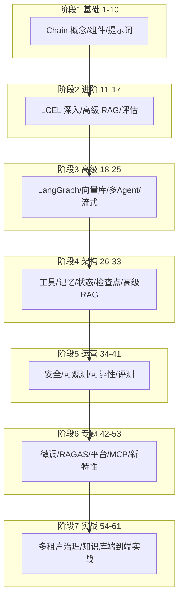

# 附录 Z 全系列知识地图与自测题（61 课版）

> 定位：工程工具 + 学习助手。61 课学完后的一站式盘点：按主题的知识地图、核心概念速记表、分主题自测题（附参考答案要点），以及给零基础学习者的复习路线。

---

## 1. 61 课全系列知识地图

**七个阶段一句话**：先会写 → 写得深 → 玩得转 → 架构清 → 运营稳 → 跟上新 → 实战通。

---

## 2. 核心概念速记表（考前 5 分钟）

| 概念 | 一句话记忆 | 出处章节 |
| --- | --- | --- |
| Chain | 把组件串起来的"流水线" | 基础篇 |
| LCEL | 用 `|` 管道语法声明式构建链 | 进阶篇 |
| RAG | 检索（Retriever）+ 生成（LLM）= 有据可答 | 进阶篇 |
| Embedding | 把文本变成"语义坐标"的向量 | 高级篇 |
| VectorStore | 存向量 + 相似检索的数据库 | 高级篇 |
| LangGraph | 用"状态图"编排可控的多步 Agent | 高级篇 |
| 检查点 Checkpoint | 保存运行状态，可暂停/恢复/回放 | 架构篇 |
| Tool | 给 LLM 装的手脚（API/代码/查库） | 架构篇 |
| 记忆 Memory | 跨轮对话保留上下文 | 架构篇 |
| Rerank | 先粗召回再精排序 | 高级篇 |
| RAGAS | 自动化评测 RAG 的指标库 | 专题篇 |
| MCP | Agent 与工具/数据源的标准"插口"协议 | 专题篇 |
| 多租户 | 一套系统服务多个客户并隔离 | 实战篇 |
| 评测集 | "固定试卷"：问题+来源+要点 | 实战篇 |

---

## 3. 分主题自测题

### 3.1 基础篇（1-10 课）

1. Chain 和直接调模型有什么区别？
2. 提示词模板里 `&#123;placeholder&#125;` 的作用是什么？
3. 如何给模型追加"系统角色"？

**要点**：Chain 可组合复用；占位符运行时填充；SystemMessage 设定角色。

### 3.2 进阶篇（11-17 课）

1. LCEL 的 `chain = a | b | c` 代表什么？
2. RAG 的三大步骤是什么？
3. 为什么 RAG 能减少幻觉？

**要点**：上一步输出为下一步输入；索引-检索-生成；回答被限定在资料范围内。

### 3.3 高级篇（18-25 课）

1. LangGraph 的节点和边分别代表什么？
2. 选向量库要看哪三个指标？
3. 多 Agent 协作的常见模式有哪两种？

**要点**：节点=执行步骤、边=转移；召回质量/延迟/成本；编排者-执行者、流水线。

### 3.4 架构篇（26-33 课）

1. 工具如何被 LLM 自动选择调用？
2. 检查点（Checkpoint）解决了什么问题？
3. 高级 RAG 中"查询改写"解决什么问题？

**要点**：Function Calling 协议；断点续跑/调试回放；问法不匹配时换表述检索。

### 3.5 运营篇（34-41 课）

1. 提示词注入攻击的常见形态？
2. 可观测性三大数据是什么？
3. 为什么先测召回率再测生成质量？

**要点**：恶意指令注入提示上下文；Metrics/Logs/Traces；链路分环节定位。

### 3.6 专题篇（42-53 课）

1. RAGAS 的四项标准指标是？
2. MCP 对 Agent 生态的意义？
3. 多租户隔离的三种模型？

**要点**：忠实度/相关性/上下文相关性/答案相关性（按版本）；统一工具接入协议；Silo/Pool/混合。

### 3.7 实战篇（54-61 课）

1. 文档治理四工序？
2. Recall@5 和 MRR 分别衡量什么？
3. 上线前必做的检查有哪些？

**要点**：解析-清洗-分块-元数据；召回有无/排名前后；§附录 Y 六项检查。

---

## 4. 错题本模板

| 问题 | 我答错的地方 | 正确理解 | 出处 |
| --- | --- | --- | --- |
| （示例）RAG 为什么能减少幻觉 | 以为只是"更准" | 关键是"限定资料范围+引用可核验" | 第 12 课 |

> 建议：把做错的题整理成自己的错题本，考前只看错题本，效率最高。

---

## 5. 复习路线（考前一周冲刺）

| 天 | 复习内容 | 行动 |
| --- | --- | --- |
| 第1天 | 基础+进阶篇 | 过一遍速记表第一列，重做 3.1/3.2 题 |
| 第2天 | 高级+架构篇 | 画一遍 LangGraph 状态图，重做 3.3/3.4 题 |
| 第3天 | 运营+专题篇 | 列一遍安全/可观测清单，重做 3.5/3.6 题 |
| 第4天 | 实战篇 | 照附录 Y 把端到端骨架敲一遍 |
| 第5天 | 全量自测 | 闭卷做 3.7 题 + 错题本 |
| 第6天 | 查漏补缺 | 针对错题回看对应课程 |
| 第7天 | 轻量回顾 | 速记表通读一遍，保持状态 |

---

## 6. 结语

知识地图是"骨架"，速记表是"浓缩液"，自测题是"体检仪"，错题本是"病历"。四样都过一遍，你就有底气说：**LangChain/LangGraph，我系统学完了**。

回到 README-61课完整版 或随时继续追加下一专题。